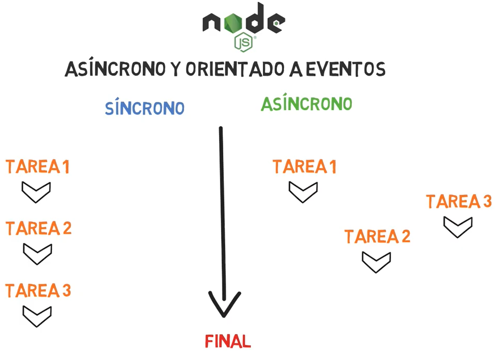

# Wednesday 15-06-2022

<ul>
    <li><strong>Node.JS Core Understanding Learning Exercise 🧠</strong></li>
    <li><strong>Node.JS Module System Core Understanding Learning Exercise 🧠</strong></li>
    <li><strong>Node.JS Module System Practice 💻</strong></li>
    <li><strong>Client-Server Model Learning Exercise 🧠</strong></li>
</ul>

<a name="Nodejs-Understand"></a>

## Node.js Core

<p align="justify">Understanding well what Node.JS is before starting to use it, will make it much easier for us to work with this powerful tool. In this exercise your task is to answer the following questions in your own words:</p>

<ol>
    <li>
        <h3>¿Qué es Node.js?</h3>
        <p align="justify">Es un entorno de ejecución para JavaScript fuera de los navegadores, en esencia Node es un programa que incluye el motor de JavaScript V8, además de módulos adicionales que no se encuentran disponibles en el navegador. Chrome y Node comparten el mismo motor de ejecución de Javascript(v8), pero proveen un entorno de ejecución distinta. </p>
        <br />
        <p align="center">
            
        </p>
        <br/>
    </li>
    <li>
        <h3>¿Qué problema resuelve Node.js?</h3>
        <p align="justify">Proporcionar una manera fácil para construir programas de red escalables, y a que se refiere con esto, bueno antes JavaScript, era un lenguaje de programación exclusivo para el lado del cliente y que solo estaba presente en los navegadores, pero apareció Node que nos brinda una única herramienta de trabajo en este caso un solo hilo de ejecución (Thread), y con este único hilo de ejecución se pueden trabajar varias tareas al mismo tiempo. Ya que cambiando la forma en que se realiza una conexión (solicitud) con el servidor. Como bien deciamos en vez de generar un nuevo thread para cada solicitud, cada solicitud dispara una ejecución de evento (evento o subproceso) dentro del motor de Node. Todos estos eventos de ejecución se van almacenando en una cola y van siendo atendidas de forma asincrona. Impidiendo que se quede en un punto muerto, y que puede soportar decenas de miles de conexiones/solicitudes de forma concurrente.</p>
        <br />
    </li>
    <li>
        <h3>¿Qué es el motor V8 de Javascript?</h3>
        <p align="justify">Es un programa que convierte código de JavaScript en código que el CPU puede entender y lo ejecuta. El código de máquina es un código de nivel más bajo que la computadora puede ejecutar sin necesidad de interpretarlo primero, ignorando la compilación y por lo tanto aumentando su velocidad. Creado por Google es ultra-rápido escrito en C++, además de que es código Open Source, esto significando que lo puede descargar y utilizar en cualquier aplicación que se desee utilizar.</p>
        <br/>
    </li>
    <li>
        <h3>¿Es realmente necesario Node.js en el ecosistema de desarrollo?</h3>
        <p align="justify">Si es necesario ya que nos deja crear proyectos escalables, ya que Node.js trabaja fuera de los navegadores y nos da mas ventajas trabajar de esta manera.</p>
        <br/>
    </li>
    <li>
        <h3>¿Cuál es la diferencia entre Node.js y cualquier otro navegador?</h3>
        <p align="justify">La principal diferencia es que Node.js se puede ejecutar fuera de cualquier navegador, ya que este cuenta con el motor V8, que simplemente interpreta el código, y además de eso provee módulos que los interpretes de cualquier otro navegador no puede utilizar, como ejemplo procesos de E/S del disco de la computadora.</p>
        <br/>
    </li>
    <li>
        <h3>¿Qué es NVM y por qué es útil para los desarrolladores de Node.js?</h3>
        <p align="justify">(Node version manager). Es una aplicación que nos permite tener y gestionar varias versiones de Node.js en el mismo sistema, permitiendo así, instalar, administrar, y cambiar las diferentes versiones de Node.js de manera fácil y rápida. Esto es útil para los desarrolladores ya que dependiendo del proyecto que estén trabajando puede acoplarse a una cierta versión de Node.js o en tal caso actualizar su versión.</p>
        <br/>
    </li>
</ol>

<a name="Nodejs-module-Understand"></a>

## Node.js Module System

<ol>
    <li>
        <h3>¿Qué es un Módulo Javascript?</h3>
        <p align="justify">Es un archivo que puede contener una clase o una biblioteca de funciones para un propósito en específico. Esto se creo debido al crecimiento de las aplicaciones, así dividiendo ciertos bloques de código en múltiples archivos. Los módulos pueden cargarse entre sí y usar directivas especiales como <i>export</i> e <i>import</i> para intercambiar funcionalidad, llamar a funcines de un módulo de otro.</p>
        <ul>
            <li><p align="justify">La palabra clave <i>export</i> etiqueta las variables y funciones que deberían  ser accesibles desde fuera del módulo actual.</p></li>
            <li><p align="justify"><i>import</i> permite importar funcionalidades desde otros módulos.</p></li>
            <li><p align="justify">El atributo &lt;script type="module"&gt; se usa para indicar cuándo se apunta a un módulo.</li>
        </ul>
        <br />
    </li>
    <li>
        <h3>¿Por qué son necesarios los módulos de Javascript?</h3>
        <p align="justify">Son necesarios los módulos ya que cuando la aplicación/proyecto se vuelve muy grande, de forma preferencial, se opta por colocar clases, librerías/bibliotecas de funciones dentro de un módulo, esto con el fin de mantener un orden y de solo exportar e importar el código necesario para el proyecto.</p>
    </li>
    <li>
        <h3>¿Qué estándares de módulos están disponibles en Node.JS?</h3>
        <p align="justify">Entre los estándares de módulos para Node.js se tiene: CommonJS, y UMD </p>
    </li>
    <li>
        <h3>¿Cuáles son las diferencias entre los módulos ESModules y los módulos CommonJS?</h3>
        <p align="justify">En ecosistemas donde predomina la utilización de NodeJS, es más frecuente usar CommonJS, mientras que en sistemas más modernos, como el navegador o Deno, es más habitual utilizar el ESModules.</p>
        <br />
    </li>
    <li>
        <h3>¿Qué tipos de módulos existen en Node.JS?</h3>
        <p align="justify">Hay 3 tipos de módulos. Todos funcionan de una manera similar pero difieren en el origen.</p>
        <ul>
            <li><p align="justify"><strong>Built-in modules:</strong> Son los módulos nativos de la API de Node.js. No hace falta que se instalen, ya que vienen incluidos por defecto con Node.js</p></li>
            <li><p align="justify"><strong>Local modules:</strong> Son los módulos escritos por los desarrolladores y forman en su conjunto gran parte de la aplicación, se estructuran así con la finalidad de poder ser un código reutilizable.</p></li>
            <li><p align="justify"><strong>External modules:</strong> Son en esencia, los paquetes de terceros distribuidos a través de npm (aunque pueden provenir de otros repositorios). Estos paquetes se instalan como dependencias y, aunque aportan funcionalidad a la aplicación, no deben incluirse en el repositorio ya que no son parte de la misma.</p></li>
        </ul>
    </li>
</ol>

<a name="CSM"></a>

## Client-Server Model 

<ol>
  <li><strong>¿Qué es un servidor?</strong><p align="justify">Es una máquina robusta tanto en hardware como en software, y actúa como un sistema gestor de datos o aplicaciones. Es el encargado de procesar las solicitudes de los clientes y dando respuestas a los clientes.</p></li>
  <li><strong>¿Qué es un Cliente?</strong><p align="justify">Es un demandante de servicio, el cliente puede ser un ordenador, como también una aplicación, la cual requiere información de la red para poder funcionar.</p></li>
  <li><strong>¿Es un servidor un ordenador físico más?</strong><p align="justify">En primera instancia si, si lo es, pero hay dos tipos de servidores, los servidores fisícos y los virtuales. El físico se trata de un hardware conocido como <i>host</i> es una máquina integrada a una red de nodos basados en software. Mientras que los servidores virtuales <i>(VPS, Virtual Private Server)</i> son softwares que proporcionan servicios a otros programas(clientes).</p></li>
  <li><strong>¿Hay alguna similitud entre la comunicación humana y el modelo cliente-servidor?</strong><p align="justify"></p></li>
  <li><strong>¿Es el modelo cliente-servidor aplicable sólo a la Web?</strong><p align="justify"></p></li>
</ol>

<!-- ```typescript

``` -->

<!-- <ul>
  <li></li>
</ul> -->
<!--  -->

<i></i>

<strong></strong>
<p align="justify"></p>
<p align="center"></p>
<br />
