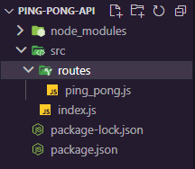
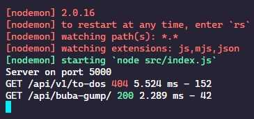
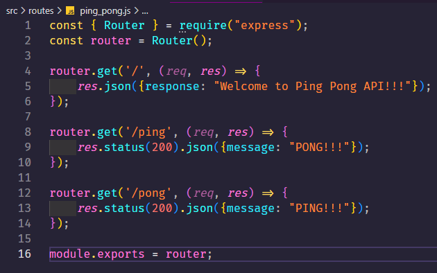
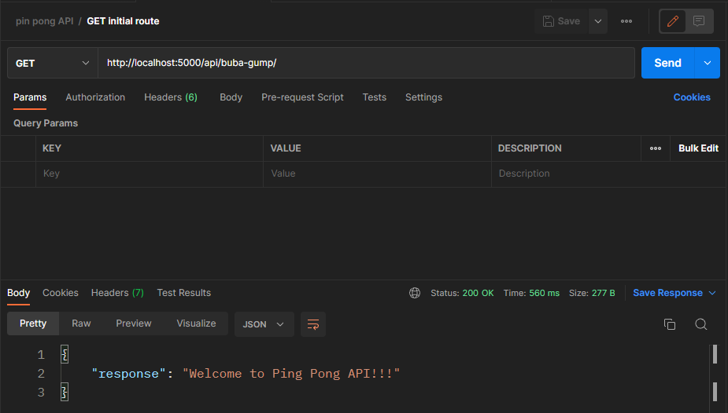
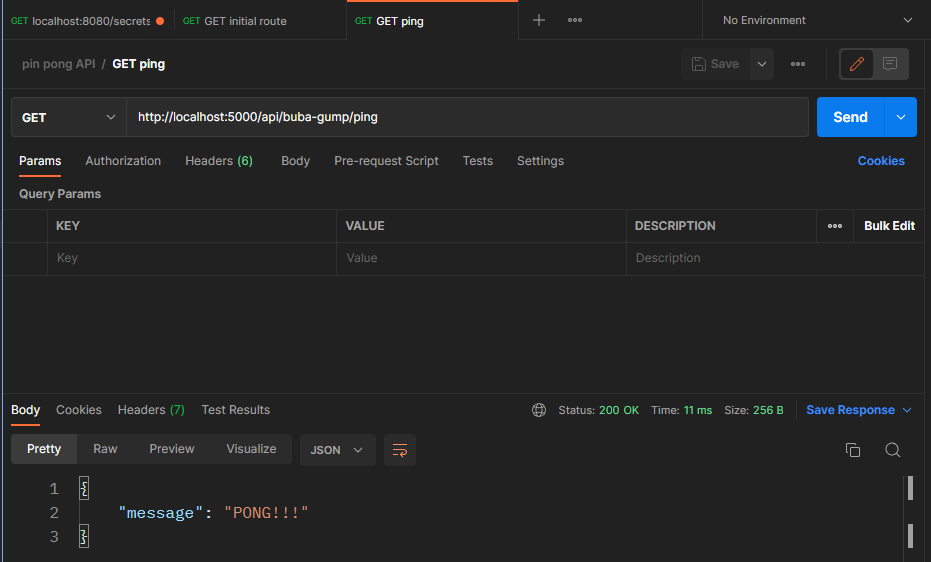
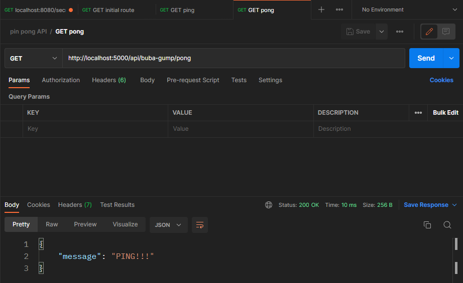
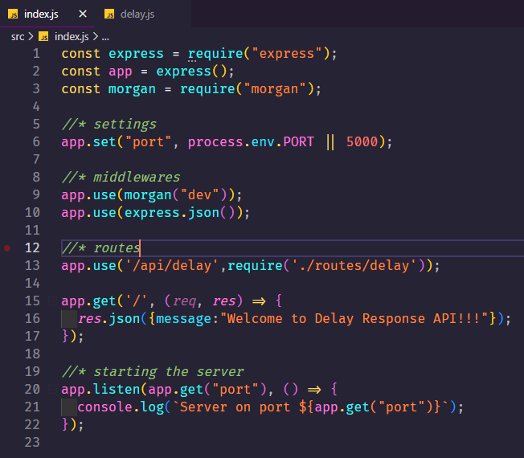
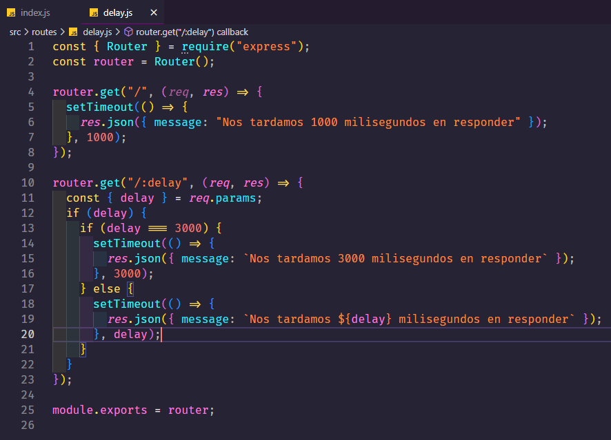

# Monday 20-06-2022

<ul>
  <li><strong>Forrest Gump Ping-Pong API 🏓</strong></li>
  <li><strong>Delayed Response API ⏳</strong></li>
</ul>

<a name="forrest"></a>

## Forrest Gump Ping-Pong API 🏓:

<p align="justify">Create a simple REST API with which you can play ping-pong.</p>

### API Requeriments:

<ul>
  <li>Use Express JS to build the API.</li>
  <li>Use any port you want for the API.</li>
  <li>The API has to be able to respond to the "ping" request with the "pong" message.</li>
  <li>Use /api/buba-gump as the root route for the API.</li>
  <li>Make sure your API responds to the request using JSON e.g:

```code
{
  "message": "pong"
}
```

  </li>
  <li>Use Postman to test your API.</li>
  <li>
    <ul>
      <li>If the user makes the "ping" move, your API should respond with "pong".</li>
      <li>If the user makes the "pong" move, your API should respond with "ping".</li>
    </ul>
  </li>
</ul>

<p align="justify">Se nos solicita crear una API de ping-pong, para esto requerimos el uso de express y otras herramientas. Lo primero que se realiza es crear una carpeta donde irá nuestro proyecto.</p>

<p align="justify">Luego de crear la carpeta de nuestro proyecto, se procede a ir hacia esa carpeta e instalar todos lo solicitado para el uso de la API. Con el siguiente comando: <code>npm install --y</code>, iniciamos el proyecto con node.js, y con el siguiente comando: <code>npm install express morgan nodemon</code>, instalamos el resto de dependencias para nuestro proyecto, en el caso de express para crear un servidor de una manera más sencilla, morgan que actua como un middleware y por último nodemon que será el encargado de estar al pendiente con cualquier pequeño cambio que se le realice al servidor.</p>

<p align="justify">Ya con todo esto: creamos una carpeta llamada src (source en inglés), en dicha carpeta irán todos nuestros archivos y carpetas a trabajar.Crearemos la siguiente distribucón de archivos y carpetas a continuación:</p>

<p align="center"></p>

<p align="justify">Como se dijo anteriormente la carpeta src contendrá archivos y carpetas de forma general dentro de dicha carpeta irá nuestro archivo principal junto con una carpeta que contendrá las rutas de nuestra API. A continuación el se explicará el código del archivo principal:</p>

```javascript

const express = require('express');
const app = express();
const morgan = require('morgan');

//* Settings
app.set('port', process.env.PORT || 5000);

//*middlewares
app.use(morgan('dev')); //*Permite ver lo que llegando al server en la consola
app.use(express.json());

app.use('/api/buba-gump', require('./routes/ping_pong'))

app.get('/', (req, res) => {
    res.json({message: "redirect to: http://localhost:5000/api/buba-gump"})
})

app.listen(app.get("port"), () => {
    console.log(`Server on port ${app.get("port")}`);
});

```

<p align="justify">Al ya tener descargadas las librerias de express, morgan y nodemon, solo mandamos a traer a express y a morgan, ya que nodemon actua solo cuando encendemos el servidor. Luego realizamos los debidos ajustes, uno de ellos es el puerto a trabajar, y lo podemos establecer, en dicho caso tenemos dos opciones, un puerto por defecto del sistema y otro que puede elegir el usuario, osea nosotros que somos los que estamos creando la API.</p>

<p align="justify">Usamos los middlewares como intermediarios para cada petición realizada, en el caso de morgan nos apoya a poder visualizar de mejor manera que tipo de petición se esta solicitando a la API </p>

<p align="center"></p>

<p align="justify">Como se puede ver en la imagen de arriba, por cada petición que se realiza nos dice desde donde se hizo, es estado de la petición, el tiempo que se tardó en procesar la petición y el tipo de petición, esto se logra observar al pasarle a morgan como parámetro como se desea ver la información en este caso se eligió la forma de <i>dev</i> osea desarrollador.</p>

<p align="justify">El siguiente middleware que ya lo trae express es JSON, este nos servirá para que cada información que reciba la API ya venga procesada como un archivo json, para un manejo más sencillo de la API.</p>

<p align="justify">El siguiente mas que ser un middleware nos ayudará a controlar las rutas donde se procesa la información que es el caso de en el primer parámetro se le pasa la url base para cualquier petición realizada a la API, y en el segundo parámetro se manda a traer el archivo que contendrá el resto de rutas a procesar.</p>

<p align="justify">Se realizo una ruta inicial de defecto por si el usuario se llega a equivocar que le indica a que ruta debe de redirigirse para poder utilizar la API.</p>

<p align="justify">Por último, se trae a una función que escucha o está al tanto de cuando se encienda la API, se le debe pasar un puerto, este caso obtenemos el puerto que ya habiamos definido antes,y como segundo parámetro le pasamos una callback, en esta función solo indica por medio de un mensaje en consola que el servidor se encuentra encendido y en que puerto se encuentra encendido.</p>

### Archivo de rutas

<p align="justify">En dicho archivo procesamos las rutas que se nos solicitó, en caso de que se hiciera una petición ping, se retornará un mensaje en json con la respuesta pong y viceversa. Se tiene que agregar que se tiene que exportar un objeto propio de express que sería <i>router</i>, que es el encargado de ayudarnos con las rutas. A continuación se muestra el archivo de rutas:</p>

<p align="center"></p>

<p align="justify">Se manda a traer el objeto router que nos ayudará con las rutas, se dicidio trabajar en dos archivos diferentes, para mantener la funcionalidad de cada uno por separado, por un lado las rutas, y por otro lado solo tener el enlace correcto que nos lleva a las rutas. Asi manteniendo un orden.</p>

<p align="justify">Como se observa en la imagen de arriba tenemos varias rutas tenemos una ruta inicial que nos da un saludo de bienvenida a la API, y otras dos rutas que responden al ping y pong. A continuación se muestra la ruta inicial testeada con Postman.</p>

<p align="center"></p>

También se presenta la ruta ping a continuación:

<p align="center"></p>

Y además se presenta la ruta pong a continuación:

<p align="center"></p>

<p align="justify">Asi, terminando de crear y testear la API creada con express y node.js y testeada en postman.</p>

<a name="delayed"></a>

## Delayed Response API ⏳:

<p align="justify">Create a simple REST API that receives a request containing a number that represents a delay
in milliseconds. The API should respond to the request after the delay specified in the request has expired.</p>

### API Requeriments:

<ul>
  <li>Use Express JS to build the API.</li>
  <li>Use any port you want for the API.</li>
  <li>The API should use route parameters to get the desired delay:
  
  ```code

  # Request example
  # Here 3000 indicates a delay of 3000 milliseconds
  http://localhost:3000/api/delay/3000

  ```

  </li>
  <li>Your API should have just one request handler.</li>
  <li>You can send any response you want after the delay has expired.</li>
  <li>If no delay is provided in the request, the API should use 1000 as default.</li>
</ul>

<p align="justify">En esta API se nos solicito crear una API que al momento de nosotros ingresarle una cantidad x de numeros que se tardará una x cantidad de tiempo en responder la API, como por ejemplo al yo ingresar 1000 la API, deberá de tardarse en contestar un segundo, si le ingreso 5000, se tardará 5 segundos en contestar. Se realizaron los mismos pasos que en la API anterior, mostrando los dos archivos a continuación:</p>

Archivo principal:

<p align="center"></p>

Archivo de las rutas:

<p align="center"></p>

<p align="justify">Se les creo una ruta por defecto, en caso de que no escriban nada se tardará un segundo en contestar la API, y en caso de que se escriba un número, ese será el tiempo en que se tardará en dar respuesta.</p>

<p align="justify">Terminando asi con las dos API´s.</p>