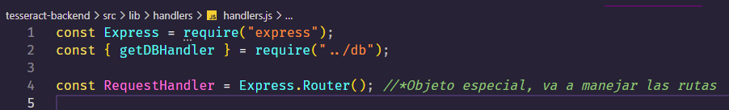

# Thursday 23-06-2022

<ul>
    <li><strong>Work on my project 🧠</strong></li>
</ul>

<p align="justify">Bien, en esta parte vamos a hablar sobre el manejador de rutas, y sobre consultas a una BD como lo es sqlite. Lo primero que hablaremos es sobre el objeto express, lo requerimos para poder usar el manejador de rutas.</p>

<p align="justify">El objeto express será el mismo para toda la API, es por eso que podemos usar donde sea necesario. Al traer el obejto de express podemos usar su propiedad router, la cual nos permitirá manejar las rutas/endpoints de nuestra API.</p>

<p align="center"></p>

<p align="justify">Estaremos enfocados en las sentencias que haremos en nuestra base de datos, luego ya construiremos las rutas para manejar los datos dependiendo del tipo de petición que realice el usuario. Pero antes un poco de introducción a la bases de datos sql.</p>

### SQL

<p align="justify">SQL, o <i>Structure Query Language</i>, es un lenguaje para consultar, manipular, y transformar datos de una base de datos relacional. (Una BD relacional representa una colección de tablas relacionadas)</p>

<p align="justify">Se encuentra DDL-DML para el manejo de la BD.</p>

<p align="justify"><strong>DDL</strong>(Data Definition Language): Encargado de la definición de BD, tablas, indices, etc.</p>

Algunos comandos:

<ul>
  <li>CREATE TABLE</li>
  <li>CREATE INDEX</li>
  <li>CREATE VIEW</li>
</ul>

<p align="justify"><strong>DML</strong>(Data Manipulation Language): Manipulación de datos, seleccionar, insertar, eliminar y actualizar datos.</p>

Algunos comandos:

<ul>
  <li>SELECT</li>
  <li>UPDATE</li>
  <li>INSERT</li>
  <li>DELETE FROM</li>
</ul>

## Tipos de datos

### **Númericos:**

<ul>
  <li>INTEGER</li>
  <li>NUMERIC</li>
  <li>DECIMAL</li>
  <li>FLOAT</li>
</ul>

### **Alfanúmericos:**

<ul>
  <li>CHAR(n)</li>
  <li>VARCHAR(n)</li>
</ul>

### **Lógicos:**

<ul>
  <li>Bit</li>
  <li>Boolean</li>
</ul>

entre otros...

## Creación de tablas

<p align="justify">La instrucción CREATE TABLE se utiliza para crear una nueva tabla en una base de datos.</p>

```sql

CREATE TABLE IF NOT EXISTS mytable (
  columna1 tipo_dato configurations
  id INTEGER PRIMARY KEY,
  title TEXT,
  description TEXT,
  is_done INTEGER DEFAULT 0
);

``` 

<p align="justify"><i>PRIMARY KEY:</i> Identifica de manera única cada fila de una tabla. La columna definida como clave primaria debe ser única y no puede contener valores nulos.</p>

## SELECT * FROM

<p align="justify"><strong>SELECT</strong>: Selecciona columnas especificas de nuestra tabla.</p>
<p align="justify"><strong>FROM</strong>: Se utiliza para especificar la tabla.</p>

```sql

  SELECT * FROM mytable
  SELECT * FROM todos

``` 

<p align="justify">El resultado de esta consulta será un conjunto de filas y columnas, pero solo con las columnas que especifícamos. Si queremos seleccionar todas las columnas de datos de una tabla, podemos utilizar el asterisco(*).</p>

## WHERE:

<p align="justify">La cláusula WHERE de SQL, se utiliza para especificar una condición al recuperar un conjunto de datos de una tabla o de un conjunto de tablas. Si se cumple la condición, la consulta devuelve los valores que se relacionan con la condición que se especifique en la cláusula WHERE.</p>

```sql

  SELECT * FROM mytable WHERE condition
  SELECT * FROM todos WHERE id = 25

```

## INSERT INTO 

<p align="justify"><strong>INSERT</strong> se utiliza para añadir datos a una tabla existente. La palabra clave <strong>VALUES</strong>, se utiliza para pasar los valores a insertar en las columnas especificadas.</p>

```sql

  INSERT INTO mytable VALUES (
    value1, value2, value3, ...
  )

```

<p align="justify"><i>Cada nuevo registro de datos debe contener valores para cada columna correspondiente en la tabla.</i></p>

## UPDATE

<p align="justify">Se utiliza para actualizar los datos existentes de una tabla.</p>

```typescript

  UPDATE mytable SET 
    colum1=value1,
    colum2=value2,
    colum3=value3,...
    WHERE condition;

  UPDATE todos SET title = ? , description = ? , is_done = ? WHERE id = ?
``` 

<p align="justify"><i>La cláusula WHERE especifica que registro(s), se deben actualizar. Si se omite la cláusula WHERE, se actualizarán todos los registros de la tabla.</i></p>

## DELETE

<p align="justify">Cuando necesitamos eliminar datos de una tabla utilizamos la declaración DELETE, que especifica la tabla sobre la que actuar, y las filas son especifícadas por la cláusula WHERE.</p>

```sql
  DELETE FROM mytable WHERE condition
  DELETE FROM todos WHERE id = 25

```

<p align="justify"><i><strong>¡¡CUIDADO!!</strong>, Si omitimos WHERE, se eliminan todas las filas</i></p>

<p align="justify">Bien, por ahora ya vimos lo que es uba BD relacional, el siguiente dia ya podremos concentrarnos en cada uno de los endpoints que contendrá la API.</p>
