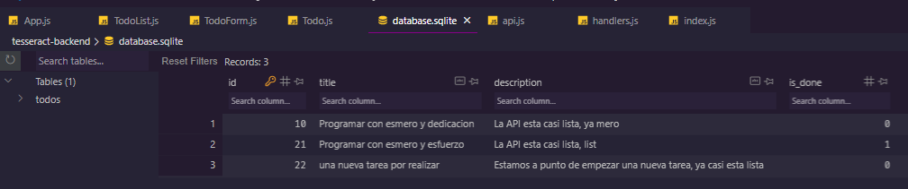
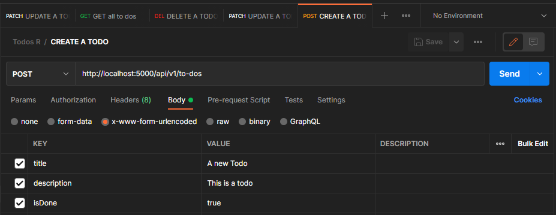
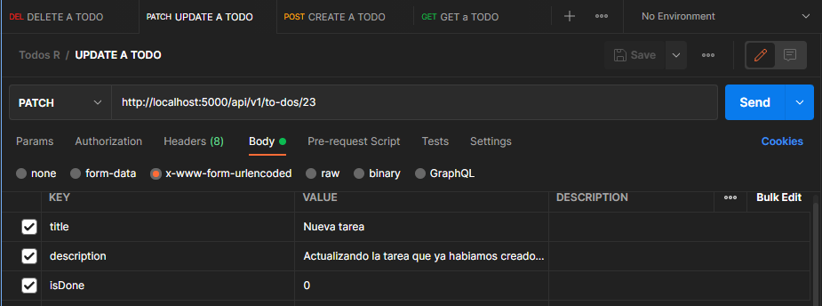
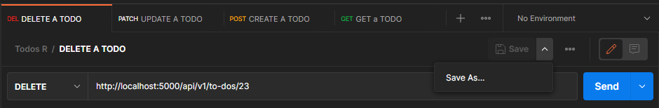
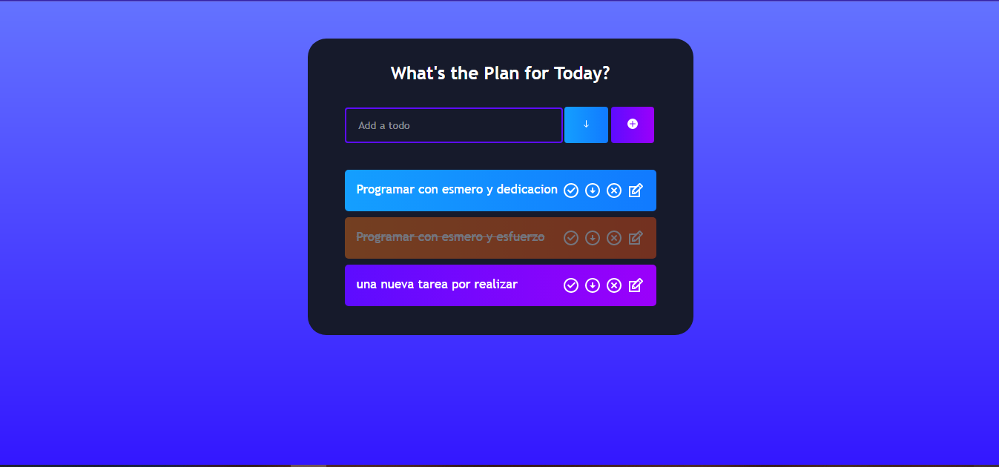
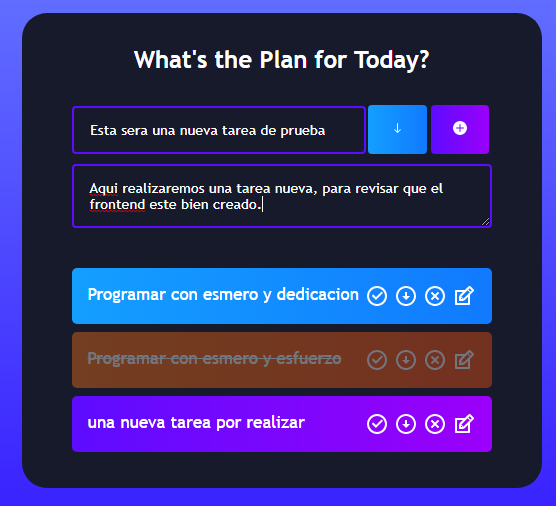
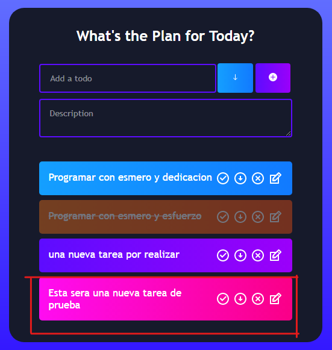
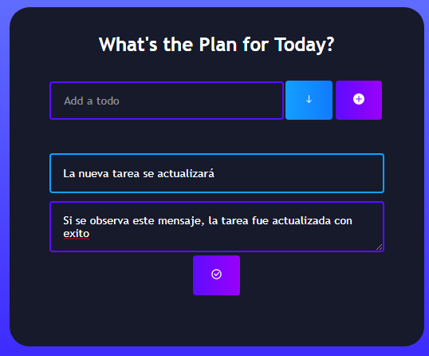
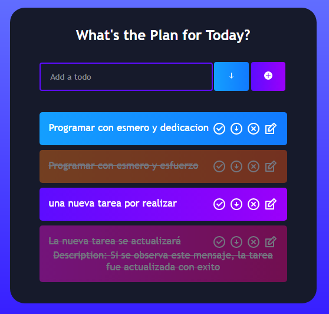
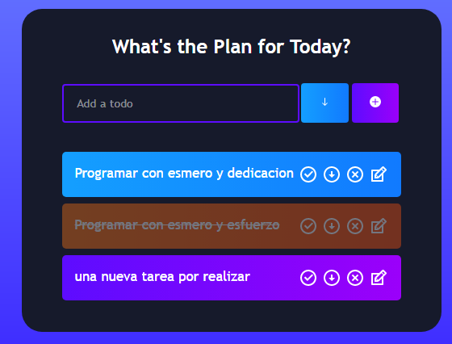

# Thursday 30-06-2022

<ul>
  <li><strong>Work on my project 🧠</strong></li>
</ul>

<p align="justify">Bien, trabajaremos las pruebas de test de la aplicación desde el lado del backend y también del frontend. Lo primero que haremos será testear el backend, en este punto ya existen unas cuantas tareas en la BD. Se muestra a continuación las tareas en la BD:</p>

<p align="center">

</p>


<p align="justify">Ahora en la parte del backend con el uso de Postman, vamos a solicitar todas las tareas, a continuación se muestran:</p>

```json

{
    "todos": [
        {
            "id": 10,
            "title": "Programar con esmero y dedicacion",
            "description": "La API esta casi lista, ya mero",
            "is_done": 0
        },
        {
            "id": 21,
            "title": "Programar con esmero y esfuerzo",
            "description": "La API esta casi lista, list",
            "is_done": 1
        },
        {
            "id": 22,
            "title": "una nueva tarea por realizar",
            "description": "Estamos a punto de empezar una nueva tarea, ya casi esta lista",
            "is_done": 0
        }
    ]
}

```

<p align="justify">Para este ejemplo tenemos a estas tareas, puede variar ya que pueden ir mas o menos tareas, lo importante es que puedan obtener las tareas, y en caso de que no tengan tareas, se mostrará un mensaje indicando que no se encontraron tareas.</p>

<p align="justify">Vamos a crear una nueva tarea en el backend, y luego podremos verla agregada a la lista de tareas.</p>

<p align="center">

</p>

<p align="justify">Obteniendo como respuesta si todo se encuentra bien, el siguiente mensaje:</p>


```json

{
    "newTodo": {
        "title": "A new Todo",
        "description": "This is a todo",
        "is_done": "true",
        "stmt": {},
        "lastID": 23,
        "changes": 1
    }
}

```

<p align="justify">Ahora vamos a pedir la tarea por medio de su ID, recordando que el último To-Do fue creado con el ID, obtenemos lo siguiente:</p>

```json

{
    "todo": {
        "id": 23,
        "title": "A new Todo",
        "description": "This is a todo",
        "is_done": 1
    }
}

```

<p align="justify">Esto nos indica que la tarea fue creada con éxito. (Recordando que puede variar según la cantidad de tareas que se hayan creado antes.), el siguiente paso es actualizar los datos de la tarea que acabamos de agregar con el id correspondiente.</p>

<p align="center">

</p>


<p align="justify">Si todo se encuentra bien, se obtendrá el siguiente mensaje:</p>

```json

{
    "updateTodo": {
        "stmt": {},
        "lastID": 0,
        "changes": 1
    }
}

```

<p align="justify">Nuevamente, obtendremos la tarea, para verificar que si exista un cambio, se muestra a continuación:</p>

```json

{
    "todo": {
        "id": 23,
        "title": "Nueva tarea",
        "description": "Actualizando la tarea que ya habiamos creado previamente",
        "is_done": 0
    }
}

```

<p align="justify">Efectivamente se actualizó. Ahora por último simplemente vamos a eliminar la tarea que creamos y actualizamos, por medio de su ID correspondiente:</p>

<p align="center">

</p>


<p align="justify">Si se elimina de forma correcta, nos muestra el siguiente mensaje:</p>


```typescript

{
    "todoRemoved": {
        "stmt": {},
        "lastID": 0,
        "changes": 1
    }
}

``` 

<p align="justify">Por último lo buscaremos para revisar efectivamente que si se elimino la tarea:</p>

```json

{}

```

<p align="justify">El resultado de la busqueda simplemente nos retorna un objeto vacio, indicando que realmente la tarea fue eliminada correctamente. Con todo esto completamos el testeo desde la parte del backend, ahora realizaremos el testeo de la parte del frontend. Inicialmente se tienen las siguientes tareas:</p>

<p align="center">

</p>

<p align="justify">Ahora vamos a crear una nueva tarea con un titulo y su descripción:</p>


<p align="center">

</p>

<p align="justify">Al terminar de agregar la tarea se mostrará agregada a la lista de tareas, si todo esta correcto, se obtiene lo siguiente:</p>

<p align="center">

</p>

<p align="justify">Ahora, se actualizará la tarea, colocando nuevos datos para dicha tarea.</p>

<p align="center">

</p>

<p align="justify">Si todo esta bien, se muestra la actualización de la tarea en la lista:</p>

<p align="center">

</p>


<p align="justify">Ahora, vamos a eliminar la tarea que agregamos y actualizamos, y se actualizará el listado en la parte del frontend:</p>

<p align="center">

</p>

<p align="justify">Efectivamente, la tarea fue eliminada con éxito, bien con esto comprobamos que tanto el backend como el frontend, están funcionando de manera correcta. Dando por terminado el proyecto final.</p>


<a href="../README.md">Inicio</a>