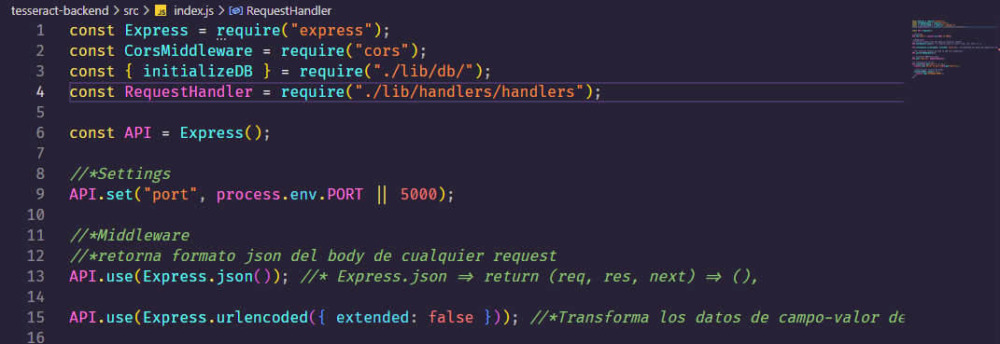
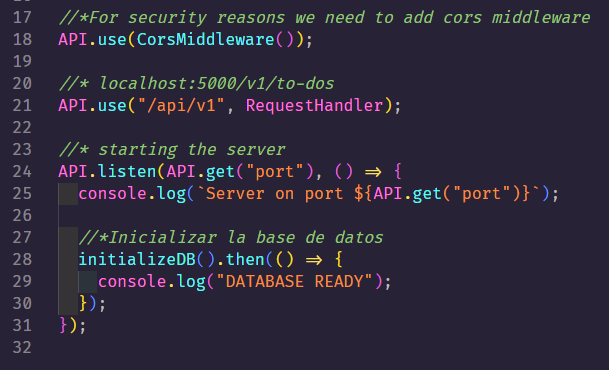

# Tuesday 28-06-2022

<ul>
  <li><strong>Work on my project 🧠</strong></li>
</ul>

<p align="justify">Bien se estuvo trabajando en el proyecto final, en la parte del backend especificamente.</p>

<p align="justify">Lo primero que hicimos es traer el módulo de express para poder utilizar un servidor, se trae también el módulo cors, para que no nos de problema interactuar entre el backend y el frontend, también requerimos de el manejador de peticiones, y también el objeto que se encarga de crear la BD en caso de que no exista una.</p>

<p align="justify">Ahora, lo siguiente que hacemos es realizar los siguientes ajustes y uso de algunos middlewares para el uso apropiado de la API.</p>

<p align="justify">Lo primero que realizamos es establecer un puerto por default para la API, y se tiene dos opciones, o trabaja con algún puerto que la computador en si misma ya tenga, o seleccionamos un puerto por default, en nuestro caso será el puerto 5000, para no interrumpir los puertos de react que normalmente son de puerto 3000. Además de los midddlewares, el uso de JSON, para que las respuestas del body, vengan ya como un objeto JSON,y sea más fácil de utilizar. También <i>urlencoded</i>, para que todos los valores de un formulario vengan en formato json, y sea más sencillo su uso.</p>

<p align="center"></p>

<p align="justify">Además de esto, también hablamos sobre los cors que son un protocolo para mantener la seguridad entre el backend y el frontend, este también actúa como un middleware. Cabe agregar que podemos crear un ruta en especifíco para que solo en dicha ruta la API pueda dar respuestas, en dicho caso nuestra url base será: <i>/api/v1</i>, y para completarla, se le pasa el manejador de peticiones que será el encargado de observar que tipo de petición se está haciendo y en base a ello seleccionar el resto de la url, para dar una respuesta.</p>

<p align="justify">Por último pero no menos importante, el escuchador de la API, al cual se le debe pasar el puerto que estamos trabajando, esto se hace por medio del puerto que ya habiamos establecido anteriormente con el objeto API, y solo lo obtenemos para que el escuchador este atento de dicho puerto, además su segundo parámetro es una callback, a la cual se le debe pasar una función, en dicho caso, se le pasa una función flecha para indicar que el servidor esta encendido y en que puerto se está trabajando ademas de inicializar la base de datos en caso de que no exista una, o simplemente alistar la BD que ya se tenia.</p>

<p align="center"></p>

<p align="justify">Todo el código completo queda de la siguiente manera:</p>

```javascript
const Express = require("express");
const CorsMiddleware = require("cors");
const { initializeDB } = require("./lib/db/");
const RequestHandler = require("./lib/handlers/handlers");

const API = Express();

//*Settings
API.set("port", process.env.PORT || 5000);

//*Middleware
//*retorna formato json del body de cualquier request
API.use(Express.json()); //* Express.json => return (req, res, next) => (),

API.use(Express.urlencoded({ extended: false })); //*Transforma los datos de campo-valor de un formulario y lo va a pasar a json

//*For security reasons we need to add cors middleware
API.use(CorsMiddleware());

//* localhost:5000/v1/to-dos
API.use("/api/v1", RequestHandler);

//* starting the server
API.listen(API.get("port"), () => {
  console.log(`Server on port ${API.get("port")}`);

  //*Inicializar la base de datos
  initializeDB().then(() => {
    console.log("DATABASE READY");
  });
});
```

<p align="justify">Bien el dia jueves de esta semana, contiene la parte delos manejadores, para terminar de familiarizarse con un poco de BD y los endpoint que tendrá nuestra API.</p>