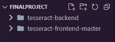
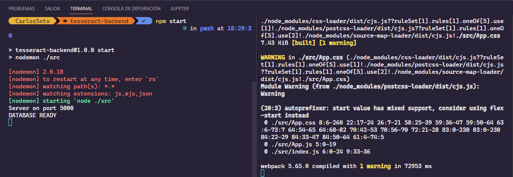
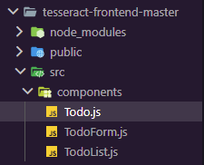
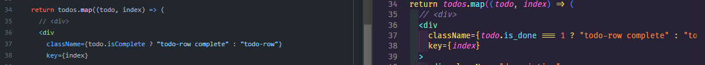
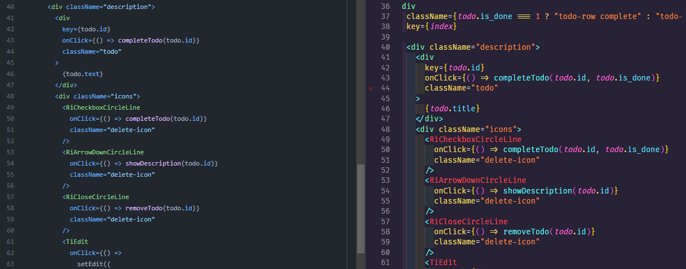
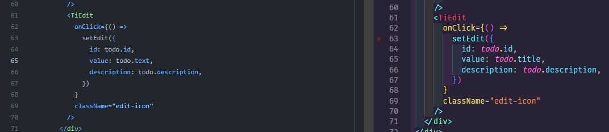
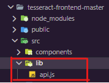
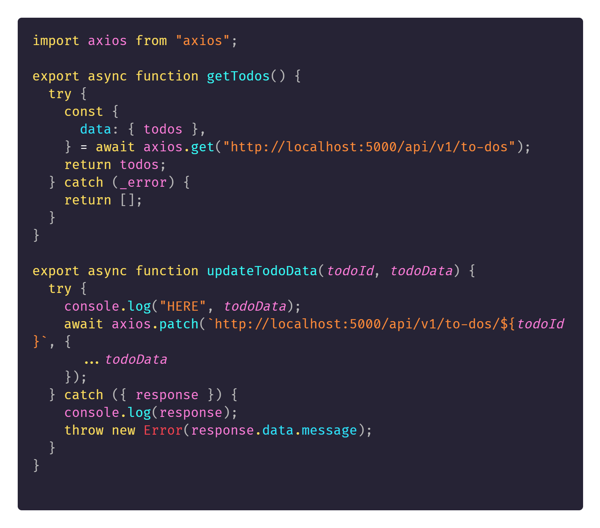

# Tuesday 28-06-2022

<ul>
  <li><strong>Work on my project 🧠</strong></li>
</ul>

<p align="justify">Bien, se estuvo explicando la parte del backend de como hacer cada uno de los endpoints, ahora nos enfocaremos en unir los dos proyectos, la parte del backend y la parte del frontend. Para empezar crearemos una carpeta raiz, y se le da el nombre que gusten, en mi caso <i>finalProject</i>, en dicha carpeta se ingresarán los dos proyectos a trabajar quedando de la siguiente manera:</p>

<p align="center"></p>

<p align="justify">Bien, como se mencionó antes, se trabajará con el <strong>puerto 5000</strong>, para el <strong>backend</strong>, y el <strong>puerto 3000</strong>, para el <strong>frontend</strong>, ya que se está trabajando con react, react normalmente trabaja con los puertos <i>3000</i>. Para poder trabajar los dos proyectos como uno solo, es la razón del por que se realizó la unión de los dos proyectos en una sola carpeta. Ahora se preguntarán como haremos para ir probando ambos, y es sencillo vs code, nos permite abrir una n cantidad de consolas en su editor, por lo que tendremos una consola para la parte del backend y otra para la parte del frontend, a continuación se muestra un ejemplo:</p>

<p align="center"></p>

<p align="justify">Cabe recalcar que al estar en la carpeta raiz, debemos de colocar en cada consola la ruta correcta para el backend y el frontend para iniciar cada uno de los servidores sin problema.</p>

<p align="justify">Para comprobar que los servidores estan funcionando correctamente se puede realizar una prueba, en el caso del backend con postman, y el en frontend con que cargue la página base estaremos bien.</p>

<p align="justify">Ahora lo que toca realizar es la debida conexión del backend con el frontend. La parte del backend ya se encuentra lista, únicamente hay que realizar la unión por el lado del frontend, esto lo haremos por medio de la libreria <strong><a href="https://github.com/axios/axios">axios</a></strong>, la cual nos permite realizar peticiones a un servidor, en este caso el servidor será el backend que creamos anteriormente.</p>

<p align="justify">Nos concentraremos en la carpeta de <i>components</i>, que son los componentes necesarios para mostrar la información, a continuación se muestra la carpeta components:</p>

<p align="center"></p>

<p align="justify">Poseemos 3 archivos los cuales representan una etiqueta creada por "<i>nosotros</i>", para la interacción del usuario con la lista de To-Do's y el resto de operaciones.</p>

<p align="justify">Lo primero que realizaremos es ir al archivo <i>Todo.js</i>, ya que realizaremos algunos cambios. El primer cambio se realiza alrededor de la linea 37, aqui cambiaremos el nombre de la variable de la tarea comletada <code>className={todo.isComplete ? "todo-row complete" : "todo-row"}</code> a el nombre de la variable <strong>is_done</strong>, <code>className={todo.is_done === 1 ? "todo-row complete" : "todo-row"}</code>, se realiza este cambio ya que todo antes se trabajaba y se operaba desde el frontend, pero al tener una API, para realizar las peticiones del frontend es necesario realizar los cambios debidos para el buen funcionamiento de la aplicación.</p>

<p align="center"></p>

<p align="justify">El segundo cambio a realizar es agregar la propiedad is_done, nuevamente ya que es necesario para que las funciones adecuadas, reconozcan que la tarea ha sido completada o no, o  simplemente mostrar si fue completada o no.</p>

<p align="center"></p>

<p align="justify">El tercer cambio fue alrededor de la linea 65, ya que como se menciono antes, todo se trabajaba en la parte del frontend, es por eso que tiene colocado text, y el cambio fue pasado a la propiedad title, además cabe agregar que cuando la persona agregaba una nueva tarea el titulo de la tarea no era visible, por lo tanto al solucionar este problema, el nombre de la tarea ya era visible.</p>

<p align="center"></p>

<p align="justify">Para este archivo serían los únicos cambios a trabajar, ahora nos enfocaremos en el módulo de <i>TodoList</i>, en este archivo, utilizaremos la librería de axios.</p>

<p align="justify">Como se mencionó antes, todo se trabajaba y almacenaba en el frontend, ahora con la API incluida podemos almacenar la información en otro lugar y solicitarla para poder realizar las acciones necesarias con dicha información. Pero antes de avanzar más, se utilizará una libreria que "creamos", para que sea más sencillo el uso de la información y no estar escribiendo el mismo código varias veces. Para esto también es necesario exportar cada una de las funciones que llegaremos a utilizar.</p>

<p align="justify">En este caso se creo la carpeta lib, y en ella se encuentra el archivo llamado API.js, el cual nos proporcionará funciones que pueden ser llamadas las veces que sean necesarias sin repetir una y otra vez el código en toda la aplicación, a continuación se presenta la carpeta y el archivo: </p>

<p align="center"></p>

<p align="justify">Mostraremos el código utilizado con una explicación de su uso:</p>

<p align="center"></p>

<p align="justify">Bien, lo primero que tenemos que hacer es importar la libreria de axios, ya que es necesaria para realizar las peticiones al servidor, se tienen dos funciones asincronas en dicho archivo, una para obtener todos los To-Do's, y otro para actualizar los datos de un To-Do</p>

### getTodos

<p align="justify">Lo primero que se hace es colocar un try-catch dentro de esta función ya que al ser asícrona, nos puede llegar a ocurrir un error. En la parte del catch simplemente se retorna un arreglo vacio, para indicar a otra función que deberá mostrar un error, y en caso de que no exista un error se obtienen los todos, se almacenan en un objeto y se retornan para su posterior procesamiento.</p>

```javascript

export async function getTodos() {
  try {
    const {
      data: { todos },
    } = await axios.get("http://localhost:5000/api/v1/to-dos");
    return todos;
  } catch (_error) {
    return [];
  }
}


``` 

<p align="justify">Usamos una de la peticiones que nos ofrece axios, en este caso es <i>get</i>, al cual debemos pasarle la url donde se realizará la petición. quedando de la siguiente manera:</p>

```javascript

axios.get("http://localhost:5000/api/v1/to-dos");
``` 


### updateTodoData

<p align="justify">Como se mencionó antes esta función sirve para actualizar los datos de un To-Do, por medio de su ID, por tanto simplemente manda los datos por medio del cuerpo de la petición para actualizar la tarea, en caso de que ocurra un error, lanzará el error provocado, y recordando que se usa try-catch, ya que también es asícrona. Quedando de la siguienta manera:</p>

```javascript

export async function updateTodoData(todoId, todoData) {
  try {
    //*console.log("HERE", todoData);
    await axios.patch(`http://localhost:5000/api/v1/to-dos/${todoId}`, {
      ...todoData
    });
  } catch ({ response }) {
    console.log(response);
    throw new Error(response.data.message);
  }
}
``` 

<p align="justify">Como se puede observar ahora utilizamos otra solicitud que nos brinda axios, la cual es <strong>patch</strong>, la cual nos ayudará a actualizar uno o varios datos de una tarea por medio del ID de la tarea. La información a actualizar viaja por medio de la solicitud de la petición realizada.</p>

<p align="justify">Seguiremos avanzando mas adelante con el resto.</p>


<a href="../README.md">Inicio</a>