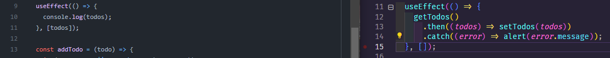

# Wednesday 29-06-2022

<ul>
  <li><strong>Work on my project 🧠</strong></li>
</ul>

<p align="justify">En esta parte estaremos realizando los cambios necesarios para el frontend. Nos quedamos en el archivo <strong>api</strong> de la carpeta <strong>lib</strong>, ahora regresamos nuevamente al archivo <strong>TodoList</strong>.</p>

<p align="justify">Una breve explicación de useEffect, useEffect nos sirve para que nuestras funciones sigan siendo puras, con esto nos referimos a que la data que se mande a dicha función sea manipulada por otra y no por la función por la cual llegaron las variables u objetos.</p>

<p align="justify">Bien lo primero que haremos es usar la función useEffect para obtener todos los To-Do's, sino hay problema se obtienen y se le pasan a la función <i>setTodos</i>, la cuál es la encargada de mostrar los To-Do's en la página del usuario. En caso de que exista un error se mostrará una alerta con un mensaje que nos indica el error. En general esto nos servirá para mostrar los datos al usuario.</p>

<p align="center"></p>

<p align="justify">Como se observa en la imagen, es el cambio de usar los To-Do's todo desde el frontend, a pasar los To-Do's al backend.</p>

<p align="justify">La siguiente función es una función flecha, para agregar un To-Do, a la cual se le pasa un objeto To-Do, y lo primero que se revisa es que el titulo sea diferente de undefined y que el titulo no contenga solo espacios vacios, en caso de que se cumpla una u otra, se retorne ya que esta mal el titulo.</p>

<p align="justify">Si todo esta bien al crear el nuevo To-Do, se traen los To-Do's, se obtienen  y se establecen para mostrar al usuario la actualización, en caso de que exista un error, se mostrará el mensaje de error en una alerta. Asi mostrando el siguiente codigo: </p>

```typescript
const addTodo = (todo) => {
  if (!todo.title || /^\s*$/.test(todo.title)) {
    return;
  }

  axios.post("http://localhost:5000/api/v1/to-dos", { ...todo }).then(() => {
    getTodos()
      .then((todos) => setTodos(todos))
      .catch((error) => alert(error.message));
  });
};
```

<p align="justify">El siguiente es para actualizar un To-Do, esto se hace por medio del id del To-Do, y se le mandan el titulo y la descripción, y se realiza la misma validación que mencionamos al crear un To-Do. Estos datos, son pasados a la función <i>updateTodoData</i> para que actualice el To-Do. Si todo sale bien, se obtienen los todos y se establecen nuevamente para la vista del usuario, si ocurre un error se mostrará en una alerta de la página.</p>

```javascript
const updateTodo = (todoId, { title, description }) => {
  if (!title || /^\s*$/.test(title)) {
    return;
  }

  updateTodoData(todoId, { title, description })
    .then(() => {
      getTodos()
        .then((todos) => setTodos(todos))
        .catch((error) => alert(error.message));
    })
    .catch((error) => alert(error.message));
};
```

<p align="justify">El siguiente es bastante sencillo, y se trata de eliminar un To-Do por medio de un id, simplemente se mandan el ID del To-Do a borrar y si todo sale bien, se obtienen los To-Do's, y nuevamente si todo sale bien, establecemos los todos para la vista del usuario. En caso de error, simplemente se muestra el error en una alerta en la página.</p>

```javascript
const removeTodo = (id) => {
  axios.delete(`http://localhost:5000/api/v1/to-dos/${id}`).then(() => {
    getTodos()
      .then((todos) => setTodos(todos))
      .catch((error) => alert(error.message));
  });
};
```

<p align="justify">Este seria el último para mostrar si la tarea esta completada. Esto se por medio del ID, y usamos la función de <i>updateTodoData</i>, al cual se le manda el id, y el cambio que se realizo para saber si la tarea esta completa o no. Si todo sale bien, se obtienen los To-Do's y se establecen para la vista del usuario, y sino simplemente se muestra un alert con el error en la página. Finalmente retornarmos todos el contenido a usar y por último exportamos el componente TodoList.</p>

```javascript

const completeTodo = (id, is_done) => {
  updateTodoData(id, { isDone: is_done === 1 ? 0 : 1 })
    .then(() => {
      getTodos()
        .then((todos) => setTodos(todos))
        .catch((error) => alert(error.message));
    })
    .catch((error) => alert(error.message));
};

```

<p align="justify">Mas adelante realizaremos las pruebas, para el proyecto final, y verificar que todo este funcionando de forma correcta.</p>


<a href="../README.md">Inicio</a>
