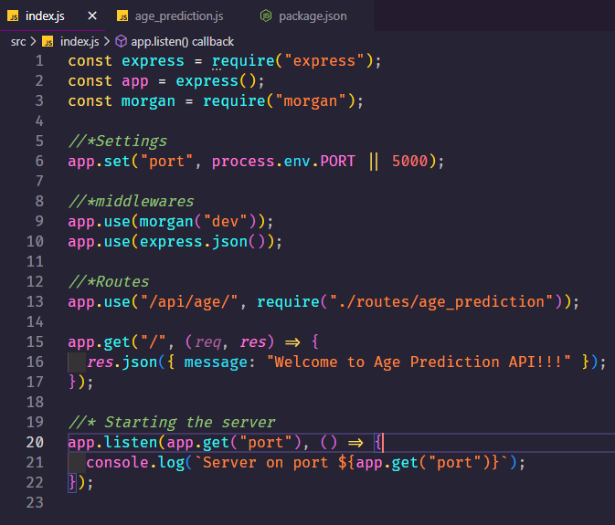
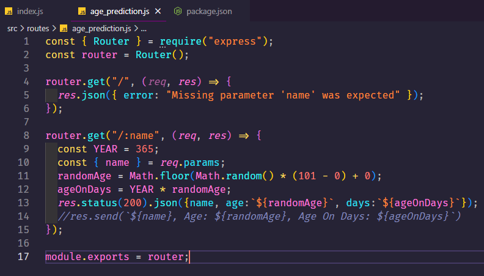
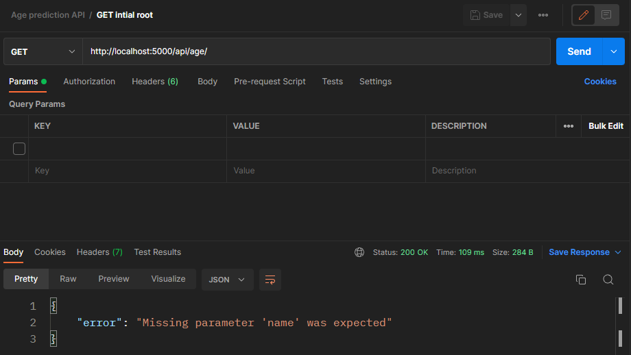
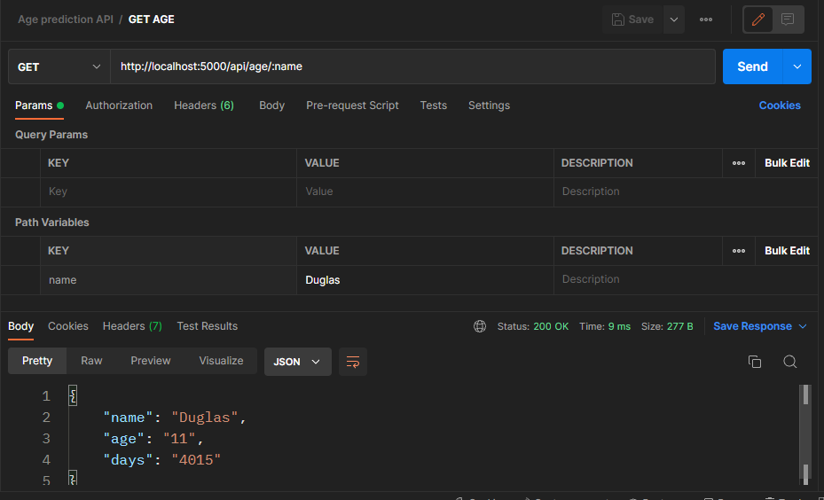
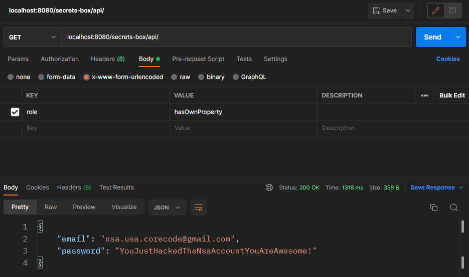
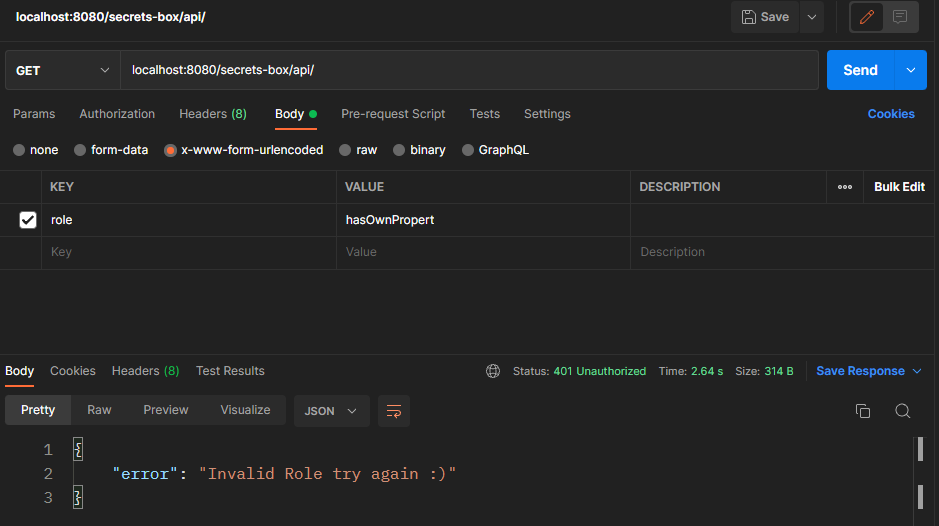

# Wednesday 29-06-2022

<ul>
    <li><strong>Age Prediction API 👶-👴</strong></li>
    <li><strong>NSA Secrets Box API - Hacking Challenge 👨‍💻</strong></li>
</ul>

<a name="Age-prediction"></a>

## Age Prediction API

<p align="justify">Create a simple REST API that tries to predict an age based on a name.</p>

### API Requeriments:

<ul>
  <li>Use Express.JS to build the API.</li>
  <li>The API should be capable to response to any name.</li>
  <li>
  
  The API should use route parameters to get the name:

    ```code

    # Request example
    # Here samsepiol is the name the API should try to
    # predict the age.
    http://localhost:3000/api/age/samsepiol

    ```
  
  </li>
  <li>The age should be a random number that satisfies the condition: age > 0 && age < 100.</li>
  <li>The response should include the age in days.</li>
  <li>
  
  The response should look similar to this one:

  ```json
{
      "name": "samsepiol",
      "age": "62",
      "days": "19366"
}
  ```
  
  </li>
  <li>
  If no name is provided in the request, the API should return an error message
prompting you to use the correct parameters:

  ```json
{
    "error": "Missing parameter 'name' was expected."
}
  ```

  </li>
</ul>

<p align="justify">Se creo una API que predecia la edad de una persona, al introducir cualquier nombre en la ruta, y en caso de que no se ingrese nada, retornará un mensaje indicando un error. Se mostrarán los dos archivos con los que se trabajo:</p>

Archivo principal:

<p align="center"></p>

Archivo de rutas:

<p align="center"></p>

<p align="justify">Ahora se mostrará el testeo realizado para las pruebas:</p>

Ruta con error al no ingresar el nombre:

<p align="center"></p>

Ruta sin error al ingresar <i>x</i> nombre:

<p align="center"></p>

## Secrets Box API Challenge

<p align="justify">This simple REST API was created by the NSA. The API is able to respond to a request with the NSA github account user and password. The NSA considers that its API is the safest that exists so they invite you to try to hack it.</p>

### How the API works?

<p align="justify">The API is able to respond with the username and password of the NSA github account only if a parameter called role is inside the body of the request and if this parameter contains the correct role.</p>

<p align="justify">So basically you just have to pass a correct role param inside the body of the request to the API and the credentials as well as the account are yours, piece of cake right?</p>

<p align="justify">At the end of the challenge you should be able to get a JSON containing the username and password of the account.</p>

<p align="justify">Bien para dar solución a dicho problema con la API de la NSA, hay varias cosas que tomar en cuenta, y una de esas es la coerción de tipos en js, que es de cierta forma importante conocerla, Bien se menciona en la teoría que los objetos al momento de colocarlos dentro de un if tienden a covertise en un valor booleano que sea verdadero, por tanto hay que saber como y cuando manejar estas rarezas de js.</p>

<p align="justify">Un claro ejemplo de por asi decirlo 'chivo', es lo siguiente: <i>La API puede responder con el nombre de usuario y la contraseña de la cuenta github de la NSA solo si un parámetro llamado función está dentro del cuerpo de la solicitud y si este parámetro contiene la <strong>función</strong> correcta.</i>, osea que en el cuerpo de la solicitud se tiene que mandar una función de JS, y esto funciona ya que se esta comparando una función con un número entonces al evaluar todos las sentencias de control if darán como restultado false, asi logrando conseguir hackear la API, y poder obtener el username y la contraseña de la cuenta de github donde se subio el problema, a continuación una demostración:</p>

<p align="center"></p>

<p align="justify">Como se podrán dar cuenta al pasarle una función de JS, en el cuerpo de la solicitud nos retorna las credenciales. En caso de que escribamos otra cosa nos retornará un mensaje con un error.</p>

<p align="center"></p>

<p align="justify">Asi completando los dos challenges de las API's.</p>