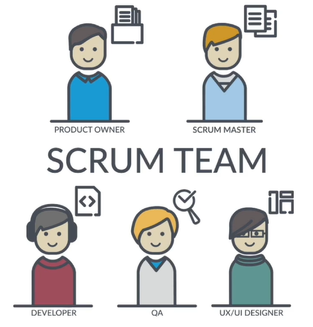
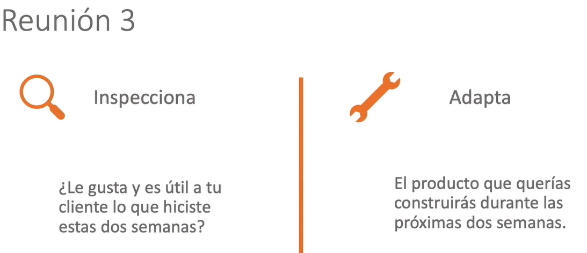
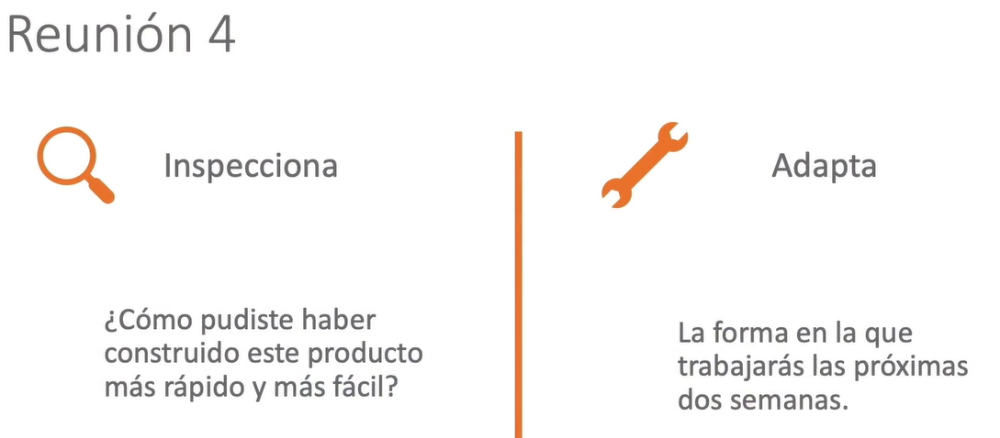
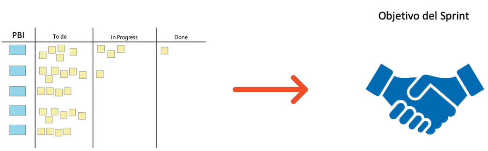

# Thursday 19-05-2022

<ul>
  <li><a href="#tile"><strong>Tile exercise, using Typescript</strong></a></li>
  <li><a href="#time"><strong>Time exercise, using Typescript</strong></a></li>
  <li><a href="#rational"><strong>Rational exercise, using Typescript</strong></a></li>
  <li><a href="complete"><strong>Complete your 4th Core Challenge - 100% Completed.</strong></a></li>
</ul>

<a href="tile"></a>

## Tile exercise, using Typescript

<p align="justify">Se tiene que crear una clase para verificar su funcionamiento. A continuación las instrucciones:</p>

<ol>
  <li>Escribir una definición para una clase nombrada Tile que represente fichas de Scrabble. Las variables de instancia deben ser de tipo string para la variable letter y de tipo number para la variable value.☑️</li>
  <li>Escribir un constructor que tome los parámetros nombrados letter y value e inicialice las variables de instancia.☑️</li>
  <li>Escribir un método llamado printTile que imprima las variables de instancia en un formato reader-friendly(no en el formato {...}).☑️</li>
  <li>No se preocupe, no tiene que verificar si la letra no tiene más de una longitud de cadena.☑️</li>
  <li>Puede usar esta Mainclase para probar su código.☑️</li>
</ol>

<p align="justify">Como salida de código se tiene la clase armada:🎢</p>

```typescript
export class Tile{
  letter:string;
  value:number;
  constructor( letter:string, value:number){
    this.letter = letter;
    this.value = value;
  }

  printTile(){
    console.log(`
    ==================
    Letter: ${this.letter}
    Value: ${this.value}
    ==================`);
  }
}
```

<a href="time"></a>

## Time exercise, using Typescript

<p align="justify">Se tiene que crear una clase para verificar su funcionamiento. A continuación las instrucciones:</p>

<ol>
  <li>Escribir una definición para el nombre de clase Time que esta clase usaría para construir un reloj digital. Esta clase debe tener 3 atributos de tipo número. hour, minutey second.☑️</li>
  <li>Escribir un constructor que tome parámetros llamados hour e inicialice las variables de instancia minute y second.☑️</li>
  <li>Escribir un método llamado getInSeconds que devuelva un número que represente el tiempo real en la instancia representada en segundos.☑️</li>
  <li>Escribir un método llamado printTime que imprima las variables de instancia en un formato reader-friendly (no en el formato {...}).☑️</li>
</ol>

<p align="justify">Como salida de código se tiene la clase armada:🏭</p>

```typescript
export class Time {
  hour:number;
  minute:number;
  second:number;
  constructor(hour:number,minute:number,second:number){
    this.hour = hour;
    this.minute = minute;
    this.second = second;
  }

  printTime(){
    console.log(`
    ==================
    Hours: ${this.hour}
    Minutes: ${this.minute}
    Seconds: ${this.second}
    ==================
    `);
  }

  getInSeconds(): number{
    return this.hour * 3600 + this.minute * 60 + this.second;
  }
}
```

<a href="rational"></a>

## Rational exercise, using Typescript

<p align="justify">Un número racional es un número que se puede representar como la razón de dos números enteros. Por ejemplo, 2/3 es un número racional y puedes pensar en 7 como un número racional con un 1 implícito en el denominador (7/1). Para esta tarea, escribirá una definición de clase para números racionales.</p>


<p align="justify">Se tiene que crear una clase para verificar su funcionamiento. A continuación las instrucciones:</p>

<ol>
  <li>Cree una nueva clase llamada Rational. Un objeto de Rational debe tener dos variables de instancia numéricas para almacenar numerator y denominator.☑️</li>
  <li>Escribir un constructor para su clase que tome dos argumentos y los use para inicializar las variables de instancia.☑️</li>
  <li>Escriba un método llamado printRational que imprima el objeto en algún formato razonable.☑️</li>
  <li>Escribir un método llamado invertir que invierta el número intercambiando el numerador y el denominador. Este método debería modificar las variables de instancia.☑️</li>
  <li>Escribir un método llamado toFloat que convierta el número racional en un número de coma flotante y devuelva el resultado. Este método es una función pura , no modifica el objeto.☑️</li>
  <li>Escriba el método llamado reduce que reduce un número racional a sus términos más bajos al encontrar el máximo común divisor (MCD) del numerador y el denominador y dividir. Este método debería modificar las variables de instancia. Para calcular el GCD puedes buscar Euclidian Algorithm: GCD.☑️</li>
</ol>

<p align="justify">Como salida de código se tiene la clase armada::
🌅</p>

```typescript
export class Rational {
  numerator: number; 
  denominator:number;
  constructor(numerator: number, denominator:number){
    this.numerator = numerator;
    this.denominator = denominator;
  }

  printRational(){
    console.log(`${this.numerator} / ${this.denominator}`);
  }

  invert ():void {
    let aux = this.numerator
    this.numerator = this.denominator
    this.denominator = aux;
  }

  toFloat():number {
    return (this.numerator/this.denominator);
  }

  gcd(n:number, d: number):number{
    if(d === 0 ) return n;
    return this.gcd(d,n%d);
  }

  reduce(){
    const gcd = this.gcd(this.numerator, this.denominator);
    this.numerator = this.numerator / gcd;
    this.denominator = this.denominator / gcd;
  }
}
```

<a href="complete"></a>

## Scrum

<p align="justify">Tomaremos el curso de Scrum y apuntaremos los conceptos de Scrum.</p>

<p align="justify">Cuando se quiere crear un producto básicamente se tiene 3 problemas:</p>

<p align="center">

</p>

1. 쯈ué es lo que se tiene que construir? Se necesita construir el producto correcto para dar solución al problema propuesto.

2. 쮺칩mo lo construyó? Al final se tendrá que construir, pero puede que tampoco sepa al principio del proyecto como construirlo.

3. 쮺칩mo logro salir a tiempo? Se tiene que salir a tiempo y aprovechar las oportunidades en la ventana del mercado.

Consideraciones:

- Cuando uno como persona ya entienda como innovar y como tener éxito, puede elaborar un producto complejo.

- 쯃ograste solucionar el problema que ibas a resolver?

- Se trata de darle valor a nuestros usuarios finales, y la misma pregunta lograste resolver el problema de tus clientes, y la respuesta es muy simple, 쯉I o NO?.

<p align="justify">Scrum es mucho mas que darle los roles a las personas o de que se va entregar, o como, sino que la mayoria de veces se trata de lograr un cambio en la forma de pensar.</p>

<p align="justify">Nuestros equipos necesitan tener un objetivo especifíco de cual es el problema que necesito resolver.</p>

<p align="justify">A su vez, iterativamente se puede elaborar el producto para resolver dicho problema, pero no es de realizar un plan, y luego comenzar ciegamente a construir y construir lo que se menciono que se iba a realizar, sino de hacer entregas parciales del producto que se desea hacer.</p>

<p align="justify">Reutilizando información de cada iteración, volviendo a replantear si el consumidor esta satisfecho con el producto. En caso de que no ajustando los parámetros y evitando los errores.</p>

<p align="justify">Varios proyectos tienen un control de proceso definido. Scrum es para cualquier tipo de proyecto, ya que se adapta al proyecto para poder ir creando el producto final.</p>


<p align="justify">Con Scrum se busca la mejora continua del proyecto para una buena entrega final del producto.</p>


<p align="center">

</p>

<p align="justify">Aplicando Kaizen</p>


<p align="center">

</p>

<p align="justify">Basado en control empírico</p>


<p align="center">

</p>

<p align="justify">Se puede planear, pero para planear se inspecciona todo el ambiente y se adapta el plan a lo que se logra observar en el ambiente, inspección y adaptación son dos de los tres pilares. Solo funciona cuando es Transparente, osea solo se puede inspeccionar algo cuando es transparente para nosotros.</p>

<p align="justify">Los pilares de Scrum son:</p>

<p align="center">

</p>

<p align="justify">Algunos conceptos se encuentran basados en las ideas de Lean:</p>

<p align="center">

</p>

<p align="justify">Minimización de desperdicio</p>

<p align="center">

</p>

<p align="justify">Arreglo de los errores.</p>

<p align="center">

</p>

<p align="justify">Eficiencia de trabajo.</p>

<p align="center">

</p>

<h2>Ser Ágil</h2>

<p align="justify">Basado en cambio de cultura empresarial, de vivir 4 valores y ser guiado por 12 principios, eso significa ser ágil. Logrando un trabajo más rápido con un alto valor para el producto final. Hay muchos marcos de trabajo que nos permite ser ágiles tambien.</p>

<p align="justify">Se tienen cuatro valores ágiles:</p>

<ul>
  <li>Individuos e interacciones sobre Procesos y herramientas</li>
  <li>Software funcionando sobre Documentación extensiva</li>
  <li>Colaboración con el cliente sobre Negociación Contractual</li>
  <li>Respuesta ante el cambio sobre Seguir el plan</li>
</ul>

<p align="justify">El producto que se esta haciendo es el software a entregar. Por lo tanto debe estar bien elaborado, y cumpliendo con los cuatro valores ágiles.</p>

<p align="center">

</p>

<p align="justify"><strong>Los 12 principios en los que soporta el manifesto ágil:</strong></p>

<ol>
  <li><p align="justify">Nuestra mayor prioridad es satisfacer al cliente mediante la entrega temprana y continua de software con valor.</p></li>
  <li><p align="justify">Aceptamos que los requisitos cambien, incluso en etapas tardías del desarrollo. Los procesos Ágiles aprovechan el cambio para proporcionar ventaja competitiva al cliente.</p></li>
  <li><p align="justify">Entregamos software funcional frecuentemente, entre dos semanas y dos meses, con preferencia al periodo de tiempo más corto posible.</p></li>
  <li><p align="justify">Los responsables de negocio y los desarrolladores trabajamos juntos de forma cotidiana durante todo el proyecto.</p></li>
  <li><p align="justify">Los proyectos se desarrollan en torno a individuos motivados. Hay que darles el entorno y el apoyo que necesitan, y confiarles la ejecución del trabajo.</p></li>
  <li><p align="justify">El método más eficiente y efectivo de comunicar información al equipo de desarrollo y entre sus miembros es la conversación cara a cara.</p></li>
  <li><p align="justify"></p>El software funcionando es la medida principal de progreso.</li>
  <li><p align="justify">Los procesos Ágiles promueven el desarrollo sostenible. Los promotores, desarrolladores y usuarios debemos ser capaces de mantener un ritmo constante de forma indefinida.</p></li>
  <li><p align="justify">La atención continua a la excelencia técnica y al buen diseño mejora la Agilidad.</p></li>
  <li><p align="justify">La simplicidad, o el arte de maximizar la cantidad de trabajo no realizado, es esencial.</p></li>
  <li><p align="justify">Las mejores arquitecturas, requisitos y diseños emergen de equipos auto-organizados.</p></li>
  <li><p align="justify">A intervalos regulares el equipo reflexiona sobre cómo ser más efectivo para a continuación ajustar y perfeccionar su comportamiento en consecuencia.</p></li>
</ol>

<h2>Equipo de Scrum</h2>
<p align="justify">No puede estar conformado por más de 10 personas. Se tendrán diferentes personas con diferentes responsabilidades.</p>

<p align="center">

</p>

### Product Owner:

<p align="justify">Es la persona encargada de definir que construir, pero no es el principio de que construir y luego soltar sino de todo el tiempo de estar construyendo y haciendo entregas parciales, además de ser el encargado de entender la repercusión positiva o negativa que tuvo x producto en los usuarios para luego realizar los ajustes necesarios sobre el producto para que al finalizar el proyecto el producto sea lo que tenia que ser para darle <strong>valor</strong> al usuario final.</p>


### Scrum master:

<p align="justify">Nos ayuda a salir a tiempo y pegarle a la ventana temporal, ayudando al equipo de Scrum y a la organización a implementar Scrum tal y como esta descrito en la guía de Scrum. Ayudando a que se den mejoras continuas, apoyando al product owner con ciertas técnicas de facilitanción y al resto del equipo de Scrum realizando mejoras.</p>

### Developer:

<p align="justify">Ayuda a construir el producto, sin importar si la persona es desarrollador de sistemas, ventas, o de recursos humanos, no importa la disciplina de la persona, sino que la persona se encuentra en el equipo construyendo el producto a crear, será llamado developer. Sin jefes ni jerarquías.</p>

<p align="center">

</p>

<p align="justify">Este equipo es multi funcional, y es auto gestionado.</p>

<ul>
  <li>Multi Funcional: 
  <p align="justify">Va a tener todas las habilidades necesarias para construir el producto que se quiere crear.</p>
  </li>
  <li>Auto Gestionado:
  <p align="justify">Cuentan con absolutas facultades para la toma de decisiones y el control del proyecto.</p>
  </li>
</ul>

### Eventos de Scrum:

<p align="center">

</p>

<p align="justify">쯈ué es lo que quiero desarrollar?, Un software para que el usuario final pueda consumirlo.</p>

<p align="justify">쮺칩mo es lo que quiero desarrollar?, Definiendo en que lenguaje de programación se adaptará mejor el proyecto, y pensando como hacerlo funcional para el usuario final.</p>

<p align="justify">쯇or qué lo quiero desarrollar?, Por que será un software que el usuario podrá utilizarlo de manera fácil, con interacciones altas y precisas.</p>

<p align="justify">Definiendo un tiempo limite de 2 semanas para cada entrega parcial del proyecto.</p>

<p align="center">

</p>

<p align="justify">Sino están funcionando las estrategias anteiormente planteadas, se tendrán que realizar adaptaciones en la estrategia, en la forma de trabajo y en el plan de trabajo de como se harán las cosas hoy.</p>

<p align="justify">Si el plan realizado anteriormente no funciona, se realizan los cambios dinámicos para que el proyecto siga en marcha y no se tenga problemas para seguir avanzando con el proyecto.</p>

<p align="center">

</p>

<p align="justify">En caso de que al usuario final, no le guste el software, se tomarán las debidas indicaciones y realizar los cambios dinámicos necesarios, para que la próxima entrega, se encuentre mejor de lo que se habia entregado anteriormente.</p>

<p align="center">

</p>

<p align="justify">Ya no nos preguntamos el que, sino el como, 쮺칩mo poder mejorar el software?, si hubieron sorpresas, 쯖칩mo las superaste para no quedar estancado?, seguir avanzando en el resto de software y seguir avanzando.</p>

<ol>
  <li>Spring Planning - Reunión 1</li>
  <li>Daily Scrum - Reunión 2 (pasa todos los dias)</li>
  <li>Spring Review - Reunión 3</li>
  <li>Spring retrospective - Reunión 4</li>
</ol>

<p align="justify">Todas estas reuniones deben suceder durante un sprint. Donde el sprint es el contenedor del resto de eventos, todos los eventos pasan dentro del sprint.El sprint en sí, también es un evento, por ello en Scrum se tienen 5 eventos.</p>

### Valores de Scrum:

<p align="justify">valores propios, con equipos hiper productivos, con los 5 valores:</p>

<ol>
  <li>
  <h4>Respeto:</h4>
  <p align="justify">En caso de fallar en alguna funcionalidad o alguna parte del proyecto, que el resto del equipo respete y nos apoye. Esto también es llamado tener un equipo psicológicamente seguro. Siendo un ambiente colaborativo y muy respetuoso entre el equipo.</p>
  </li>
  <li>
  <h4>Coraje:</h4>
  <p align="justify">Se necesita coraje en el grupo para expresar ideas, y en caso de no estar de acuerdo con la idea de algun integrante del grupo, hablar con coraje y respeto dando su punto de vista u opinión de como mejorar o implementar una mejor idea de como realizar x proceso en una x situación.</p>
  </li>
  <li>
  <h4>Apertura:</h4>
  <p align="justify">En caso de que no le parezca una idea o algún proceso a un integrante ser abiertos a no solo escuchar la nueva idea, también si existe algún problema ser transparente y comentar que se tiene un x problema, y pedir ayuda.</p>
  </li>
  <li>
  <h4>Compromiso:</h4>
  <p align="justify">Compromiso para lograr, lo que un integrante del equipo dijo que iba a hacer en una iteración o durante el sprint.</p>
  </li>
  <li>
  <h4>Foco:</h4>
  <p align="justify">Divide y vencerás, en caso de tener un problema grande, no se quiere que el equipo completo se enfoque en resolverlo, tomar el gran problema y dividirlo en problemas mas pequeños, seccionando cada problema para ciertos integrantes del grupo, iterativamente resolviendo un x problema enfocados solo en dicho problema, y para la siguiente iteración enfocandosé en otro x problema del problema grande.</p>
  </li>
</ol>

<p align="center">

</p>

### Artefactos de Scrum:

<p align="justify">Existen 3 artefactos en Scrum:</p>

<ol>
  <li>Product Backlog</li>
  <li>Sprint Backlog</li>
  <li>Incremento</li>
</ol>

#### Product Backlog

<p align="center">

</p>

<p align="justify">Es como la lista de requerimientos que queremos construir, aun así es mucho más que eso. Posee características de un ser vivo, cambiando todo el tiempo. En la parte superior se encuentra los requerimientos que se van a construir primero, y probablemente a salir primero al usuario final, y los que están hasta abajo son los que se construirán de último y probablemente van a salir de último a nuestro usuario final.</p>

<p align="justify">Decir que está vivo se refiere a que es algo que estará todo el tiempo cambiando, teniendo nuevas ideas, ingresando nuevos requerimientos que no se tenia antes, eliminando cosas que se percató el equipo que cierta funcionalidad no le parecio mucho al cliente, y eliminarla junto con las funcionalidades parecidas. Refinando todos sus elementos.</p>

<p align="justify">Recientemente agregado el objetivo del producto, pensando en grandes rasgos en una pequeña frase que describe <strong>que es todo ese producto</strong>, es muy poderoso ya que en una pequeña frase da a entender cual es el objetivo de todo el product Backlog. Alineando los equipos en la misma direección.</p>

#### sprint Backlog

<p align="center">

</p>

<p align="justify">Como construyó x product backlog item, de una pequeña lista que tome de todos los  product's backlog item disponibles, Describiendo todos los pasos de como construir el x product backlog item, osea que cada uno de estos se "quebrará en tareas", En general es el plan inicial que se comprometio a construir el incremento (conjunto de product backlog items).</p>

Un pequeño parentésis

<strong>Definion of Done:</strong>
<p align="justify">Será un checkList por el cual pasan <Strong>todos </Strong>los elementos pasarán por el mismo checkList, esto dependerá de la empresa en que se encuentre, del producto que se pretende elaborar, existen regulaciones gubernamentales en la empresa donde se labora, existen estandáres de calidad bien definidos, asegurandonos de cumplir con todos los estandáres en cuestiones de regularidad y de calidad. De forma general sirve para asegurarse de que antes de despegar el producto al usuario final, cumple con todos los estandáres deseados.</p>

#### Incremento

<p align="center">

</p>

<p align="justify">Es lo que los desarrolladores lograron llevar ha estar terminado, un ejemplo que se da es los 5 product Backlog items que el equipo podría haber dicho que se iban a entregar, y pueden ocurrir dos casos, el caso donde se entreguen los 5 product Backlog items, o el caso donde se entreguen menos de los 5 product Backlog items que se habia dicho que se iban a entregar, y solo se entregan los que se tengan 100% listos no más no menos. Esto quiere decir que el compromiso que se tuvo al iniciar con el sprint planning aunque no siempre es así. Cumpliendo con el <strong>definition of done</strong>.</p>

#### 3-5-3

<p align="justify">3 roles, 5 eventos, y 3 artefactos.</p>

<p align="justify">De primero tenemos al product owner, encargado de estar hablando todo el tiempo con los clientes, directivos, personas interesadas para ir entendiendo cuales son las necesidades que se tienen, recopilando información e ir cambiando constantemente, haciendo y refinando lo que se llama el product backlog, ojo, se tiene que tener un buen product backlog para comenzar el sprint sin problemas. Esto para evitar tener problemas durante el sprint, ya que se tenga el product backlog, se comienza con el sprint planning, esta seria la primera reunión, en esta parte arranca el sprint</p>

<p align="justify">Un sprint puede durar de 1 a 4 semanas, la mayoria de equipos normalmente usa dos semanas, dicha reunion para un sprint de 4 semanas puede durar máximo 8 horas, si el sprint es de la mitad el tiempo, la reunión debería de ser también de la mitad del tiempo.</p>

<p align="justify">En dicha reunión lo que se hace es entender todo lo que hay que hacer del product backlog y lograr entender y decidir cual va a ser el incremento que el equipo de scrum va a lograr construir durante este sprint. También se el puede llamar la cantidad de product backlong item's que los developers sus capaces de llevar hasta el status de terminado durante el sprint.</p>

<p align="justify">Entender que va a ser el increment es fundamental, y luego en esa misma reunión ya se puede definir, como se va a construir, este vendría siendo el sprint backlog, teniendo las nociones de tener un plan pre-eliminar que puede irse cambiando, de como lograr construir el incremento.</p>

<p align="justify">También en este punto debemos obtener el objetivo del por que construir x producto. Luego de esto, arrancamos y todos los días empezamos a producir, se tendrá una reunión todos los dias llamada <strong>Daily Scrum</strong>, está reunión no debe jamás de ser de más de 15 minutos, aunque es raro ya que es la regla mas conocida de Scrum y la menos respetada. Si esto pasa en una organización, quiere decir que no han entendido para que sirve el daily Scrum.</p>

<p align="justify">El Daily Scrum, es una reunión que sirve para inspecccionar todos los días que tanto te estás acercando al incremento y sino te estás acercando lo suficientemente rápido, para cumplir que lo que se habia prometido entregar, entonces se debe de cambiar la forma de trabajo durante las próximas 24 hrs, adaptando el plan de trabajo osea el Sprint Backlog.</p>

<p align="justify">Al finalizar el sprint, se desea mostrar el producto a los interesados, state holders, a los usuarios (sprint review), que fue lo que se hizo. Recordando que todo es inspeccionar y adaptar, ya que no sirve de nada enseñar que fue lo que se hizo, si luego no se recolecta información necesaria para luego realizar los cambios necesarios en el product backlog. Basado en la data empírica de los usuarios. Esta reunión no debe de ser de más de 4 horas para un sprint de 4 semanas.</p>

<p align="justify">Se tiene otra reunión, que sería la sprint retrospective, sirve para que nosostros hablemos de como hicimos las cosas, 쯥erá que las hicimos bien?, 쯥erá que las hicimos mal?, 쯤ué errores se comentieron?, 쯤ué se puede hacer para que el próximo sprint no se tengan los problemas que se tuvieron?. Esta reunión no debe de ser de más de tres horas para un sprint de 4 semanas.</p>

<p align="justify">Esto es todo Scrum, de forma global.</p>

<p align="justify">Existe una reunión más y es la de product backlog refinement, y recordando que todo comienza con un buen product backlog, entonces es necesario que durante el sprint 1, se trabaje en el product backlog que va a entrar al sprint planning del sprint 2, es decir que iremos como que adelantados un sprint, esta es una actividad, no un evento formal de Scrum, pero es una actividad que se debe de tener para que en el siguiente sprint todo salga bien, y no se tenga problemas ni inconvenientes en el cual el product owner puede pedirle a los miembros del equipo que lo ayuden a refinar el product backlog, para que la próxima iteración no existan problemas.</p>
<p align="justify"></p>

<p align="center">

</p>

<a href="../README.md">Inicio</a>
