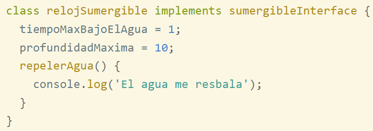
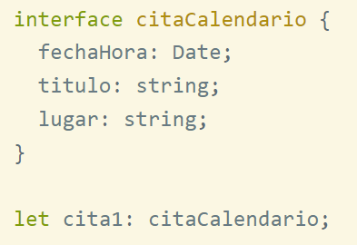
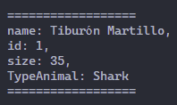
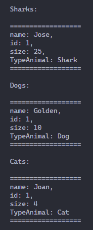

# Monday 23-05-2022

<ul>
  <li><a href="#input"><strong>Input/Output playground, using Typescript 💹</strong></a></li>
  <li><a href="#readme-exercise"><strong>Readme - OOP exercise</strong></a></li>
</ul>

<a name="input"></a>

## Readme - OOP exercise

## Readme - OOP exercise

<p align="justify">In your Readme or in a md file, you are going to create a OOP glossary, for this you are requested to first create a space of key-words, this would be the list for the key-words:</p>

### kEY-WORDS:

1. ABSTRACTION
2. INHERITANCE
3. POLYMORPHISM
4. ENCAPSULATION
5. CLASS
6. OBJECT
7. INSTANCE
8. INTERFACE
9. ACCES MODIFIERS
10. CONSTRUCTORS

### OOP glossary:

<ol>
  <li>
  <h4>ABSTRACTION:</h4>
  <p align="justify">Es un proceso de interpretación y diseño que implica reconocer y enfocarse en las carácterísticas importantes de una situación u objeto, y filtrar o ignorar todas las particularidades no esenciales.</p>
  <ul>
    <li><p align="justify">Dejar a un lado los detalles de un objeto y definir las características específicas de este, aquellas que lo distingan de los demás tipos de objetos.</p></li>
    <li><p align="justify">Hay que centrarse en lo que es y lo que hace un objeto, antes de decirdir como debería ser implementado.</p></li>
    <li><p align="justify">Se hace énfasis en el qué hace más que en el cómo lo hace.</p></li>
  </ul>
  </li>
  <li>
  <h4>INHERITANCE:</h4>
  <p align="justify">Es una propiedad que permite crear clases a partir de otras ya existentes, obtiendo características (métodos y atributos) similares a los ya existentes. En otras palabras la nueva clase (subclase o clase derivada) puede utilizar la misma inplementación de su superclase (clase base) o especificar una nueva implementación.</p>
  <ul>
    <li>Es la relación entre una clase general y otra clase más especifíca.</li>
    <li>Es un mecanismo que nos permite crear clases derivadas a partir de clases base.</li>
    <li>Nos permite compartir automáticamente métodos y datos entre clases, subclases y objetos.</li>
  </ul>
  </li>
  <li>
  <h4>POLYMORPHISM:</h4>
  <p align="justify">Son comportamientos diferentes, asociados a objetos distintos, pueden compartir el mismo nombre, al llamarlos por ese nombre se utilizará el comportamiento correspondiente al objeto que se esté usando.</p>
  <ul>
  <li><p align="justify">Es la característica de los objetos que les permite comunicación entre sí bajo la misma sintaxis.</p></li>
  <li><p align="justify">Un objeto aplica polimorfismo en el momento en el que sabe responder a un mensaje.</p></li>
  <li><p align="justify">Es una consecuencia de la herencia y la abstracción, y facilita implementar comportamientos distintos para elementos que siguen una jerarquía de definiciones.</p></li>
  </ul>
  </li>
  <li>
  <h4>ENCAPSULATION:</h4>
  <p align="justify">Define las reglas en las cuales se les permite a los objetos interactuar, Limita la herencia y el acceso a la información de cada instancia, limitando la interferencia y manteniendo la integridad.</p>
  <ul>
  <li><p align="justify">Permite asegurar que la infromación de un objeto está oculta del mundo exterior.</p></li>
  <li><p align="justify">Consiste en agrupar en una clase las características (atributos) con un acceso privado y los comportamientos (métodos) con un acceso público.</p></li>
  <li><p align="justify">Acceder o modificar los miembros de una clase a través de sus métodos.</p></li>
  </ul>
  </li>
  <li>
  <h4>CLASS:</h4>
  <p align="justify">La clase es un <strong>modelo</strong> o prototipo que define las variables y m'etodos comunes a todos los objetos de cierta clase. También se puede mencionar que una clase es una <strong>plantilla genérica</strong> para un<strong> conjunto de objetos</strong> de similares características.</p>
  <ul>
  <li><p align="justify">Una clase define el estado y el comportamiento que todos los objetos creados a partir de esa clase tendrán.</p></li>
  </ul>
  </li>
  <li>
  <h4>OBJECT:</h4>
  <p align="justify">Se trata de un ente abstracto (orientado a objetos reales) usado en programación que permite separar los diferentes componentes de un programa, simplificando así su elaboración, depuración y posteriores mejoras.</p>
  <ul>
  <li><p align="justify">Un objeto es una instancia de una clase.</p></li>
  </ul>
  </li>
  <li>
  <h4>INSTANCE:</h4>
  <p align="justify">En un lenguaje en el que <strong>cada objeto es creado a partir de una clase</strong>, un objeto es llamado una instancia de esa clase. Cada objeto pertenece a un tipo y dos objetos que pertenezcan a la misma clase tendrán el mismo <strong>tipo de dato</strong>.</p>
  <ul>
  <li><p align="justify">En otras palabras, un objeto puede ser creado instanciando una clase.</p></li>
  </ul>
  </li>
  <li>
  <h4>INTERFACE:</h4>
  <p align="justify">Es una especie de plantilla para la construcción de clases. Normalmente una interface se compone de un conjunto de declaraciones de cabeceras de métodos (sin implementar, de forma similar a un método abstracto) que especifícan un protocolo de comportamiento para una o varias clases.</p>
  <ul>
  <li><p align="justify">Las interfaces son una forma de especificar qué debe hacer una clase sin especificar el cómo.</p></li>
  <li><p align="justify">Tiene una semejanza con las clases abstractas, en el forma que no tiene sentido definir objetos instancia de una interfaz.</p></li>
  </ul>
  </li>
  <li>
  <h4>ACCESS MODIFIERS:</h4>
  <p align="justify">Los modificadores de acceso son palabras clave que se usan para especificar la accesibilidad declarada de un miembro o un tipo. Son un mecanismo por el cual se permite hacer visibles o no, atributos y métodos de una clase. Se presentan cuatro modificadores de acceso:</p>
  <ul>
  <li><p align="justify">Private: Este modificador restringe la visibilidad de los atributos de la clase sólo a esta clase.</p></li>
  <li><p align="justify">Public: la propiedad o método es accesible desde cualquier método de otra clase.</p></li>
  <li><p align="justify">Protected: Hace visible atributos entre clases padre e hijas, pero los hace no-visibles al resto del mundo.</p></li>
  <li><p align="justify">Readonly: como su nombre lo indica, permite sólo la lectura de un atributo ya que, en caso de querer modificarlo el código arrojaría un error.</p></li>
  </ul>
  </li>
  <li>
  <h4>CONSTRUCTORS:</h4>
  <p align="justify">Un constructor es una subrutina cuya misión es inicializar un objeto de una clase. Al utilizar un constructor, el compilador determina cuál de los dos objetos va a responder al mensaje (virtual) que se ha creado.</p>
  <ul>
  <li><p align="justify">Es un método especial de una clase que se llama automáticamente siempre que se declara un objeto de esa clase.</p></li>
  <li><p align="justify">Sirve para asegurarnos que los objetos siempre contiene valores válidos.</p></li>
  </ul>
  </li>
</ol>

<a name="readme-exercise"></a>

## Example

<p align="justify">Create a guide showing an example on how to use OOP in typescript, for now your example should show the use of classes, objects, encapsulation, access modifiers, instances and interfaces.</p>

<p align="justify">Empecemos la guía de como usar POO en TypeScript, y empezaremos creando una clase, y será una clase sencilla, en este caso tendremos la clase Persona:</p>

```typescript
class Person {
  name: string;
  last_name: string;
  age: number;

  constructor(name: string, last_name: string, age: number) {
    this.name = name;
    this.last_name = last_name;
    this.age = age;
  }

  toString():void {
    console.log(`
==============
Name: ${this.name},
Last name: ${this.last_name},
Age: ${this.age}
==============
    `);
  }
}
```

<p align="justify">Esta clase es una plantilla para crear varios objetos a partir de ella, dentro de la clase se puede colocar a sus variables un modificador de acceso, en este caso por default, las propiedades name, last_name, age, son de acceso público. Los métodos constructor y toString, tambíen son públicos por defecto.</p>

<p align="justify">Posee también su método constructor para inicializar las variables de la clase.</p>

<p align="justify">Ahora antes de seguir avanzando, hablaremos acerca de las interfaces, un poco más a profundidad.</p>

### interfaces

<p align="justify">Son un mecanismo de la POO, que trata de suplir la carencia de herencia múltiple. La mayoría de los lenguajes que implementan POO, no ofrecen la posibilidad de definir una clase que extienda varias clases a la vez y sin embargo a veces es deseable, y ahí es donde entran las interfaces. En typeScritpt las podemos usar de dos maneras: </p>

<ol>
  <li>
  Implementando una interfaz: 
  <p align="justify">Una vez definida la interfaz, se puede implementar en todas las clases que se desee mediante la palabra "implements" en la cabecera de la clase.</p>
  <p align="center"></p></li>
  <li>
  Interfaz como un nuevo tipo:
  <p align="justify">TypeScript nos ofrece una aplicación adicional de las interfaces: la creación de un nuevo tipo que podemos usar a lo largo de nuestro código.</p>
  <p align="center"></p></li>
</ol>

Mas información acerca de las <a href="https://desarrolloweb.com/articulos/definicion-interfaces-typescript.html">interfaces</a> en Typescript.

<p align="justify">Ahora con dicha información, se hará un ejemplo un tanto más complejo. Donde se implementará una interface y se usa en varias clases, la interface será de un animal, y las clases Tiburón, Perro y Gato implementarán de ella.</p>

<p align="justify">La interface tendrá un tipo de animal, y tres métodos más los cuales son: locomotion, eat y sound, hay que recordar que las interfaces declara que se hará en vez de comó se hará. Se muestra la interface <strong>Animal</strong> a continuación:</p>

```typescript
export interface Animal {
  typeAnimal: string;
  locomotion(): void;
  eat(): void;
  sound(): void;
}
```

<p align="justify">Ahora, importaremos la interface al módulo donde se encuentra la clase Shark, y se crearán todas las propiedades y métodos necesarios, y además de eso, se implementará la interface Animal en la clase Shark.</p>

```typescript
import { Animal } from "./Animal";

export class Shark implements Animal{

  public name: string;
  private static id_s = 0;
  private id = 0;
  protected size: number;
  readonly typeAnimal = "Shark";

  constructor(name:string, size: number){
    this.name = name;
    this.size = size;
    this.id = ++Shark.id_s;
  }

  locomotion(): void {
    console.log("I'm swim!!!")
  }

  eat(): void {
    console.log("seal dipper to eat")
  }

  sound(): void {
    console.log("My shark sound is: arrgghh")
  }

  public get getID() : string {
    return this.id.toString();
  }

  printPresentation():void {
    console.log(`
==================
name: ${this.name},
id: ${this.getID},
size: ${this.size.toString()},
TypeAnimal: ${this.typeAnimal}
==================
    `);
  }
}
```

<p align="justify">En los atributos de la clase se puede ver lo siguiente:</p>

```typescript
public name: string;
private static id_s = 0;
private id = 0;
protected size: number;
readonly typeAnimal = "Shark";
```

<ol>
  <li>
  <h4>Público:</h4> 
  <p align="justify">Ya se había hablado del método público, al tenerlo se puede acceder al atributo o método desde cualquier lugar de la clase o desde otro módulo.</p></li>
  <li>
  <h4>Privado:</h4>
  <p align="justify">El modificador privado puede acceder al atributo o método solamente en la clase.</p></li>
  <li>
  <h4>Protected:</h4>
  <p align="justify">El modificador protected nos encapsula la información a la clase padre y sus clases derivadas.</p></li>
  <li>
  <h4>Readonly:</h4>
  <p align="justify">El modificador readonly solo nos deja ver el valor o resultado de los atributos o métodos, y no modificarlos.</p></li>
</ol>

<p align="justify">Bien, ahora mostraremos las otras dos clases, Dog y Cat que implementan la interface Animal, y realizan los mismos métodos:</p>

### Clase Dog

```typescript
import { Animal } from "./Animal";

export class Dog implements Animal{

  public name: string;
  private static id_s = 0;
  private id = 0;
  protected size: number;
  typeAnimal = "Dog";

  constructor(name:string, size: number){
    this.name = name;
    this.size = size;
    this.id = ++Dog.id_s;
  }

  locomotion(): void {
    console.log("I run on four legs!!!")
  }

  eat(): void {
    console.log("I eat kibble")
  }

  sound(): void {
    console.log("My dog sound is: goaf goaf")
  }

  public get getID() : string {
    return this.id.toString();
  }

  printPresentation():void {
    console.log(`
==================
name: ${this.name},
id: ${this.getID},
size: ${this.size.toString()}
TypeAnimal: ${this.typeAnimal}
==================
    `);
  }

}
```
### Clase Cat

```typescript
import { Animal } from "./Animal";

export class Cat implements Animal{

  public name: string;
  private static id_s = 0;
  private id = 0;
  protected size: number;
  readonly typeAnimal = "Cat";

  constructor(name:string, size: number){
    this.name = name;
    this.size = size;
    this.id = ++Cat.id_s;
  }

  locomotion(): void {
    console.log("I run on four legs!!!")
  }

  eat(): void {
    console.log("I eat fish")
  }

  sound(): void {
    console.log("My cat sound is: meow meow meow")
  }

  public get getID() : string {
    return this.id.toString();
  }

  printPresentation():void {
    console.log(`
==================
name: ${this.name},
id: ${this.getID},
size: ${this.size.toString()}
TypeAnimal: ${this.typeAnimal}
==================
    `);
  }
}
```

<p align="justify">Ya que terminamos de crear las clases y la interface, en otro módulo empezaremos a crear objetos (instancias de una clase), lo primero que se hará es importar cada una de las clases a utilizar:</p>

```typescript
import { Shark } from "./models/Shark";
import { Dog } from "./models/Dog";
import { Cat } from "./models/Cat";
```

<p align="justify">Ahora, creamos un objeto de tipo Shark, e imprimiremos sus datos:</p>

```typescript
const tiburon: Shark = new Shark("Tiburón Martillo",35);
tiburon.printPresentation()
```

<p align="justify">Como resultado se tiene:</p>

<p align="center"></p>

<p align="justify">Con la palabra reservada <strong>new</strong> estamos creando un nuevo objeto, osea se está instanciando la clase para el nuevo objeto.</p>

<p align="justify">Ahora con un ejemplo más largo</p>

<p align="center"></p>

<p align="justify">Con esto damos fin a la explicación de POO en Typescript.</p>


<a href="../README.md">Inicio</a>