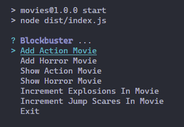

# Tuesday 24-05-2022

<ul>
  <li><a href="#menu"><strong>Menu exercise, using Typescript</strong></a></li>
  <li><a href="#movie"><strong>Movies exercise, using Typescript</strong></a></li>
</ul>

<a name="menu"></a>

## Menu exercise, using Typescript

**Instructions:**

You are working at a restaurant, your task is to create the main menu, here are the specifications of the menu. The menu should have the following food:

1. Soup
    * Wonton Soup (Chicken).... $2.25
    * Chicken Corn Soup.... $1.95
    * Vegetable Corn Soup... $2.25

2. Chef's Specials
    * Orange Beef.... $8.95
    * Kung Pao Shrimp.... $8.50

3. Chicken
    * Lemon Chicken.... $9.95
    * Sesame Chicken.... $9.95
    * Hunan Chicken.... $10.50

4. Beef
    * Pepper Steak.... $9.95
    * Manchurian Beef... $11.95

5. Beverages
    * Piña Colada.... $3.00
    * Spanish Coffee.... $5.50

...

<p>El resto de instruccciones se encuentra <a href="https://github.com/corecodeio/devguide-from-scratch-2022-02/tree/main/src/technologies/2022/week07/exercises/e02/desc">aqui</a></p>

<p align="justify">Bien siguiendo el resto de instrucciones se elaboraron las siguientes clases: Menu, MenuElements, y Main, como clase complementaria que se nos entregó para utilizar de una manera más sencilla es la clase: Input. Dicha clase nos abstrajo de una parte del uso de la líbreria <a href="https://www.npmjs.com/package/enquirer">enquirer</a>, la cual nos permite que la consola sea mas interactiva con el usuario final. Además de dicha líbrería se uso la librería <a href="https://www.npmjs.com/package/uuid">uuid</a>, que nos genera un id único(hash). Este se implemento para que cada menu tuviera un id único. A continuación mostramos las clases:</p>


Clase Input:

```typescript
import { prompt } from 'enquirer';

export type UserInput = { data: string };
export type UserFormInput = { data: any };
export type UserOption = { data: number };
export type UserOptionById = UserInput;
export type UserConfirm = { data: boolean };
export type Choice = { name: string; message: string };
export type SelectChoice = { option: number; message: string };
type Choices = Choice[] | string[];
type UserOptionAux = { data: string };
type SelectChoices = SelectChoice[];

export class Input {
  static async getInput(message: string): Promise<UserInput> {
    const input: UserInput = await prompt({
      type: 'input',
      name: 'data',
      message: message,
    });
    return input;
  }

  static async getForm(
    message: string,
    choices: Choices
  ): Promise<UserFormInput> {
    const input: UserFormInput = await prompt({
      type: 'form',
      name: 'data',
      message: message,
      choices: choices,
    });
    return input;
  }

  static async getSelect(
    message: string,
    choices: SelectChoices
  ): Promise<UserOption> {
    const input: UserOptionAux = await prompt({
      type: 'select',
      name: 'data',
      message: message,
      choices: choices.map((choice: SelectChoice) => ({
        name: choice.option.toString(),
        message: choice.message,
      })),
    });
    return { data: Number(input.data) };
  }

  static async getSelectById(
    message: string,
    choices: Choice[]
  ): Promise<UserOptionById> {
    const input: UserOptionById = await prompt({
      type: 'select',
      name: 'data',
      message: message,
      choices: choices,
    });
    return input;
  }

  static async getConfirm(message: string): Promise<UserConfirm> {
    const input: UserConfirm = await prompt({
      type: 'confirm',
      name: 'data',
      initial: false,
      message: message,
    });
    return { data: input.data };
  }
}
```

Clase MenuElements:

```typescript
import { v4 as uuidv4 } from 'uuid';

export class MenuElement {

    id: string;
    name:string;
    price:number;
    emoji:string;

    constructor(name:string, price:number, emoji:string){
        this.id = uuidv4();
        this.name = name;
        this.price = price;
        this.emoji = emoji;
    }

    printOption(){
        return `${this.name}........${this.price}
        `;
    }
}
```

Clase Menu:

```typescript
import { Choice, Input, SelectChoice, UserOption } from "./Input";
import { MenuElement } from "./MenuElement";

export class Menu {
  mainMenu: SelectChoice[] = [];

  soupMenu: Choice[] = [];
  chefSpecialMenu: Choice[] = [];
  chickenMenu: Choice[] = [];
  beefMenu: Choice[] = [];
  beveragesMenu: Choice[] = [];

  soupOptions: MenuElement[] = [];
  chefSpecialsOptions: MenuElement[] = [];
  chickenOptions: MenuElement[] = [];
  beefOptions: MenuElement[] = [];
  beveragesOptions: MenuElement[] = [];

  constructor() {
    this.fillMainMenu();
    this.fillOptions();
    this.fillSubMenus();
  }

  fillMainMenu() {
    this.mainMenu = [
      { option: 1, message: "Soup" },
      { option: 2, message: `Chef's Specials` },
      { option: 3, message: "Chicken" },
      { option: 4, message: "Beef" },
      { option: 5, message: "Beverages" },
      { option: 6, message: "Exit" },
    ];
  }

  fillOptions() {
    this.soupOptions = [
      new MenuElement("Wonton Soup", 2.25, "🍜"),
      new MenuElement("Chicken Corn Soup", 1.95, "🌽"),
      new MenuElement("Vegetable Corn Soup", 2.25, "🥕"),
    ];

    this.chefSpecialsOptions = [
      new MenuElement("Orange Beef", 8.95, "🟠"),
      new MenuElement("Kung Pao Shrimp", 8.95, "🦐"),
    ];

    this.chickenOptions = [
      new MenuElement("", 9.95, "🍋"),
      new MenuElement("", 9.95, "🌱"),
      new MenuElement("", 9.95, "🈶"),
    ];

    this.beefOptions = [
      new MenuElement("Pepper Steak", 9.95, "🍖"),
      new MenuElement("Manchurian Steak", 9.95, "🥘"),
    ];

    this.beveragesOptions = [
      new MenuElement("Piña Colada", 3.0, "🥤"),
      new MenuElement("Spanish Coffee", 5.5, "『☕』"),
    ];
  }

  fillSubMenus() {
    this.soupMenu = this.soupOptions.map((e: MenuElement) => ({
      name: e.id,
      message: e.printOption(),
    }));

    this.chefSpecialMenu = this.chefSpecialsOptions.map((e: MenuElement) => ({
      name: e.id,
      message: e.printOption(),
    }));

    this.chickenMenu = this.chickenOptions.map((e: MenuElement) => ({
      name: e.id,
      message: e.printOption(),
    }));

    this.beefMenu = this.beefOptions.map((e: MenuElement) => ({
      name: e.id,
      message: e.printOption(),
    }));

    this.beveragesMenu = this.beveragesOptions.map((e: MenuElement) => ({
      name: e.id,
      message: e.printOption(),
    }));
  }

  async showMainMenu() {
    let opcion = -1;
    let entrada: UserOption;
    do {
      entrada = await Input.getSelect('Select a menu option', this.mainMenu);
      opcion = entrada.data;
      switch (opcion) {
        case 1:
          await this.showSubMenuOption('Select your soup', this.soupMenu, this.soupOptions);
          break;
        case 2:
          await this.showSubMenuOption(`Select your chef's Specials`, this.chefSpecialMenu, this.chefSpecialsOptions);
          break;
        case 3:
          await this.showSubMenuOption('Select your chicken', this.chickenMenu, this.chickenOptions);
          break;
        case 4:
          await this.showSubMenuOption('Select your beef', this.beefMenu, this.beefOptions);
          break;
        case 5:
          await this.showSubMenuOption('Select your beverages', this.beveragesMenu, this.beveragesOptions);
          break;
        case 6:
          console.log("Bye, regresa pronto!!!");
          break;
      }
    } while (opcion !== 6);
  }

  async showSubMenuOption(
    message: string,
    subMenu: Choice[],
    subMenuOption: MenuElement[]
  ) {
    const input = await Input.getSelectById(message, subMenu);
    const option = subMenuOption.find((e: MenuElement) => input.data == e.id);
    console.log(`\n
    =========================================================
    Here is your ${option?.emoji} at a ${option?.price} cost
    =========================================================
`);
  }
}
```

Clase Main:

```typescript
import { Menu } from "./Menu";
export class Main {
  async start() {
    const menu = new Menu();
    await menu.showMainMenu();
  }
}
```

Clase principal (index.ts):

```typescript
import { Main } from "./models/Main";

const main = new Main()
main.start()
```

<p align="justify">En esta última clase, osea la clase principal, nos sirve para solamente iniciar/arrancar el programa. Obteniendo el siguiente resultado:</p>

<p align="center">

</p>

## Movies exercise, using Typescript

**Instructions:**

You are working on a side project called Blockbuster, it is a simple project for now but It will be evolving through time. This project is basically to keep track of different movies, right now the scope is to keep track of action and horror movies.

<p>El resto de instruccciones se encuentra <a href="https://github.com/corecodeio/devguide-from-scratch-2022-02/tree/main/src/technologies/2022/week07/exercises/e03/desc">aqui</a></p>

<p align="justify">Bien siguiendo el resto de instrucciones se elaboraron las siguientes clases: Movie, ActionMovie, HorrorMovie, y Main, como clase complementaria que se nos entregó para utilizar de una manera más sencilla es la clase: Input. Dicha clase nos abstrajo de una parte del uso de la líbreria <a href="https://www.npmjs.com/package/enquirer">enquirer</a>, la cual nos permite que la consola sea mas interactiva con el usuario final. Además de dicha líbrería se uso la librería <a href="https://www.npmjs.com/package/uuid">uuid</a>, que nos genera un id único(hash). Este se implemento para que cada menu tuviera un id único. A continuación mostramos las clases:</p>

Clase Movie

```typescript
import { v4 as uuidv4 } from "uuid";

export class Movie {
  id: string = '';
  name: string;
  director: string;
  language: string;
  time: number;
  year: number;

  constructor(
    name: string,
    director: string,
    language: string,
    time: number,
    year: number
  ) {
    this.name = name;
    this.director = director;
    this.language = language;
    this.time = time;
    this.year = year;
    this.id = uuidv4();
  }
}
```

Clase ActionMovie

```typescript
import { Movie } from "./Movie";

export class ActionMovie extends Movie {
  explosions: number;
  guns: boolean;
  martialArts: boolean;
  constructor(
    name: string,
    director: string,
    language: string,
    time: number,
    year: number,
    explosions: number,
    guns: boolean,
    martialArts: boolean
  ) {
    super(name, director, language, time, year);
    this.explosions = explosions;
    this.guns = guns;
    this.martialArts = martialArts;
  }

  incrementExplosions(): void {
    this.explosions++;
  }

  expectGuns(): string {
    return this.guns ? "🔫" : "🙅‍♀️";
  }

  expectMartialArts(): string {
    return this.martialArts ? "🥋" : "🙅‍♂️";
  }

  printActionMovie(): void {
    console.log(`
===============================
Name: ${this.name},
Release Year: ${this.year},
Director: ${this.director},
Language: ${this.language},
Running Time: ${this.time}
Explotions: ${this.explosions}
Guns: ${this.expectGuns()}
Martial Arts: ${this.expectMartialArts()}
===============================
    `);
  }
}
``` 

Clase HorrorMovie

```typescript
import { Movie } from "./Movie";

export class HorrorMovie extends Movie {
  jump_scares: number;
  ghosts: boolean;
  visions: boolean;
  constructor(
    name: string,
    director: string,
    language: string,
    time: number,
    release_year: number,
    jump_scares: number,
    ghosts: boolean,
    visions: boolean
  ) {
    super(name, director, language, time, release_year);
    this.jump_scares = jump_scares;
    this.ghosts = ghosts;
    this.visions = visions;
  }

  incrementJumpscares(): void {
    this.jump_scares++;
  }

  expectGhosts(): string {
    return this.ghosts ? "👻" : "🙅‍♀️";
  }

  expectVisions(): string {
    return this.visions ? "🔮" : "🙅‍♂️";
  }

  printHorrorMovie(): void {
    console.log(`
===============================
Name: ${this.name},
Release Year: ${this.year},
Director: ${this.director},
Language: ${this.language},
Running Time: ${this.time},
Total Jump Scares: ${this.jump_scares},
Ghosts: ${this.expectGhosts()},
Visions: ${this.expectVisions()}
===============================
    `);
  }
}
```

Clase Main:

```typescript
import { Choice, Input, SelectChoice } from "./Input";
import { Movie } from "./Movie";
import { ActionMovie } from "./ActionMovie";
import { HorrorMovie } from "./HorrorMovie";

type ActionMovieInput = {
  name: string;
  director: string;
  language: string;
  time: string;
  release_year: string;
  explosions: string;
};

type HorrorMovieInput = {
  name: string;
  director: string;
  language: string;
  time: string;
  release_year: string;
  jump_scares: string;
};

export class Main {
  movies: Movie[] = [];
  menuOptions: SelectChoice[] = [
    { option: 1, message: "Add Action Movie" },
    { option: 2, message: "Add Horror Movie" },
    { option: 3, message: "Show Action Movie" },
    { option: 4, message: "Show Horror Movie" },
    { option: 5, message: "Increment Explosions In Movie" },
    { option: 6, message: "Increment Jump Scares In Movie" },
    { option: 7, message: "Exit" },
  ];

  actionMovieForm: Choice[] = [
    { name: "name", message: "Name" },
    { name: "director", message: "Director" },
    { name: "language", message: "Language" },
    { name: "time", message: "Running Time (min)" },
    { name: "year", message: "Year" },
    { name: "explosions_count", message: "Explosions Count" },
  ];

  horrorMovieForm: Choice[] = [
    { name: "name", message: "Name" },
    { name: "director", message: "Director" },
    { name: "language", message: "Language" },
    { name: "time", message: "Running Time (min)" },
    { name: "year", message: "Year" },
    { name: "jump_scares_count", message: "Jump Scares Count" },
  ];

  async start() {
    let opcion = -1;
    do {
      opcion = (await Input.getSelect("Blockbuster", this.menuOptions)).data;
      console.clear();
      switch (opcion) {
        case 1: {
          await this.addActionMovie();
          break;
        }
        case 2: {
          await this.addHorrorMovie();
          break;
        }
        case 3: {
          await this.showActionMovies();
          break;
        }
        case 4: {
          await this.showHorrorMovies();
          break;
        }
        case 5: {
          await this.incrementExplosions();
          break;
        }
        case 6: {
          await this.incrementJumpscares();
          break;
        }
        case 7: {
          console.log("Bye, regresa pronto!!!");
          break;
        }
        default: {
          console.log("No valid option selected");
        }
      }
    } while (opcion != 7);
  }

  async addActionMovie() {
    const value: ActionMovieInput = (
      await Input.getForm("Fill the following:", this.actionMovieForm)
    ).data;
    const guns: boolean = (
      await Input.getConfirm("Are there guns in this movie?")
    ).data;
    const martial_arts: boolean = (
      await Input.getConfirm("Are there martial arts in this movie?")
    ).data;
    this.movies.push(
      new ActionMovie(
        value.name,
        value.director,
        value.language,
        Number(value.time),
        Number(value.release_year),
        Number(value.explosions),
        guns,
        martial_arts
      )
    );
  }
  async addHorrorMovie() {
    const value: HorrorMovieInput = (
      await Input.getForm("Fill the following:", this.horrorMovieForm)
    ).data;
    const ghosts: boolean = (
      await Input.getConfirm("Are there ghosts in this movie?")
    ).data;
    const visions: boolean = (
      await Input.getConfirm("Are there visions in this movie?")
    ).data;
    this.movies.push(
      new HorrorMovie(
        value.name,
        value.director,
        value.language,
        Number(value.time),
        Number(value.release_year),
        Number(value.jump_scares),
        ghosts,
        visions
      )
    );
  }

  showActionMovies(): void {
    this.movies.forEach((movie: Movie) => {
      if (movie instanceof ActionMovie) movie.printActionMovie();
    });
  }

  showHorrorMovies(): void {
    this.movies.forEach((movie: Movie) => {
      if (movie instanceof HorrorMovie) movie.printHorrorMovie();
    });
  }

  async incrementExplosions() {
    const actionMovieOptions: Choice[] = this.movies
      .filter((movie: Movie) => {
        if (movie instanceof ActionMovie) return movie;
      })
      .map((movie: Movie) => ({
        name: movie.id,
        message: movie.name,
      }));

    if (actionMovieOptions.length === 0)
      return console.log("No action movies avaliable");

    const idOfMovieToIncrementExplosions = (
      await Input.getSelectById("Select the action movie", actionMovieOptions)
    ).data;

    this.movies.forEach((movie: Movie) => {
      if (movie.id === idOfMovieToIncrementExplosions) {
        if (movie instanceof ActionMovie) return movie.incrementExplosions();
      }
    });
    console.log("Las explosiones de la pelicula aumentaron 💣💥🧨");
  }

  async incrementJumpscares() {
    const horrorMovieOptions: Choice[] = this.movies
      .filter((movie: Movie) => {
        if (movie instanceof HorrorMovie) return movie;
      })
      .map((movie: Movie) => ({
        name: movie.id,
        message: movie.name,
      }));

    if (horrorMovieOptions.length === 0)
      return console.log("No horror movies avaliable");

    const idOfMovieToIncrementJumpScares = (
      await Input.getSelectById("Select the horror movie", horrorMovieOptions)
    ).data;

    this.movies.forEach((movie: Movie) => {
      if (movie.id === idOfMovieToIncrementJumpScares) {
        if (movie instanceof HorrorMovie) return movie.incrementJumpscares();
      }
    });
    console.log("Los saltos de susto de la pelicula aumentaron 👻🦇🎃");
  }
}
``` 

clase principal (index.ts)

```typescript
import { Main } from "./models/Main";

const main = new Main()
main.start();
```

<p align="justify">En esta última clase, osea la clase principal, nos sirve para solamente iniciar/arrancar el programa. Obteniendo el siguiente resultado:</p>

<p align="center">

</p>

<a href="../README.md">Inicio</a>