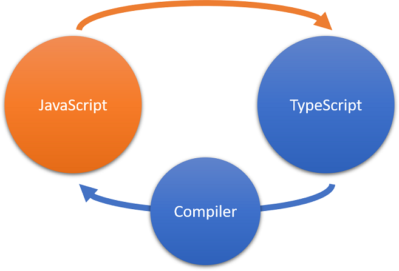

# Monday 23-05-2022

<ol>
  <li><strong>Get Started With TypeScript guided exercise, using Typescript </strong></li>
  <li><strong>Declare Variable Types In TypeScript guided exercise, using Typescript</strong></li>
  <li><strong>Watch Object-Oriented Programming - Resume video</strong></li>
</ol>

<a name="input"></a>

## Get Started With TypeScript guided exercise, using Typescript

### ¿Qué es TypeScript?

<p align="justify">TypeScript es un lenguaje de código abierto desarrollado por Microsoft. Es un superconjunto de JavaScript, lo que significa que puede continuar usando las habilidades de JavaScript que ya ha desarrollado y agregar ciertas funciones que anteriormente no estaban disponibles para usted.</p>

<p align="justify">La característica principal de TypeScript es su sistema de tipos. En TypeScript, puede identificar el tipo de datos de una variable o parámetro mediante una sugerencia de tipo . Con sugerencias de tipo, describe la forma de un objeto, lo que proporciona una mejor documentación y permite que TypeScript valide que su código funciona correctamente.</p>

<p align="justify">A través de la comprobación de tipos estáticos, TypeScript detecta problemas de código en una etapa temprana del desarrollo que JavaScript normalmente no puede detectar hasta que el código se ejecuta en el navegador. Los tipos también le permiten describir lo que su código pretende hacer. Si está trabajando en un equipo, un compañero de equipo que llega después de usted también puede entenderlo fácilmente.</p>

<p align="justify">Los tipos también potencian los beneficios de inteligencia y productividad de las herramientas de desarrollo, como IntelliSense, la navegación basada en símbolos, ir a definición, buscar todas las referencias, completar declaraciones y refactorizar código.</p>

<p align="justify">Los tipos de escritura pueden ser opcionales en TypeScript, porque la inferencia de tipos le permite obtener mucha potencia sin escribir código adicional. Si TypeScript puede determinar el tipo de datos implícitamente (por ejemplo, cuando asigna un valor a una variable mediante let age = 42), infiere automáticamente el tipo de datos.</p>

#### Otras características de código de TypeScript

TypeScript tiene funciones de codificación adicionales que no encontrará en JavaScript:

<ul>
  <li>Interfaces</li>
  <li>Espacios de nombres</li>
  <li>Genéricos</li>
  <li>Clases abstractas</li>
  <li>Modificadores de datos</li>
  <li>Opcionales</li>
  <li>Sobrecarga de funciones</li>
  <li>Decoradores</li>
  <li>Escriba útiles</li>
  <li>palabra clave de solo lectura/li>
</ul>

### Compatibilidad de TypeScript con JavaScript

<p align="justify">TypeScript es un superconjunto estricto de ECMAScript 2015 (ECMAScript 6 o ES6). Esto significa que todo el código JavaScript también es código TypeScript, y un programa TypeScript puede consumir JavaScript sin problemas.</p>

<p align="justify">Los navegadores solo entienden JavaScript. Para que su aplicación funcione, cuando la escribe en TypeScript, necesita compilar su código y convertirlo a JavaScript. El código TypeScript se transforma en código JavaScript mediante el compilador TypeScript o un transpilador compatible con TypeScript. El JavaScript resultante es un código limpio y simple que se ejecuta en cualquier lugar donde se ejecute JavaScript: en un navegador, en Node.js o en sus aplicaciones.</p>

<p align="center">

</p>

<strong>Importante</strong>
<p align="justify" >Cuando trabaje con TypeScript, recuerde en casi todas las situaciones que TypeScript se compilará (o transpilará) en JavaScript, y el tiempo de ejecución realmente ejecutará JavaScript. Puede usar TypeScript en cualquier proyecto en el que use JavaScript.</p>

## Declare Variable Types In TypeScript guided exercise, using Typescript

<p align="justify">JavaScript es un lenguaje de tipado dinámico. Si bien esto facilita la declaración de variables, en algunos casos puede generar resultados inesperados. El sistema de tipos estáticos en TypeScript le permite describir la forma de un objeto, proporcionando una mejor documentación y permitiendo que TypeScript valide que su código funciona correctamente. </p>

<p align="justify">En TypeScript, las declaraciones de espacios de nombres, clases, propiedades, funciones, variables y otras entidades del lenguaje asocian tipos con esas entidades. La forma en que se forma un tipo y se asocia con una entidad lingüística depende del tipo de entidad. Este módulo presenta algunos de los tipos disponibles y muestra cómo asociarlos con variables. Los módulos posteriores examinan cómo las interfaces, las funciones y las clases usan tipos estáticos.</p>

### Descripción general de los tipos en TypeScript

<p align="justify">El principal beneficio de Typescript es que le permite agregar tipos estáticos a su código JavaScript. Los tipos imponen restricciones estáticas a las entidades del programa, como funciones, variables y propiedades, de modo que los compiladores y las herramientas de desarrollo puedan ofrecer una mejor verificación y asistencia durante el desarrollo.</p>

<p align="justify">El sistema de tipos de tiempo de compilación estático de TypeScript modela fielmente el sistema de tipos de tiempo de ejecución dinámico de JavaScript, lo que le permite expresar con precisión las relaciones de tipos que se espera que existan cuando se ejecutan sus programas y que el compilador de TypeScript valide previamente esas suposiciones. El análisis de tipos de TypeScript ocurre completamente en tiempo de compilación y no agrega sobrecarga de tiempo de ejecución a la ejecución del programa.</p>

### Declarar variables let y const

<p align="justify">ECMAScript 2015 agregó las palabras clave lety constpara la declaración de variables en JavaScript, lo que eliminó algunos de los problemas asociados con la varpalabra clave en versiones anteriores. Este cambio permite declarar variables con ámbito de nivel de bloque y evita que se declare la misma variable varias veces.</p>


TypeScript fomenta el uso de las palabras clave lety constpara declaraciones de variables.

<strong>Nota</strong>
<p align="justify">Como recordatorio, la diferencia entre ellos es que las letdeclaraciones se pueden hacer sin inicialización, mientras que constlas declaraciones siempre se inicializan con un valor. Y constlas declaraciones, una vez asignadas, nunca se pueden reasignar.</p>

### Inferencia de tipos en TypeScript

<p align="justify">Puede asociar tipos con variables a través de anotaciones de tipo explícitas o mediante inferencia de tipo implícita.</p>

```typescript
let x: number;   //* Explicitly declares x as a number type
let y = 1;       //* Implicitly declares y as a number type
let z;           //* Declares z without initializing it
```

### Tipos y subtipos en TypeScript

#### Cualquier tipo

<p align="justify">Todos los tipos en TypeScript son subtipos de un solo tipo superior llamado anytipo. El anytipo es el tipo que puede representar cualquier valor de JavaScript sin restricciones. Todos los demás tipos se clasifican como tipos primitivos, tipos de objeto o parámetros de tipo. Estos tipos introducen varias restricciones estáticas en sus valores.</p>

<p align="center">

</p>

### tipos primitivos

<p align="justify">Los tipos primitivos son los tipos boolean, number, string, void, nully undefinedjunto con la enumeración o los enumtipos definidos por el usuario. El voidtipo existe únicamente para indicar la ausencia de un valor, como en una función sin valor de retorno. Los tipos nully undefinedson subtipos de todos los demás tipos. No es posible hacer referencia explícita a los tipos nulo e indefinido. Solo se puede hacer referencia a los valores de esos tipos, utilizando los literales nully .undefined</p>

### Tipos de objeto y parámetros de tipo

<p align="justify">Los tipos de objeto son todos tipos de clase, interfaz, matriz y literal (cualquier cosa que no sea un tipo primitivo).</p>

<p align="justify">Los tipos de clase e interfaz se introducen a través de declaraciones de clase e interfaz y se les hace referencia por el nombre que se les da en sus declaraciones. Los tipos de clase e interfaz pueden ser tipos genéricos que tienen uno o más parámetros de tipo. Aprenderá más sobre estos tipos de objetos en módulos posteriores.</p>


### tipo booleano

<p align="justify">El tipo de datos más básico es el valor trueo false, conocido como booleano.</p>

Por ejemplo:

```typescript
let flag: boolean;
let yes = true;
let no = false;
``` 

### Tipos numéricos y BigInteger

<p align="justify">Al igual que en JavaScript, todos los números en TypeScript son valores de punto flotante o BigIntegers. Estos números de coma flotante obtienen el tipo number, mientras que BigIntegers obtienen el tipo bigint. Además de los literales hexadecimales y decimales, TypeScript también admite los literales binarios y octales introducidos en ECMAScript 2015.</p>

Por ejemplo:

```typescript
let x: number;
let y = 0;
let z: number = 123.456;
let big: bigint = 100n;
``` 

### tipo de cadena

<p align="justify">La stringpalabra clave representa secuencias de caracteres almacenados como unidades de código Unicode UTF-16. Al igual que JavaScript, TypeScript también usa comillas dobles ( ") o comillas simples ( ') para rodear datos de cadena.</p>

Algunos ejemplos:

```typescript
let s: string;
let empty = "";
let abc = 'abc';
``` 

<p align="justify">En TypeScript, también puede usar cadenas de plantilla, que pueden abarcar varias líneas y tener expresiones incrustadas. Estas cadenas están rodeadas por el carácter backtick/backquote ( ` ) y las expresiones incrustadas tienen la forma ${ expr }.</p>

Por ejemplo:

```typescript
let firstName: string = "Mateo";
let sentence: string = `My name is ${firstName}.
    I am new to TypeScript.`;
console.log(sentence);
```

Este ejemplo produce la salida:

```code
My name is Mateo.
    I am new to TypeScript.
```

### Los tipos void, null e indefinido

<p align="justify">JavaScript y TypeScript tienen dos valores primitivos que se usan para señalar un valor ausente o no inicializado: nully undefined. Estos tipos son más útiles en el contexto de las funciones, por lo que los analizaremos con más detalle en un módulo posterior.</p>

## enumeraciones

### El tipo de enumeración

<p align="justify">Una adición útil al conjunto estándar de tipos de datos de JavaScript es el tipo de enumeración o enum.</p>
<p align="justify">Las enumeraciones ofrecen una manera fácil de trabajar con conjuntos de constantes relacionadas. Un enum, es un nombre simbólico para un conjunto de valores. Las enumeraciones se tratan como tipos de datos y puede usarlas para crear conjuntos de constantes para usar con variables y propiedades.</p>
<p align="justify"></p>

<p align="justify">Siempre que un procedimiento acepte un conjunto limitado de variables, considere usar una enumeración. Las enumeraciones hacen que el código sea más claro y legible, particularmente cuando se usan nombres significativos.</p>

<ul>
  <li>Ayuda a reducir los errores causados por transponer o escribir mal los números.</li>
  <li>Facilita el cambio de valores en el futuro.</li>
  <li>Hace que el código sea más fácil de leer, lo que significa que es menos probable que se introduzcan errores.</li>
  <li>Asegura la compatibilidad hacia adelante. Con las enumeraciones, es menos probable que su código falle si en el futuro alguien cambia los valores correspondientes a los nombres de los miembros.</li>
</ul>

Ejemplo de Enum:

```typescript
enum ContractStatus {
     Permanent = 1,
     Temp,
     Apprentice
}

let employeeStatus: ContractStatus = ContractStatus.Temp;
console.log(employeeStatus);
console.log(ContractStatus[employeeStatus]);
```

<br />

## Cualquier tipo y tipos desconocidos en TypeScript

<p align="justify">Hay momentos en los que necesitará trabajar con valores que son desconocidos para usted en el momento de desarrollar su código, o que son de un rango estrecho posible de tipos de valores. En estos casos, puede usar los tipos anyy unknowny usar aserción de tipo y guardias de tipo para mantener el control sobre lo que su código puede hacer con los valores que se pasan.</p>

### Cualquier tipo

<p align="justify">El tipo any es el tipo que puede representar cualquier valor de JavaScript sin restricciones. Esto puede ser útil cuando espera un valor de una biblioteca de terceros o entradas de usuario donde el valor es dinámico porque el anytipo le permitirá reasignar diferentes tipos de valores. Y, como se mencionó anteriormente, usar el anytipo le permite migrar gradualmente su código JavaScript para usar tipos estáticos en TypeScript.</p>

El siguiente ejemplo declara una variable de tipo anyy le asigna valores:

```typescript
let randomValue: any = 10;
randomValue = 'Mateo';   // OK
randomValue = true;      // OK
```

<p align="justify">Cuando se compila este ejemplo, no arroja un error porque el tipo any abarca valores de todos los tipos posibles. El tipo any opta por no realizar la verificación de tipos y no lo obliga a realizar ninguna verificación antes de llamar, construir o acceder a las propiedades de estos valores.</p>

Usar el tipo any en este ejemplo le permite llamar:

<ul>
  <li>Una propiedad que no existe para el tipo.</li>
  <li>randomValuecomo una función./li>
  <li>Un método que solo se aplica a un stringtipo.</li>
</ul>

<strong>Importante</strong>
<p align="justify">Recuerde que toda la comodidad de anyviene a costa de perder la seguridad de tipo. La seguridad de tipos es una de las principales motivaciones para usar TypeScript. Debe evitar su uso anycuando no es necesario.</p>

### tipo desconocido

<p align="justify">Si bien es flexible, el tipo any puede causar errores inesperados. Para abordar esto, TypeScript introdujo el tipo unknown.</p>
<p align="justify">El tipo unknown es similar al tipo any en que se puede asignar cualquier valor al tipo unknown. Sin embargo, no puede acceder a ninguna propiedad de un tipo unknown, ni puede llamarlas o construirlas.</p>
<p align="justify">Este ejemplo cambia el anytipo del ejemplo anterior a unknown. Ahora generará errores de verificación de tipos y le impedirá compilar el código hasta que tome las medidas adecuadas para resolverlos</p>

```typescript
let randomValue: unknown = 10;
randomValue = true;
randomValue = 'Mateo';

console.log(randomValue.name);  // Error: Object is of type unknown
randomValue();                  // Error: Object is of type unknown
randomValue.toUpperCase();      // Error: Object is of type unknown
```

<strong>Nota</strong>
<p align="justify">La principal diferencia entre anyy unknownes que no puede interactuar con una variable de tipo unknown; hacerlo genera un error de compilación . anyomite cualquier verificación en tiempo de compilación y el objeto se evalúa en tiempo de ejecución; si el método o la propiedad existe, se comportará como se esperaba.</p>

---

<p align="justify">El siguiente ejemplo realiza la verificación necesaria para determinar que randomValues un stringantes de usar la aserción de tipo para llamar al toUpperCasemétodo.</p>

```typescript
let randomValue: unknown = 10;

randomValue = true;
randomValue = 'Mateo';

if (typeof randomValue === "string") {
    console.log((randomValue as string).toUpperCase());    //* Returns MATEO to the console.
} else {
    console.log("Error - A string was expected here.");    //* Returns an error message.
}
```

<br />

### Tipo guardias

<p align="justify">El ejemplo anterior demuestra el uso de typeofen el ifbloque para examinar el tipo de una expresión en tiempo de ejecución. Esto se llama protección de tipo .</p>
<p align="justify">Es posible que esté familiarizado con el uso de typeofy instanceofen JavaScript para probar estas condiciones. TypeScript entiende estas condiciones y cambiará la inferencia de tipos en consecuencia cuando se use en un ifbloque.</p>
<p align="justify">Puede usar las siguientes condiciones para aprender el tipo de una variable:</p>

Escribe   | Predicado
----------|-----------
string    | typeof s === "string"
number    | typeof n === "number"
boolean   | typeof b === "boolean"
undefined | typeof undefined === "undefined"
function  | typeof f === "function"
array     | Array.isArray(a)

## Tipos de unión e intersección en TypeScript

<p align="justify">TypeScript proporciona opciones más avanzadas para declarar tipos. Los tipos Unión e Intersección lo ayudan a manejar situaciones en las que un tipo se compone de dos o más tipos posibles, mientras que los tipos literales le permiten restringir los valores asignados a un tipo a una lista limitada de opciones.</p>

### Tipos de unión

<p align="justify">Un tipo de unión describe un valor que puede ser uno de varios tipos. Esto puede ser útil cuando un valor no está bajo su control (por ejemplo, valores de una biblioteca, una API o entrada del usuario).</p>

<p align="justify">Un tipo de unión usa la barra vertical o tubería ( |) para separar cada tipo. En el siguiente ejemplo, multiTypepuede ser a  numbero a  boolean:</p>

```typescript
let multiType: number | boolean;
multiType = 20;         //* Valid
multiType = true;       //* Valid
multiType = "twenty";   //* Invalid
```

### Tipos de intersección

<p align="justify">Los tipos de intersección están estrechamente relacionados con los tipos de unión, pero se usan de manera muy diferente. Un tipo de intersección combina dos o más tipos para crear un nuevo tipo que tiene <strong>todas las propiedades</strong> de los tipos existentes. Esto le permite agregar tipos existentes para obtener un solo tipo que tenga todas las funciones que necesita.</p>
<p align="justify">Un tipo de Intersección utiliza el símbolo de y comercial ( &) para separar cada tipo.</p>
<p align="justify">Los tipos de intersección se usan con mayor frecuencia con las interfaces. El siguiente ejemplo define dos interfaces, Employeey Manager, y luego crea un nuevo tipo de intersección llamado ManagementEmployeeque combina las propiedades en ambas interfaces.</p>

```typescript
interface Employee {
  employeeID: number;
  age: number;
}
interface Manager {
  stockPlan: boolean;
}
type ManagementEmployee = Employee & Manager;
let newManager: ManagementEmployee = {
    employeeID: 12345,
    age: 34,
    stockPlan: true
};
```

### ¿Qué es el estrechamiento literal?

<p align="justify">Cuando declara una variable usando varo leten TypeScript, le está diciendo al compilador que existe la posibilidad de que esta variable cambie su contenido. Declarar una variable con let escribe la variable (por ejemplo, como a string), lo que permite un número infinito de valores potenciales.</p>
<p align="justify">Por el contrario, usar constpara declarar una variable informará a TypeScript que este objeto nunca cambiará. Declarándolo con consttipos al valor (por ejemplo, "Hello World").</p>
<p align="justify">El proceso de pasar de un número infinito de casos potenciales a un número finito más pequeño de casos potenciales se denomina estrechamiento.</p>

### **Definición de tipos literales**

<p align="justify">Los tipos literales se escriben como literales de tipo objeto, matriz, función o constructor y se utilizan para componer nuevos tipos a partir de otros tipos.</p>
<p align="justify">La mejor manera de demostrar el uso de tipos literales es con un ejemplo. Esta definición de tipo crea un tipo literal denominado testResult, que puede contener uno de tres stringvalores:</p>

```typescript
type testResult = "pass" | "fail" | "incomplete";
let myResult: testResult;
myResult = "incomplete";    //* Valid
myResult = "pass";          //* Valid
myResult = "failure";       //* Invalid
```
<br />

<p align="justify">TypeScript también tiene tipos de literales numéricos, que actúan de la misma manera que los literales de cadena anteriores. También puede usar booleanvalores al definir tipos literales o cualquier combinación de tipos.</p>

## Tipos de colección en TypeScript

<p align="justify">Los tipos de objeto son todos tipos de clase, interfaz, matriz y literal (cualquier cosa que no sea un tipo primitivo). Por ahora, veamos los tipos de matriz y tupla.</p>

### arreglos

<p align="justify">TypeScript, como JavaScript, le permite trabajar con matrices. Los arreglos se pueden escribir de una de dos maneras. En el primero, usa el tipo de los elementos seguido de corchetes ( [ ]) para indicar una matriz de ese tipo de elemento:</p>

```typescript
let list: number[] = [1, 2, 3];
``` 

La segunda forma usa un tipo genérico Array, usando la sintaxis Array<type>:

```typescript
let list: Array<number> = [1, 2, 3];
``` 

No hay ninguna ventaja en usar uno sobre el otro, por lo que depende de usted decidir qué sintaxis usar.

### tuplas

<p align="justify">Tener una matriz de los mismos tipos de valores es útil, pero a veces tiene una matriz que contiene valores de tipos mixtos. Para ese propósito, TypeScript proporciona el tipo Tuple. Para declarar una Tupla, use la sintaxis variableName: [type, type, ...].</p>

```typescript
let person1: [string, number] = ['Marcia', 35];
```

<!-- ```typescript

``` -->

<!-- <ul>
  <li></li>
</ul> -->
<!--  -->
<p align="justify"></p>
<strong></strong>
<p align="center"></p>
<br />