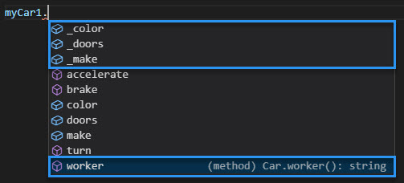
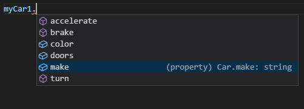
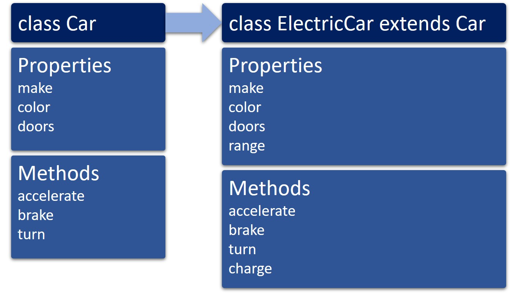

# Tuesday 31-05-2022

<ul>
  <li><strong>Develop typed functions by using TypeScript guided exercise, using Typescript</strong></li>
  <li><strong>Declare and instantiate classes in TypeScript guided exercise, using Typescript</strong></li>
  <li><strong>Watch Abstract Classes vs Interfaces video</strong></li>
</ul>

## Develop typed functions by using TypeScript guided exercise, using Typescript

### Crear funciones en TypeScript

<p align="justify">TypeScript simplifica el desarrollo de funciones y facilita la resolución de problemas al permitirle escribir parámetros y devolver valores. TypeScript también agrega nuevas opciones para los parámetros. Por ejemplo, mientras que todos los parámetros son opcionales en las funciones de JavaScript, puede optar por hacer que los parámetros sean obligatorios u opcionales en TypeScript.</p>

<p align="justify">Agregar tipos a las funciones ayuda a evitar que pase valores que no debería pasar a sus funciones. Esto es especialmente importante cuando trabaja con bases de código más grandes o funciones desarrolladas por otros. Si bien agregar tipos es una diferencia simple, ofrece el beneficio de verificar los valores que pasa a la función y lo que se devuelve. En lugar de tener que agregar toda la lógica a la función para verificar que se le haya pasado el tipo de valor correcto y que el valor devuelto sea correcto, TypeScript ayuda a garantizar los tipos de valor correctos a medida que desarrolla su código. Además, al crear la lógica de la función, tendrá soporte completo de autocompletado, ya que su editor sabrá el tipo de datos de los parámetros, algo que JavaScript normalmente no puede detectar. Esto es especialmente útil cuando</p>

### Funciones con nombre

<p align="justify">Una función con nombre es una declaración de función escrita con la palabra clave function y provista de un nombre distinto dentro del alcance actual. Las declaraciones de funciones con nombre se cargan en el contexto de ejecución antes de que se ejecute cualquier código. Esto se conoce como elevación, lo que significa que puede usar la función antes de declararla.</p>

<p align="justify">La sintaxis para declarar una función con nombre en TypeScript es la misma que para definir una en JavaScript. La única diferencia con TypeScript es que puede proporcionar una anotación de tipo para los parámetros de la función y el valor de retorno.</p>

<p align="justify">Esta función acepta dos parámetros de tipo numbery devuelve un number.</p>

```typescript
function addNumbers(x: number, y: number): number {
  return x + y;
}
addNumbers(1, 2);
```

<br />

### Funciones anónimas

<p align="justify">Una expresión de función (o función anónima ) es una función que no está precargada en el contexto de ejecución y solo se ejecuta cuando el código la encuentra. Las expresiones de función se crean en tiempo de ejecución y deben declararse antes de que puedan llamarse. (Esto significa que no se elevan, a diferencia de las declaraciones de funciones con nombre que se elevan tan pronto como comienza la ejecución del programa y se pueden llamar antes de su declaración).</p>
<p align="justify">Las expresiones de función representan valores, por lo que generalmente se asignan a una variable o se pasan a otras funciones, y pueden ser anónimas, lo que significa que la función no tiene nombre.</p>
<p align="justify">Este ejemplo asigna una  expresión <i>function</i> a la variable addNumbers. Observe que la función aparece en lugar del nombre de la función, lo que hace que la función sea anónima. Ahora puede usar esta variable para llamar a la función.</p>

```typescript
let addNumbers = function (x: number, y: number): number {
  return x + y;
};
addNumbers(1, 2);
```

---

Ejemplo extra - **"Tipado Contextual"**

```typescript
let total = function (input: number[]): number {
  let total: number = 0;
  for (let i = 0; i < input.length; i++) {
    if (isNaN(input[i])) {
      continue;
    }
    total += Number(input[i]);
  }
  return total;
};

console.log(total([1, 2, 3]));
```

<br/>
<p align="justify">Como antes, obtendrá verificación de tipo e Intellisense cuando use funciones anónimas. También notará en este ejemplo que la variable totalno está escrita, pero TypeScript puede determinar su tipo a través de algo llamado "tipado contextual", una forma de inferencia de tipos. Esto puede reducir la cantidad de esfuerzo requerido para mantener su programa tipeado.</p>

### Funciones de flecha

<p align="justify">Las funciones de flecha (también llamadas Lambda o funciones de flecha gruesa debido al =>operador que se usa para definirlas) proporcionan una sintaxis abreviada para definir una función anónima. Debido a su naturaleza concisa, las funciones de flecha a menudo se usan con funciones simples y en algunos escenarios de manejo de eventos.</p>

<p align="justify">Este ejemplo compara la sintaxis de una función de flecha anónima con una de una sola línea. La función de flecha abrevia la sintaxis al omitir la palabra clave de la función y agregar el =>operador entre los parámetros y el cuerpo de la función.</p>

```typescript
// Anonymous function
let addNumbers1 = function (x: number, y: number): number {
  return x + y;
};

// Arrow function
let addNumbers2 = (x: number, y: number): number => x + y;
```

<br />

<p align="justify">En este ejemplo, observe también que se han quitado las llaves y que no hay declaración <i>return</i>. Las funciones de flecha de una sola línea pueden usar una  sintaxis de <strong>cuerpo concisa</strong> o  un <strong>retorno implícito</strong>, lo que permite la omisión de las llaves y la palabra clave <i>return</i>.</p>

<p align="justify">Si el cuerpo de la función tiene más de una sola línea, escríbala entre llaves e incluya la declaración <i>return</i> (si corresponde). Este ejemplo muestra cómo se ve la función anónima en el ejemplo anterior cuando se escribe como una función de flecha.</p>

```typescript
let total2 = (input: number[]): number => {
  let total: number = 0;
  for (let i = 0; i < input.length; i++) {
    if (isNaN(input[i])) {
      continue;
    }
    total += Number(input[i]);
  }
  return total;
};
```

<br />

<strong>Consejo</strong>

<p align="justify">Las funciones de flecha se introdujeron en ES2015, por lo que no todos los navegadores las admiten. Al usar TypeScript, puede aprovechar estos tipos de funciones y luego transferirlos a versiones anteriores de JavaScript, si es necesario, para que su código funcione con navegadores más antiguos.</p>

### Diversión con parámetros

<p align="justify">El compilador de TypeScript asume, de forma predeterminada, que se requieren todos los parámetros definidos en una función. Cuando se llama a una función, el compilador de TypeScript verifica:</p>

<ul>
  <li>Se ha proporcionado un valor para cada parámetro.</li>
  <li>Solo se le pasan los parámetros que requiere la función.</li>
  <li>Los parámetros se pasan en el orden en que están definidos en la función.</li>
</ul>

<p align="justify">Esto es diferente de JavaScript, que asume que todos los parámetros son opcionales y le permite pasar más (o menos) argumentos a la función que los definidos por ella.</p>

<p align="justify">Además de los parámetros obligatorios, puede definir funciones con parámetros opcionales, predeterminados y de descanso, así como parámetros de objetos deconstruidos.</p>

### Parámetros requeridos

<p align="justify">Todos los parámetros de función son obligatorios, a menos que se especifique lo contrario, y el número de argumentos que se pasan a una función debe coincidir con el número de parámetros necesarios que espera la función.</p>
<p align="justify">En este ejemplo, todos los parámetros son obligatorios.</p>

```typescript
function addNumbers(x: number, y: number): number {
  return x + y;
}

addNumbers(1, 2); // Returns 3
addNumbers(1); // Returns an error
```

<br />

### Parámetros opcionales

<p align="justify">También puede definir parámetros opcionales agregando un signo de interrogación (?) al final del nombre del parámetro.</p>
<p align="justify">En este ejemplo, <i>x</i> es obligatorio y <i>y</i> opcional. El parámetro opcional debe aparecer después de cualquier parámetro requerido en la lista de parámetros. Además, para que esta función devuelva el valor correcto, debe abordar la posibilidad de que "<i>y</i>" se pase como indefinido.</p>

```typescript
function addNumbers(x: number, y?: number): number {
  if (y === undefined) {
    return x;
  } else {
    return x + y;
  }
}

addNumbers(1, 2); // Returns 3
addNumbers(1); // Returns 1
```

<br />

### Parámetros predeterminados

<p align="justify">También puede asignar valores predeterminados a parámetros opcionales. Si se pasa un valor como argumento al parámetro opcional, se le asignará ese valor. De lo contrario, se le asignará el valor predeterminado. Al igual que con los parámetros opcionales, los parámetros predeterminados deben aparecer después de los parámetros requeridos en la lista de parámetros.</p>

<p align="justify">En este ejemplo, <i>x</i> es obligatorio y <i>y</i> opcional. Si no se pasa valor a "<i>y</i>", el valor predeterminado es 25.</p>

```typescript
function addNumbers(x: number, y = 25): number {
  return x + y;
}

addNumbers(1, 2); // Returns 3
addNumbers(1); // Returns 26
```

<br />

### Parámetros de descanso

<p align="justify">Si desea trabajar con varios parámetros como un grupo (en una matriz) o no sabe cuántos parámetros tomará finalmente una función, puede usar los parámetros de descanso. Los parámetros de descanso se tratan como un número ilimitado de parámetros opcionales. Puede dejarlos fuera o tener tantos como desee.</p>

<p align="justify">Este ejemplo tiene un parámetro requerido y un parámetro opcional llamado restOfNumbersque puede aceptar cualquier cantidad de números adicionales. Los puntos suspensivos ( ...) anteriores restOfNumbersle indican al compilador que cree una matriz de los argumentos pasados a la función y le asigna el nombre que sigue para que pueda usarlo en su función.</p>

```typescript
let addAllNumbers = (
  firstNumber: number,
  ...restOfNumbers: number[]
): number => {
  let total: number = firstNumber;
  for (let counter = 0; counter < restOfNumbers.length; counter++) {
    if (isNaN(restOfNumbers[counter])) {
      continue;
    }
    total += Number(restOfNumbers[counter]);
  }
  return total;
};
```

<p align="justify">La función ahora puede aceptar uno o más valores y devolver el resultado.</p>

```typescript
addAllNumbers(1, 2, 3, 4, 5, 6, 7); // returns 28
addAllNumbers(2); // returns 2
addAllNumbers(2, 3, "three"); // flags error due to data type at design time, returns 5
```

<br />

### Parámetros de objetos deconstruidos

<p align="justify">Los parámetros de función son posicionales y deben pasarse en el orden en que están definidos en la función. Esto puede hacer que su código sea menos legible al llamar a una función con múltiples parámetros que son opcionales o del mismo tipo de datos.</p>

<p align="justify">Para habilitar los parámetros con nombre, puede usar una técnica llamada parámetros de objetos deconstruidos. Esto le permite usar una interfaz para definir parámetros con nombre, en lugar de posicionales, en sus funciones.</p>

<p align="justify">El siguiente ejemplo define una interfaz llamada Messageque define dos propiedades. En la displayMessagefunción, el Messageobjeto se pasa como parámetro, proporcionando acceso a las propiedades como si fueran parámetros normales.</p>

```typescript
interface Message {
  text: string;
  sender: string;
}

function displayMessage({ text, sender }: Message) {
  console.log(`Message from ${sender}: ${text}`);
}

displayMessage({ sender: "Christopher", text: "hello, world" });
```

<br />

### Inferencia de tipo de función

<p align="justify">Al definir una función, no es necesario que los nombres de los parámetros de función coincidan con los del tipo de función. Si bien debe nombrar los parámetros en la firma de tipo en ambos lugares, los nombres se ignoran al verificar si dos tipos de funciones son compatibles.</p>
<p align="justify">También puede omitir los tipos de parámetros y el tipo de retorno porque TypeScript los deducirá del tipo de función.</p>
<p align="justify">En lo que respecta a TypeScript, estas tres declaraciones son idénticas.</p>

```typescript
let addNumbers: Calculator = (x: number, y: number): number => x + y;
let addNumbers: Calculator = (number1: number, number2: number): number =>
  number1 + number2;
let addNumbers: Calculator = (num1, num2) => num1 + num2;
```

<br />

## **Declare and instantiate classes in TypeScript guided exercise, using Typescript**

### **Introducción a las clases en TypeScript**

<p align="justify">Las clases le permiten expresar patrones comunes orientados a objetos de forma estándar, lo que hace que funciones como la herencia sean más legibles e interoperables. En TypeScript, las clases son otra forma de definir la forma de un objeto, además de describir tipos de objetos con interfaces y funciones.</p>

<p align="justify">Puede pensar en una clase como un modelo para construir objetos, como un automóvil. Una clase <i>Car</i> describe los atributos de un automóvil, por ejemplo, la marca, el color o el número de puertas. También describe los comportamientos que puede realizar el automóvil, como acelerar, frenar o girar.</p>

<p align="justify">Pero la clase <i>Car</i> es solo un plan para construir el automóvil. Debe crear una instancia de <i>Car</i> la clase <i>Car</i> antes de que se convierta en un objeto al que pueda asignar valores de propiedad (como establecer el color en azul) o llamar a sus comportamientos (como aplicar los frenos).</p>

<p align="justify">La clase <i>Car</i> se puede reutilizar para crear cualquier número de objetos <i>Car</i> nuevos, cada uno con sus propias características. También puedes ampliar la clase <i>Car</i>. Por ejemplo, una clase <i>ElectricCar</i> podría extenderse <i>Car</i>. Tendrá todos los mismos atributos y comportamientos <i>Car</i> pero también puede tener sus propios atributos y comportamientos únicos, como su rango y una operación de carga.</p>
<p align="justify"></p>

<p align="center">

</p>

<p align="justify">La clase Car incluye las propiedades marca, color y puertas y los métodos acelerar, frenar y girar. Cuando la clase ElectricCar extiende Car, incluye todas las propiedades y métodos de Car, además de una nueva propiedad llamada rango y un nuevo método llamado cargo.</p>

<p align="justify">Una clase encapsula datos para el objeto. Los datos y el comportamiento están incluidos en la clase, pero los detalles de ambos pueden ocultarse a la persona que está trabajando con el objeto en el código. Por ejemplo, si llama al método <i>turn</i> de un objeto <i>Car</i>, no necesita saber exactamente cómo funciona el volante, solo necesita saber que el automóvil girará a la izquierda cuando se lo indique. La clase sirve como una caja negra donde todos los atributos y comportamientos solo se exponen a través de las propiedades y los métodos, lo que limita lo que un codificador puede hacer con ella.</p>

---

<strong>💡 Consejo:</strong>

<p align="justify">Si desea profundizar en los conceptos de programación orientada a objetos con más detalle, vea el video Fundamentos de las clases .</p>

---

### Componentes de clase

<ul>
  <li><p align="justify"><strong>Las propiedades</strong>, también denominadas campos, son los datos (o atributos) del objeto. Estas son las características definitorias del objeto que puede establecer o devolver desde su código.</p></li>
  <li><p align="justify"><i>constructor</i>: s una función especial utilizada para crear e inicializar objetos basados en la clase . Cuando crea una nueva instancia de la clase, el constructor crea un nuevo objeto con la forma de la clase y lo inicializa con los valores que se le pasan.</p></li>
  <li><p align="justify"><strong>Los descriptores</strong> de acceso son un tipo de función que utiliza para <i>get</i> o <i>set</i> el valor de las propiedades. Las propiedades pueden ser de solo lectura simplemente omitiendo el descriptores <i>set</i> de acceso en la clase, o inaccesibles al omitir el descriptor de <i>get</i> acceso (la propiedad regresará <i>undefined</i> si intenta acceder a ella, incluso si se le asigna un valor durante la inicialización).</p></li>
  <li><p align="justify"><strong>Los métodos</strong> son funciones que definen los comportamientos o acciones que el objeto puede realizar. Puede llamar a estos métodos para invocar el comportamiento del objeto. También puede definir métodos a los que solo se puede acceder desde dentro de la propia clase y que normalmente son llamados por otros métodos de la clase para realizar una tarea.</p></li>
</ul>

### Notas de Diseño

<p align="justify">Puede crear clases para modelar datos, encapsular funcionalidad, proporcionar plantillas y muchos otros usos. Como tal, los componentes enumerados anteriormente no son necesarios en todas las clases que cree. Es posible que solo necesite métodos y un constructor para un objeto de utilidad, o solo propiedades para administrar datos.</p>

---

<strong>🏳️ Nota:</strong>

<p align="justify">Los accesores generalmente solo se usan cuando necesita controlar el acceso a los valores, como implementar la validación o calcular valores dinámicamente. Si su clase almacena estrictamente valores y no necesita la funcionalidad adicional proporcionada por los accesores, puede usar propiedades.</p>

---

### Crear una clase

<p align="justify">Para crear una clase, defina sus miembros: propiedades, a constructor, accesores y métodos.</p>

<p align="justify">Vamos a crear una nueva clase llamada Car. Puede usar la clase <i>Car</i> por sí sola para crear objetos <i>Car</i> básicos, o puede extender la clase <i>Car</i> para crear nuevas clases para tipos específicos de automóviles, como un GasCar o una clase <i>ElectricCar</i>. Estas clases heredarán las propiedades y métodos de la clase <i>Car</i>, así como también tendrán sus propias propiedades y métodos.</p>
<p align="justify"></p>

<ol>
  <li><p align="justify">Cree una nueva class utilizando la palabra clave <i>class</i> seguida del nombre de la clase, <i>Car</i>. Por convención, los nombres de las clases son PascalCase. Agreguemos también algunos comentarios para que sea más fácil agregar a los miembros de la clase en los lugares correctos.</p></li>
</ol>

```typescript
class Car {
  // Properties
  // Constructor
  // Accessors
  // Methods
}
```

<br />

### Declarar las propiedades de la clase

<p align="justify">Puede pensar en las propiedades de una clase como los datos sin procesar que se pasan al objeto cuando se inicializa.</p>

<p align="justify">Las propiedades de la clase <i>Car</i> son las que se aplican a cualquier automóvil, independientemente de la marca o modelo específico. Por ejemplo, estas propiedades pueden incluir la marca del automóvil, el color y la cantidad de puertas. Debido a que está trabajando en TypeScript, también puede aplicar atributos de tipo a las propiedades.</p>

<ol>
  <li><p align="justify">Declare las tres propiedades para la clase <i>Car</i>: _model: string, _color: string y _doors: number.</p></li>
</ol>

```typescript
// Properties
_make: string;
_color: string;
_doors: number;
```

<br />

### Definir el constructor de la clase

<p align="justify">Las clases en TypeScript crean dos tipos separados: el tipo de instancia, que define qué miembros tiene una instancia de una clase, y el <i>constructor</i> de tipo función, que define qué miembros <i>constructor</i> tiene la función de clase. El <i>constructor</i> de tipo función también se conoce como el tipo de "lado estático" porque incluye miembros estáticos de la clase.</p>

<p align="justify">El uso de <i>constructor</i> puede simplificar las clases y hacerlas más fáciles de administrar cuando trabaja con muchas clases.</p>

<p align="justify">Una función <i>constructor</i> inicializa las propiedades de la clase y tiene tres partes:</p>

<ul>
  <li>La palabra clave <i>constructor</i></li>
  <li><p align="justify">Una lista de parámetros, que define los parámetros que se pasarán al nuevo objeto cuando se cree una nueva instancia. Al definir la lista de parámetros, recuerde que:</p>
    <ul>
      <li><p align="justify">No es necesario definir un parámetro para cada propiedad de la clase.</p></li>
      <li><p align="justify">Al igual que con todas las funciones de TypeScript, los parámetros pueden ser obligatorios u opcionales, tener valores predeterminados o ser parámetros de descanso. (Esta es una diferencia clave con JavaScript).</p></li>
      <li><p align="justify">Los nombres de los parámetros pueden ser diferentes de los nombres de las propiedades. Tenga en cuenta que estos nombres aparecerán en Intellisense cuando trabaje con objetos de este tipo, así que use nombres que sean lo suficientemente descriptivos.</p></li>
    </ul>
  </li>
  <li><p align="justify">Las cesiones de bienes. Cada declaración asigna el valor de un parámetro al valor de una propiedad. Para indicar que está accediendo a un miembro de la clase (en este caso, la propiedad), aplique la palabra clave <i>this.</i></p></li>
</ul>

<p align="justify">Una clase puede contener como máximo una declaración de <i>constructor</i>. Si una clase no contiene una declaración de <i>constructor</i>, se proporciona un constructor automático.</p>

Continúe definiendo la clase <i>Car</i> en el Playground.

<ol>
  <li><p align="justify">Crea el <i>constructor</i> para la clase <i>Car</i>. Comience con la palabra clave <i>constructor</i> y luego defina los parámetros y tipos que se pasarán al nuevo objeto <i>Car</i> cuando se cree una nueva instancia. Para la clase <i>Car</i>, defina un parámetro para cada una de las tres propiedades y anótelo con el tipo. Haga que el parámetro <i>doors</i> sea opcional con un valor predeterminado de 4.</p></li>
  <br/>
  <li><p align="justify">Dentro del bloque de código para <i>constructor</i>, asigne un valor de parámetro a cada propiedad (por ejemplo, <i>this._make = make</i>). En este caso, simplemente lo establecerá en el valor del parámetro asociado, pero tenga en cuenta que puede asignar cualquier expresión que devuelva el tipo requerido.</p></li>
</ol>

```typescript
// Constructor
constructor(make: string, color: string, doors = 4) {
    this._make = make;
    this._color = color;
    this._doors = doors;
}
```

---

<strong>💡 Consejo:</strong>

<p align="justify">El guión bajo ( <strong>_</strong> ) antes del nombre de la propiedad no es obligatorio en la declaración de la propiedad, pero proporciona una forma de distinguir la declaración de la propiedad de los parámetros a los que se puede acceder a través del constructor, al mismo tiempo que los une visualmente.</p>

---

### Definir los accesores

<p align="justify">Si bien puede acceder a las propiedades de la clase directamente (son <i>public</i>, de forma predeterminada), TypeScript admite getters/setters como una forma de interceptar el acceso a una propiedad. Esto le brinda un control más detallado sobre cómo se accede a un miembro en cada objeto.</p>

<p align="justify">Para <i>set</i> o devolver el valor de los miembros del objeto desde el código, debe definir <i>get</i> y <i>set</i> accesores en la clase.</p>

<p align="justify">Continúe definiendo la clase <i>Car</i> en el Playground.</p>

<ol>
  <li><p align="justify">Defina un bloque <i>get</i> para el parámetro <i>make</i> que devuelva el valor de la propiedad <i>_make</i>.</p>
  
  ```typescript
// Accessors
get make() {
    return this._make;
}
  ```

  </li>
  <li>Defina un bloque <i>set</i> para el parámetro <i>make</i> que establezca el valor de la propiedad <i>_make</i> en el valor del parámetro <i>make</i>.
  
  ```typescript
set make(make) {
    this._make = make;
}
  ```

  </li>
  <li><p align="justify">También puede usar los bloques <i>get</i> y <i>set</i> para validar datos, imponer restricciones o realizar otra manipulación de los datos antes de devolverlos al programa. Defina los bloques <i>get</i> y <i>set</i> para el parámetro <i>color</i>, pero esta vez, devuelva una cadena concatenada al valor de la propiedad <i>_color</i>.</p>
  
  ```typescript
get color() {
    return 'The color of the car is ' + this._color;
}
set color(color) {
    this._color = color;
}
  ```
  
  </li>
  <li><p align="justify">Definir los bloques <i>get</i> y <i>set</i> para el parámetro <i>doors</i>. Antes de devolver el valor de la propiedad <i>_doors</i>, verifique que el valor del parámetro <i>doors</i> sea un número par. Si no, lanza un error.</p>
  
```typescript
get doors() {
    return this._doors;
}
set doors(doors) {
    if ((doors % 2) === 0) {
        this._doors = doors;
    } else {
        throw new Error('Doors must be an even number');
    }
}
```

  </li>
</ol>

### Definir los métodos de clase

<p align="justify">Puede definir cualquier función de TypeScript dentro de una clase y llamarla como un método en el objeto o desde otras funciones dentro de la clase. Estos miembros de la clase describen los comportamientos que su clase puede realizar y pueden realizar cualquier otra tarea requerida por la clase.</p>

<ol>
  <li><p align="justify">Defina estos cuatro métodos para la clase <i>Car</i>: <i>accelerate</i>, <i>brake</i>, <i>turn</i> y  <i>worker</i>. Notarás que no hay ninguna palabra clave <i>function</i>. Esto no es obligatorio ni está permitido cuando se definen funciones en una clase, por lo que le ayuda a mantener la sintaxis su cinta.</p>
  
```typescript
// Methods
accelerate(speed: number): string {
    return `${this.worker()} is accelerating to ${speed} MPH.`
}
brake(): string {
    return `${this.worker()} is braking with the standard braking system.`
}
turn(direction: 'left' | 'right'): string {
    return `${this.worker()} is turning ${direction}`;
}
// This function performs work for the other method functions
worker(): string {
    return this._make;
}
```

  </li>
</ol>

### **Instanciar una clase**

<p align="justify">En este punto, tiene una clase nombrada <i>Car</i> que tiene tres propiedades y puede obtener y establecer el valor de esas propiedades. También tiene cuatro métodos. Ahora, puede instanciar la clase <i>Car</i> usando la palabra clave <i>new</i> y pasarle parámetros, creando un nuevo objeto <i>Car</i>.</p>

<ol>
  <li><p align="justify">Debajo de la declaración de clase, declare una variable llamada <i>myCar1</i> y asígnele un nuevo objeto <i>Car</i>, pasando valores para los parámetros make, colory doors(asegúrese de que el doorsparámetro tenga asignado un número par).</p>
  
```typescript
let myCar1 = new Car('Cool Car Company', 'blue', 2);  // Instantiates the Car object with all parameters
```

  </li>
  <li><p align="justify">Ahora puede acceder a las propiedades del nuevo objeto <i>myCar1</i>. Ingrese <i>myCar1</i>, y debería ver una lista de los miembros definidos en la clase, incluidos color y _color. Seleccione Ejecutar para devolver el valor de ambas propiedades a la consola. ¿Lo que sucede? ¿Por qué?</p>
  
```typescript
console.log(myCar1.color);
console.log(myCar1._color);
```

  </li>
  <li><p align="justify">El miembro <i>_color</i> representa  la propiedad definida en la clase, mientras que colores el parámetro que pasa al constructor. Cuando hace referencia a <i>_color</i>, está accediendo a los datos sin procesar de la propiedad, que devuelve <strong>'blue'</strong>. Cuando hace referencia a <i>color</i>, está accediendo a la propiedad a través del accesor <i>get</i> o , que devuelve. Es importante comprender la diferencia entre los dos porque a menudo no desea permitir el acceso directo a la propiedad sin realizar alguna validación u otro trabajo en los datos antes de obtenerlos o configurarlos. Aprenderá a usar modificadores de acceso para controlar la visibilidad de los miembros de la clase más adelante en la unidad.<i> set 'The color of the car is blue'</i></p></li>
  <li><p align="justify">Recuerde que el bloque <i>set</i> del parámetro <i>doors</i> prueba el valor para determinar si es par o impar. Pruébelo declarando una variable llamada <i>myCar2</i> y asignándole un nuevo objeto <i>Car</i>, pasando valores para los parámetros <i>make</i>, <i>color</i> y <i>doors</i>. Esta vez establezca el valor del parámetro puertas en un número impar. Ahora, selecciona Ejecutar. ¿Lo que sucede? ¿Por qué?</p>
  
```typescript
let myCar2 = new Car('Galaxy Motors', 'red', 3);
```
  
  </li>
  <li><p align="justify">Aunque pasó un número <i>impar</i> a doors, compila y se ejecuta sin errores porque no se realiza ninguna validación de datos en el <i>constructor</i>. Intente establecer el valor de <i>doors</i> en otro número impar (por ejemplo, <i>myCar2.doors = 5</i>) y pruébelo. Esto debería invocar el bloque <i>set</i> y arrojar un error. Si desea realizar este paso de validación cuando se inicializa el objeto <i>Car</i>, debe agregar una verificación de validación al archivo <i>constructor</i>.</p>
  
```typescript
constructor(make: string, color: string, doors = 4) {
    this._make = make;
    this._color = color;
    if ((doors % 2) === 0) {
        this._doors = doors;
    } else {
        throw new Error('Doors must be an even number');
    }
}
```
  
  </li>
  <li><p align="justify">Pruebe el parámetro opcional <i>doors</i> omitiéndolo de la inicialización del objeto.</p>
  
```typescript
let myCar3 = new Car('Galaxy Motors', 'gray');
console.log(myCar3.doors);  // returns 4, the default value
```

  </li>
  <li><p align="justify">Pruebe los métodos enviando los valores devueltos a la consola.</p>
  
```typescript
console.log(myCar1.accelerate(35));
console.log(myCar1.brake());
console.log(myCar1.turn('right'));
```
  
  </li>
</ol>

---

## Modificadores de acceso

<p align="justify">Todos los miembros de la clase son <i>public</i>, de forma predeterminada. Esto significa que son accesibles desde fuera de la clase contenedora. Vio un ejemplo de esto anteriormente cuando devolvió el valor de dos miembros de la clase <i>Car</i>: <i>_color</i>(una propiedad definida en la clase) y <i>color</i>(un parámetro definido en <i>constructor</i>). A veces es deseable proporcionar acceso a ambos, pero normalmente desea controlar el acceso a los datos sin procesar contenidos en la propiedad al permitir el acceso solo a través del accesor <i>set</i> o <i>get</i>.</p>

<p align="justify">También puede controlar el acceso a las funciones del método. Por ejemplo, la clase <i>Car</i> contiene una función llamada <i>worker</i> que solo se llama desde otras funciones de método dentro de la clase. Llamar a esta función directamente desde fuera de la clase puede generar resultados no deseados.</p>

<p align="justify">En TypeScript, puede controlar la visibilidad de los miembros de la clase agregando la palabra clave <i>public</i>, <i>private</i> o <i>protected</i> antes del nombre del miembro.</p>

<table>
  <thead>
    <td>Modificador de acceso</td>
    <td>Descripción</td>
  </thead>
  <tbody>
    <tr>
      <td><i>public</i></td>
      <td><p align="justify">Si no especifica un modificador de acceso, el valor predeterminado es público. También puede configurar explícitamente el miembro como público utilizando la palabra clave <i>public</i>.</p></td>
    </tr>
    <tr>
      <td><i>private</i></td>
      <td><p align="justify">Si modifica el miembro con la palabra clave <i>private</i>, no se puede acceder a él desde fuera de la clase que lo contiene.</p></td>
    </tr>
    <tr>
      <td><i>protected</i></td>
      <td><p align="justify">El modificador <i>protected</i> actúa como el modificador con la excepción de que también se puede acceder a los miembros <i>private</i> declarados dentro de las clases derivadas. <i>protected</i> (Obtendrá más información sobre esto más adelante en el módulo).</p></td>
    </tr>
  </tbody>
</table>


<p align="justify">Además, las propiedades se pueden crear <i>readonly</i> utilizando el modificador de solo lectura. Las propiedades de solo lectura solo se pueden establecer cuando se inicializan en su declaración o en el archivo <i>constructor</i>.</p>

---

<strong>🏳️ Nota:</strong>

<p align="justify">TypeScript es un sistema de tipo estructural. Cuando compara dos tipos diferentes, independientemente de su procedencia, si los tipos de todos los miembros son compatibles, decimos que los tipos en sí son compatibles. Sin embargo, al comparar tipos que tienen miembros privados y protegidos, estos tipos se tratan de forma diferente. Para que dos tipos se consideren compatibles, si uno de ellos tiene un miembro privado, entonces el otro debe tener un miembro privado que se originó en la misma declaración. Lo mismo se aplica a los miembros protegidos.</p>

---

## Aplicar modificadores de acceso a una clase

<p align="justify">Se aplicarán los modificadores de acceso a las propiedades y métodos de la clase <i>Car</i>.</p>

<ol>
  <li><p align="justify">Pruebe el acceso de los miembros de la clase escribiendo <i>myCar1</i>.y observe que todos los miembros aparecen en la lista, incluidas las propiedades, los parámetros del <i>constructor</i>, los métodos y la función <i>worker</i>.</p>
  <br />
  <p align="center">
    
  </p>
  </li>
  <br />
  <li><p align="justify">Establezca el modificador de acceso de las propiedades <i>_color</i> y la función <i>_doors</i> en <i>._makeworkerprivate</i> .</p>
  
```typescript
// Properties
private _make: string;
private _color: string;
private _doors: number;
// ...
private worker(): string {
    return this._make;
}
```

  </li>
  <li><p align="justify">Vuelva a probar el acceso de los miembros de la clase escribiendo <i>myCar1</i>.y observe que las propiedades y la función <i>worker</i> ya no están disponibles. Cualquier intento de usar estos miembros de la clase generará un error en el momento de la compilación.</p>
  <p align="center">
    
  </p>
  </li>
</ol>

### Definir propiedades estáticas

<p align="justify">Las propiedades y los métodos de las clases definidas hasta ahora son <strong>propiedades de instancia</strong>, lo que significa que se instancian y se invocan en cada instancia del objeto de clase. Hay otro tipo de propiedad llamada <strong>propiedad estática</strong>. Todas las instancias de una clase comparten propiedades y métodos estáticos.</p>

<p align="justify">Para hacer que una propiedad sea estática, use la palabra clave <i>static</i> antes del nombre de una propiedad o método.</p>

<p align="justify">Por ejemplo, puede agregar una nueva propiedad <i>static</i> a la clase <i>Car</i> llamada <i>numberOfCars</i> que almacena la cantidad de veces que <i>Car</i> se instancia de la clase y establecer su valor inicial en 0. Luego, en el constructor, incremente el conteo en uno.</p>

```typescript
class Car {
    // Properties
    private static numberOfCars: number = 0;  // New static property
    private _make: string;
    private _color: string;
    private _doors: number;

    // Constructor
    constructor(make: string, color: string, doors = 4) {
        this._make = make;
        this._color = color;
        this._doors = doors;
        Car.numberOfCars++; // Increments the value of the static property
    }
    // ...
}
```

<p align="justify">Tenga en cuenta que usa la sintaxis <i>className.propertyName</i> en lugar de <i>this</i>, cuando accede a la propiedad estática.</p>

<p align="justify">También puede definir métodos estáticos. Puede llamar al método <i>getNumberOfCars</i> para devolver el valor de <i>numberOfCars</i>.</p>

```typescript
public static getNumberOfCars(): number {
    return Car.numberOfCars;
}
```

<p align="justify">Cree una instancia de la clase <i>Car</i> como de costumbre y luego use la sintaxis <i>Car.getNumberOfCars()</i> para devolver el número de instancias.</p>

```typescript
// Instantiate the Car object with all parameters
let myCar1 = new Car('Cool Car Company', 'blue', 2);
// Instantiates the Car object with all parameters
let myCar2 = new Car('Galaxy Motors', 'blue', 2);
// Returns 2
console.log(Car.getNumberOfCars());
```

## Extender una clase usando herencia

<p align="justify">La herencia le permite establecer relaciones y crear jerarquías de clases en la composición de objetos.</p>
<p align="justify">Por ejemplo, puede <i>extender</i> la clase <i>Car</i> para crear una nueva clase llamada <i>ElectricCar</i>. La clase <i>ElectricCar</i> heredará propiedades y métodos de la clase <i>Car</i>, pero también puede tener sus propios atributos y comportamientos únicos, como <i>range</i> y <i>charge</i>. Entonces, al extender la clase <i>Car</i>, puede crear nuevas clases que reutilicen el código de la clase <i>Car</i> y luego se basen en él.</p>

<p align="center">

</p>

<p align="justify">La clase Car incluye las propiedades marca, color y puertas y los métodos acelerar, frenar y girar. Cuando la clase ElectricCar extiende Car, incluye todas las propiedades y métodos de Car, además de una nueva propiedad llamada rango y un nuevo método llamado cargo.</p>

<p align="justify"><i>ElectricCar</i> es una <strong>subclase</strong> que usa la palabra clave <i>extends</i> para derivar de la clase base <i>Car</i>. (Las clases base también se denominan <strong>superclases</strong> o clases <strong>principales</strong> ). Debido a que <i>ElectricCar</i> amplía la funcionalidad de <i>Car</i>, puede crear una instancia de <i>ElectricCar</i> que puede <i>accelerate</i>, <i>brake</i> y <i>turn</i>. Si necesitaba realizar cambios en el código de la clase base, solo necesita cambiarlo en la clase <i>Car</i> y luego todas las subclases <i>Car</i> heredarán esos cambios.</p>

Algunas razones para usar la herencia incluyen:

<ul>
  <li><p align="justify">Reutilización de código. Puede desarrollar una vez y reutilizarlo en muchos lugares. Esto también le ayuda a evitar la redundancia en su código.</p></li>
  <li><p align="justify">Puede usar una base para derivar cualquier número de subclases en una jerarquía. Por ejemplo, las subclases en la jerarquía <i>Car</i> también podrían incluir una clase <i>SUV</i> o una clase <i>Convertible</i>.</p></li>
  <li><p align="justify">En lugar de tener que realizar cambios de código en muchas clases diferentes que tienen una funcionalidad similar, solo necesita realizar los cambios una vez en la clase base.</p></li>
</ul>

### **Anular un método**

<p align="justify">Cuando una clase derivada tiene una definición diferente para una de las funciones miembro de la clase base, se dice que la función base está <i>anulada</i>. La anulación es lo que sucede cuando crea una función en una subclase con el mismo nombre que la función en la clase base pero tiene una funcionalidad diferente.</p>

<p align="justify">Por ejemplo, suponga que los autos eléctricos usan un tipo de sistema de frenado diferente al de los autos tradicionales llamado frenado regenerativo. Por lo tanto, es posible que desee anular el método <i>brake</i> de la clase <i>Car</i> base con un método especializado para la subclase <i>ElectricCar</i>.</p>

### Ampliar una clase

<p align="justify">Se extenderá la clase <i>Car</i> para crear una nueva clase llamada <i>ElectricCar</i> e invalidar un método.</p>

<ol>
  <li>Se crea una nueva clase llamada. <i>ElectricCar extends Car</i>
  
```typescript
class ElectricCar extends Car {
    // Properties unique to ElectricCar

    // Constructor

    // Accessors

    // Methods

}
```
  
  </li>
  <li>
<p align="justify">Se Declara la propiedad que es única para la clase <i>ElectricCar</i> <i>_range</i>, como una privatepropiedad de tipo <i>number</i>.</p>

```typescript
// Properties
private _range: number;
```

  </li>
  <li><p align="justify">El <i>constructor</i> para la subclase es diferente del <i>constructor</i> para la clase base en algunos aspectos.</p>
    <ul>
      <li><p align="justify">La lista de parámetros puede incluir cualquiera de las propiedades tanto de la clase base como de la subclase. (Al igual que con todas las listas de parámetros en TypeScript, recuerde que los parámetros obligatorios deben aparecer antes que los parámetros opcionales).</p></li>
      <li><p align="justify">En el cuerpo del <i>constructor</i>, debe agregar la palabra clave <i>super()</i> para incluir los parámetros de la clase base. La palabra clave <i>super</i> ejecuta el <i>constructor</i> de la clase base cuando se ejecuta.</p></li>
      <li><p align="justify">La palabra clave <i>super</i> debe aparecer antes de cualquier referencia a <i>this</i>, cuando se hace referencia a propiedades en la subclase.</p></li>
    </ul>
  </li>
  <li><p align="justify">Defina la clase <i>constructor</i> para <i>ElectricCar</i>, incluidas las propiedades <i>_make</i>, <i>_color</i> y <i>_doors</i> de la clase base y la propiedad <i>_range</i> de la subclase. En este <i>constructor</i>, establezca el valor predeterminado del parámetro <i>doors</i> en 2.</p>
  
```typescript
// Constructor
constructor(make: string, color: string, range: number, doors = 2) {
    super(make, color, doors);
    this._range = range;
}
```
  
  </li>
  <li><p align="justify">Defina los accesores <i>get</i> y <i>set</i> para el parámetro <i>range</i>.</p>
  
```typescript
// Accessors
get range() {
    return this._range;
}
set range(range) {
    this._range = range;
}
```
  
  </li>
  <li><p align="justify">Ingrese el siguiente método <i>charge</i> que devuelve un mensaje a la consola. Este método incluye una llamada a la función <i>worker</i> que definiste en la clase <i>Car</i>. Pero genera el error <strong>la propiedad 'worker' es privada y solo se puede acceder a ella dentro de la clase 'Car'</strong> . ¿Sabes cómo corregir este problema?</p>
  
```typescript
// Methods
charge() {
    console.log(this.worker() + " is charging.")
}
```

  </li>
  <li><p align="justify">En la clase <i>Car</i>, cambie el modificador de acceso de la función <i>worker</i> de <i>private</i> a <i>protected</i>. Esto permite que las subclases de la clase <i>Car</i> usen la función, mientras la mantienen oculta para los miembros disponibles para los objetos instanciados desde la clase. El error en el método <i>charge</i> ahora debería resolverse.</p></li>
  <li><p align="justify">Pruebe la nueva clase <i>ElectricCar</i> para verificar que funciona como se esperaba.</p>

```typescript
let spark = new ElectricCar('Spark Motors','silver', 124, 2);
let eCar = new ElectricCar('Electric Car Co.', 'black', 263);
console.log(eCar.doors);       // returns the default, 2
spark.charge();                // returns "Spark Motors is charging"
```
  
  </li>
  <li><p align="justify">Se Define un nuevo método <i>brake</i> en la clase <i>ElectricCar</i> que tenga diferentes detalles de implementación. Tenga en cuenta que la firma del parámetro y el tipo de retorno del método <i>brake</i> deben ser los mismos que los del método <i>brake</i> de la clase <i>Car</i>.</p>
  
```typescript
// Overrides the brake method of the Car class
brake(): string {
    return `${this.worker()}  is braking with the regenerative braking system.`
}
```

  </li>
  <li><p align="justify">Pruebe el nuevo método y compruebe que funciona como se esperaba:</p>

```typescript
console.log(spark.brake());  // returns "Spark Motors is braking with the regenerative braking system"
```
  
  </li>
</ol>

## Declarar una interfaz para garantizar la forma de la clase

<p align="justify">Recuerde que en Typescript, puede usar una interfaz para establecer un "contrato de código" que describa las propiedades requeridas de un objeto y sus tipos. Por lo tanto, puede usar una interfaz para garantizar la forma de la instancia de clase. Las declaraciones de clase pueden hacer referencia a una o más interfaces en su cláusula <i>implements</i> para validar que proporcionan una implementación de las interfaces.</p>


<ol>
  <li><p align="justify">Se Declara una interfaz <i>Vehicle</i> que describe las propiedades y métodos de la clase <i>Car</i>.</p>
  
```typescript
interface Vehicle {
    make: string;
    color: string;
    doors: number;
    accelerate(speed: number): string;
    brake(): string;
    turn(direction: 'left' | 'right'): string;
}
```

  </li>

  <li><p align="justify">Observe que la interfaz incluye los parámetros del constructor, no las propiedades. Intente incluir una de las propiedades privadas (por ejemplo, <i>_make: string</i>). TypeScript generará un error, porque la interfaz solo puede describir el lado público de la clase y es posible que no incluya miembros privados. Esto le prohíbe usarlos para verificar que una clase también tenga los tipos correctos para el lado privado de la instancia de la clase.</p></li>
  <li><p align="justify">Ahora puede implementar la interfaz <i>Vehicle</i> en la clase <i>Car</i>. A medida que desarrolla los detalles de la clase, TypeScript se asegurará de que la clase se adhiera al contrato de código descrito en la interfaz.</p>
  
```typescript
class Car implements Vehicle {
    // ...
}
```

  </li>
</ol>

## Consideraciones de diseño

<p align="justify">TypeScript ofrece un par de formas clave para definir la estructura de los objetos: clases e interfaces. Quizás se pregunte cuándo es mejor usar cada uno.</p>

### Cuándo usar interfaces

<p align="justify">Las interfaces son una construcción en tiempo de diseño de TypeScript. Debido a que JavaScript no tiene un concepto de interfaces, se eliminan cuando TypeScript se transpila a JavaScript. Esto significa que son completamente ingrávidos, no ocupan espacio en el archivo resultante y no tienen un impacto negativo en el código que se ejecutará.</p>

<p align="justify">A diferencia de otros lenguajes de programación donde las interfaces solo se pueden usar con clases, TypeScript le permite usar una interfaz para definir una estructura de datos sin necesidad de una clase. Puede usar interfaces para definir objetos de parámetros para funciones, definir la estructura para varias propiedades del marco y definir cómo se ven los objetos desde servicios remotos o API.</p>

<p align="justify">Si estaba creando una aplicación de pila completa con implementaciones de cliente y servidor, normalmente necesitará definir cómo se estructurarán los datos. Si los datos en cuestión fueran para almacenar información sobre un perro, por ejemplo, podría crear una interfaz que se vea así:</p>

```typescript
interface Dog {
    id?: number;
    name: string;
    age: number;
    description: string;
}
``` 

<p align="justify">Esta interfaz podría usarse en un módulo compartido tanto para el código del cliente como del servidor, lo que garantiza que la estructura de datos sea la misma en ambos lados. En el cliente, es posible que tenga un código para recuperar el perro de la API del servidor que defina, que se parece a lo siguiente:</p>

```typescript
async loadDog(id: number): Dog {
    return await (await fetch('demoUrl')).json() as Dog;
}
``` 

<p align="justify">Al usar la interfaz <i>loadDogle</i>, permitirá a TypeScript conocer la estructura del objeto. No necesita crear una clase para asegurarse de que esto funcione.</p>

### Cuándo usar las clases

<p align="justify">La diferencia clave entre las interfaces y las clases en cualquier lenguaje de programación es que las clases te permiten definir los detalles de implementación. Las interfaces definen únicamente cómo se estructuran los datos. Las clases le permiten definir métodos, campos y propiedades. Las clases también proporcionan una forma de crear plantillas de objetos, definiendo valores predeterminados.</p>

<p align="justify">Volviendo al ejemplo anterior, en el servidor es posible que desee agregar código para cargar o guardar un perro en la base de datos. Una técnica común para administrar datos en una base de datos es usar lo que se conoce como "patrón de registro activo", lo que significa que el objeto en sí tiene los métodos <i>save</i> y <i>load</i> similares. Podemos usar la interfaz <i>Dog</i> definida anteriormente para asegurarnos de tener las mismas propiedades y estructura, mientras agregamos el código necesario para realizar las operaciones.</p>

```typescript
class DogRecord implements Dog {
    id: number;
    name: string;
    age: number;
    description: string;

    constructor({name, age, description, id = 0}: Dog) {
        this.id = id;
        this.name = name;
        this.age = age;
        this.description = description;
    }

    static load(id: number): DogRecord {
        // code to load dog from database
        return dog;
    }

    save() {
        // code to save dog to database
    }
}
```

<strong>Resumen</strong>
<p align="justify">A medida que continúe utilizando TypeScript, encontrará muchas instancias nuevas en las que las interfaces, en particular, facilitarán su vida como desarrollador. Una característica clave de TypeScript para recordar acerca de las interfaces es que no requieren una clase. Esto le permite usarlos siempre que necesite la capacidad de definir una estructura de datos sin tener que crear una implementación de clase completa.</p>


```typescript
function calculateTotalPrice(prices: number[], discount: number): number {
  let mostExpensiveItem = Math.max(...prices),
    porcentDiscount = mostExpensiveItem * (discount / 100);
  prices = prices.map((item: number) => {
    if (item === mostExpensiveItem) return item - porcentDiscount;
    return item;
  });
  return prices.reduce((pv: number, cv: number) => pv + Math.floor(cv), 0);
}

console.log(calculateTotalPrice([9, 9, 5, 4, 3, 2], 45));
```

<!-- 

```ts

/*
let addThreeNumbers = (x: number, y: number, z?: number): number => {
    if((z === undefined)) {
        return x + y;
    } else {
        return x + y + z;
    }
};

let subtractThreeNumbers = (x: number, y: number, z=100): number => x - y - z;

// type calculator = (x: number, y: number) => number;
interface calculator {
    (x: number, y: number): number;
}

let addNumbers: calculator = (x: number, y: number): number => x + y;
let subtractNumbers: calculator = (x: number, y: number): number => x - y;

console.log(addNumbers(1, 2));
console.log(subtractNumbers(1, 2));

let doCalculation = (operation: 'add' | 'subtract'): calculator => {
    if (operation === 'add') {
        return addNumbers;
    } else {
        return subtractNumbers;
    }
}

console.log(doCalculation('add')(1, 2))

*/
// console.log(subtractThreeNumbers(10, 20));    
// console.log(subtractThreeNumbers(10, 20, 15));

//console.log(addThreeNumbers(1,2));


```


<details><summary><b>Output</b></summary>

```ts
"use strict";
/*
let addThreeNumbers = (x: number, y: number, z?: number): number => {
    if((z === undefined)) {
        return x + y;
    } else {
        return x + y + z;
    }
};

let subtractThreeNumbers = (x: number, y: number, z=100): number => x - y - z;

// type calculator = (x: number, y: number) => number;
interface calculator {
    (x: number, y: number): number;
}

let addNumbers: calculator = (x: number, y: number): number => x + y;
let subtractNumbers: calculator = (x: number, y: number): number => x - y;

console.log(addNumbers(1, 2));
console.log(subtractNumbers(1, 2));

let doCalculation = (operation: 'add' | 'subtract'): calculator => {
    if (operation === 'add') {
        return addNumbers;
    } else {
        return subtractNumbers;
    }
}

console.log(doCalculation('add')(1, 2))

*/
// console.log(subtractThreeNumbers(10, 20));    
// console.log(subtractThreeNumbers(10, 20, 15));
//console.log(addThreeNumbers(1,2));

```
