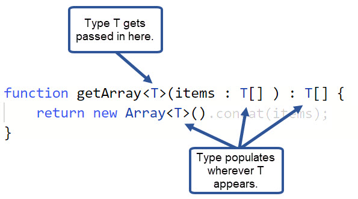

# Wednesday 01-06-2022

<ul>
  <li><strong>Define generics in TypeScript guided exercise, using Typescript</strong>☑️</li>
  <li><strong>Make the Deadfish Swim exercise, using Typescript</strong>☑️</li>
</ul>

## Introducción a los genéricos

<p align="justify">En módulos anteriores de la ruta de aprendizaje Crear aplicaciones de JavaScript mediante TypeScript , aprendió a aplicar anotaciones de tipo a sus interfaces, funciones y clases para crear componentes fuertemente tipados. Pero, ¿qué sucede si desea crear un componente que pueda funcionar con una variedad de tipos en lugar de solo uno? Puede usar el tipo <i>any</i>, pero luego pierde el poder detrás del sistema de verificación de tipos de TypeScript.</p>

<p align="justify">Los genéricos son plantillas de código que puede definir y reutilizar en su base de código. Proporcionan una forma de decirle a las funciones, clases o interfaces qué tipo desea usar cuando lo llama. Puede pensar en esto de la misma manera que los argumentos se pasan a una función, excepto que un genérico le permite decirle al componente qué tipo debe esperar en el momento en que se llama.</p>

<p align="justify">Cree funciones genéricas cuando su código sea una función o clase que:</p>

<ul>
  <li>Funciona con una variedad de tipos de datos.</li>
  <li>Utiliza ese tipo de datos en varios lugares.</li>
</ul>

<p align="justify">Los genéricos pueden:</p>

<ul>
  <li>Proporciona más flexibilidad al trabajar con tipos.</li>
  <li>Habilitar la reutilización de código.</li>
  <li>Reducir la necesidad de utilizar el tipo <i>any</i>.</li>
</ul>

## ¿Por qué usar genéricos?

<p align="justify">Para comprender por qué podría usar genéricos, es útil ver un ejemplo.</p>

<p align="justify">La función <i>getArray</i> genera una matriz de elementos de tipo <i>any</i>.</p>

```typescript
function getArray(items: any[]): any[] {
  return new Array().concat(items);
}
```

<br />

<p align="justify">Luego, la variable <i>numberArray</i> se declara llamando a la función <i>getArray</i>, pasándole una matriz de números, y la variable <i>stringArray</i> se declara con una matriz de cadenas. Sin embargo, debido a que se usa el tipo <i>any</i>, no hay nada que impida que el código inserte un <i>string</i> en el <i>numberArray</i> o un <i>number</i> en el <i>stringArray</i>.</p>

```typescript
let numberArray = getArray([5, 10, 15, 20]);
let stringArray = getArray(["Cats", "Dogs", "Birds"]);
numberArray.push(25); // OK
stringArray.push("Rabbits"); // OK
numberArray.push("This is not a number"); // OK
stringArray.push(30); // OK
console.log(numberArray); // [5, 10, 15, 20, 25, "This is not a number"]
console.log(stringArray); // ["Cats", "Dogs", "Birds", "Rabbits", 30]
```

<br />

<p align="justify">¿Qué sucede si desea determinar el tipo de valores que contendrá la matriz cuando llame a la función y luego haga que TypeScript haga el trabajo de verificación de tipo de los valores que le pasa para asegurarse de que sean de ese tipo? Aquí es donde entran en juego los genéricos.</p>

<p align="justify">Este ejemplo reescribe la función <i>getArray</i> usando genéricos. Ahora puede aceptar cualquier tipo que especifique al llamar a la función.</p>

```typescript
function getArray<T>(items: T[]): T[] {
  return new Array<T>().concat(items);
}
```

<br />
<p align="justify">Los genéricos definen una o más <strong>variables de tipo</strong> para identificar el tipo o tipos que pasará al componente, entre paréntesis angulares ( <i>< > </i>). (También verá variables de tipo denominadas parámetros de tipo o parámetros genéricos). En el ejemplo anterior, la variable de tipo en la función se denomina &lt;T&gt;. <i>T</i> es un nombre de uso común para un genérico, pero puede nombrarlo como desee.</p>

<p align="justify">Después de especificar la variable de tipo, puede usarla en lugar del tipo en los parámetros, el tipo de retorno o en cualquier otro lugar de la función donde agregaría una anotación de tipo.</p>

<p align="center">

</p>

<p align="justify">La variable de tipo T se puede utilizar siempre que se necesite la anotación de tipo. En la función getArray, se usa para especificar el tipo del parámetro de elementos, el tipo de devolución de la función y para devolver una nueva matriz de elementos.</p>

<p align="justify">Para llamar a la función y pasarle un tipo, agregue &lt;type&gt; al nombre de la función. Por ejemplo, getArray&lt;number&gt; indica a la función que solo acepte una matriz de valores <i>number</i> y devuelva una matriz de valores <i>number</i>. Debido a que el tipo se especificó como <i>number</i>, TypeScript esperará que los valores <i>number</i> se pasen a la función y generará un error si se trata de otra cosa.</p>

---

<strong>🏳️ Nota:</strong>

<p align="justify">Si omite la variable de tipo al llamar a la función, TypeScript deducirá el tipo. Sin embargo, esto solo funciona con datos simples. Pasar matrices u objetos infiere el tipo de cualquiera y elimina las comprobaciones de tipo.</p>

---

<p align="justify">En este ejemplo, con las declaraciones de variables para <i>numberArray</i> y <i>stringArray</i> actualizadas para llamar a la función con el tipo deseado, TypeScript evita que los elementos no válidos se agreguen a la matriz.</p>

```typescript
let numberArray = getArray<number>([5, 10, 15, 20]);
numberArray.push(25); // OK
numberArray.push("This is not a number"); // Generates a compile time type check error

let stringArray = getArray<string>(["Cats", "Dogs", "Birds"]);
stringArray.push("Rabbits"); // OK
stringArray.push(30); // Generates a compile time type check error
```

<br />

## Uso de múltiples variables de tipo

<p align="justify">No está limitado a usar una sola variable de tipo en sus componentes genéricos.</p>

<p align="justify">Por ejemplo, la función <i>identity</i> acepta dos parámetros, <i>value</i> y <i>message</i>, y devuelve el parámetro <i>value</i>. Puede usar dos genéricos &lt;T&gt; y &lt;U&gt;, para asignar diferentes tipos a cada parámetro y al tipo de devolución. La variable <i>returnNumber</i> se inicializa llamando a la función <i>identity</i> con &lt;number, string&gt; como tipos para los argumentos  <i>value</i> y <i>message</i>, <i>returnString</i> se inicializa llamándola con &lt;string, string&gt;, y <i>returnBoolean</i> se inicializa llamándola con &lt;boolean, string&gt;. Al usar estas variables, TypeScript puede escribir los valores y devolver un error de tiempo de compilación si hay un conflicto.</p>

```typescript
function identity<T, U>(value: T, message: U): T {
  console.log(message);
  return value;
}

let returnNumber = identity<number, string>(100, "Hello!");
let returnString = identity<string, string>("100", "Hola!");
let returnBoolean = identity<boolean, string>(true, "Bonjour!");

returnNumber = returnNumber * 100; // OK
returnString = returnString * 100; // Error: Type 'number' not assignable to type 'string'
returnBoolean = returnBoolean * 100; // Error: Type 'number' not assignable to type 'boolean'
```

<br />

## Usar los métodos y propiedades de un tipo genérico

<p align="justify">Al usar variables de tipo para crear componentes genéricos, solo puede usar las propiedades y métodos de los objetos que están disponibles para cada tipo. Esto evita que se produzcan errores cuando intenta realizar una operación en un valor de parámetro que no es compatible con el tipo que se le está pasando.</p>

<p align="justify">Si agrega la declaración <i>let result: T = value + value</i>, a la función <i>identity</i>, TypeScript genera el error <strong>El lado izquierdo de una operación aritmética debe ser del tipo 'cualquiera', 'número', 'bigint' o un tipo de enumeración</strong> porque no sabe el valor qué tendrá qué ser pasado a él en tiempo de ejecución. Si tuviera que pasar un valor no numérico, la expresión generaría un error, por lo que TypeScript le informa del problema en el momento de la compilación.</p>

```typescript
function identity<T, U>(value: T, message: U): T {
  let result: T = value + value; // Error
  console.log(message);
  return result;
}
```

<br />

## Uso de restricciones genéricas para limitar tipos

<p align="justify">La función <i>identity</i> puede aceptar cualquier tipo que elija para pasar a las variables de tipo. Pero, en este caso, debe restringir los tipos que el parámetro <i>value</i> puede aceptar a un rango de tipos en los que puede realizar una operación de adición, en lugar de aceptar cualquier tipo posible. Esto se llama una <strong>restricción genérica</strong>.</p>

<p align="justify">Hay varias maneras de hacer esto dependiendo de la variable de tipo. Una forma es declarar un <i>type</i> personalizado como una tupla y luego <i>extender</i> la variable de tipo con el tipo personalizado. El siguiente ejemplo declara <i>ValidTypes</i> como una tupla con una <i>string</i> y un <i>number</i>. Luego, extiende <i>T</i> con el nuevo tipo. Ahora, sólo puedes pasar tipos de <i>number</i> o <i>string</i> a la variable de tipo.</p>

```typescript
type ValidTypes = string | number;

function identity<T extends ValidTypes, U>(value: T, message: U): T {
  let result: T = value + value; // Error
  console.log(message);
  return result;
}

let returnNumber = identity<number, string>(100, "Hello!"); // OK
let returnString = identity<string, string>("100", "Hola!"); // OK
let returnBoolean = identity<boolean, string>(true, "Bonjour!"); // Error: Type 'boolean' does not satisfy the constraint 'ValidTypes'.
```

<br />
<p align="justify">También puede restringir un tipo a la propiedad de otro objeto. Este ejemplo utiliza <i>extends</i> con el operador <i>keyof</i>, que toma un tipo de objeto y produce una cadena o unión literal numérica de sus claves. Aquí, <i>K extends keyof T</i> asegurándose de que el parámetro clave sea del tipo correcto para el tipo asignado a <i>pet</i>.</p>

#Duda con este tema

```typescript
function getPets<T, K extends keyof T>(pet: T, key: K) {
  return pet[key];
}

let pets1 = { cats: 4, dogs: 3, parrots: 1, fish: 6 };
let pets2 = { 1: "cats", 2: "dogs", 3: "parrots", 4: "fish" };

console.log(getPets(pets1, "fish")); // Returns 6
console.log(getPets(pets2, "3")); // Error
```

### Uso de protectores de tipo con genéricos

<p align="justify">Notará que TypeScript aún genera un problema con la expresión <i>value + value</i> en la función <i>identity</i>. Pero ahora sabe que solo los tipos <i>number</i> y <i>string</i> se pueden pasar a la función.</p>

<p align="justify">Puede usar la protección <i>typeof</i> de tipo en un bloque <i>if</i> para verificar el tipo del parámetro <i>value</i> antes de realizar una operación, como se muestra en el siguiente ejemplo. TypeScript puede determinar a partir de la declaración <i>if</i> si la operación funcionará con los valores proporcionados dentro del bloque.</p>

```typescript
type ValidTypes = string | number;
function identity<T extends ValidTypes, U>(value: T, message: U) {
  // Return type is inferred
  let result: ValidTypes = "";
  let typeValue: string = typeof value;

  if (typeof value === "number") {
    // Is it a number?
    result = value + value; // OK
  } else if (typeof value === "string") {
    // Is it a string?
    result = value + value; // OK
  }

  console.log(
    `The message is ${message} and the function returns a ${typeValue} value of ${result}`
  );

  return result;
}

let numberValue = identity<number, string>(100, "Hello");
let stringValue = identity<string, string>("100", "Hello");

console.log(numberValue); // Returns 200
console.log(stringValue); // Returns 100100
```

---

<strong>🏳️ Nota:</strong>

<p align="justify">Solo puede usar una protección <i>typeof</i> de tipos para verificar los tipos primitivos <i>string</i>, <i>number</i>, <i>bigint</i>, <i>function</i>, <i>boolean</i>, <i>symbol</i>, <i>object</i> y <i>undefined</i>. Para verificar el tipo de una clase, use un protector de tipo <i>instanceof</i>.</p>

---

## implementar genéricos con interfaces y clases

<p align="justify">Los genéricos son solo una forma de pasar tipos a un componente, por lo que no solo puede aplicar tipos nativos a variables de tipo genérico, sino también interfaces, funciones y clases. En esta unidad, verá algunas formas diferentes de usar genéricos con estos tipos complejos.</p>

<p align="justify">Intente usar genéricos con interfaces, funciones y clases. Todos los ejemplos de código realizan esencialmente las mismas tareas utilizando diferentes enfoques.</p>

<ol>
  <li>
    <p align="justify">Declare una interfaz simple llamada <i>identity</i> que tenga dos propiedades, <i>value</i> y <i>message</i>, y dos variables de tipo genérico, <i>T</i> y <i>U</i>, para los tipos de propiedad.</p>

```typescript
interface Identity<T, U> {
    value: T;
    message: U;
}
```

  </li>
  <li>
    <p align="justify">Declare dos variables, utilizando la Identityinterfaz como un tipo de objeto.</p>

```typescript
let returnNumber: Identity<number, string> = {
    value: 25,
    message: 'Hello!'
}
let returnString: Identity<string, number> = {
    value: 'Hello!',
    message: 25
}
```

  </li>
</ol>

## Declarar una interfaz genérica como un tipo de función

<ol>
  <li>
    <p align="justify">Declare una interfaz genérica llamada <i>ProcessIdentity</i> que incluya la firma genérica de un método, <i>(value: T, message: U): T</i>. Observe que el método no tiene nombre. Al hacer esto, puede aplicarlo a cualquier función con una firma de tipo coincidente.</p>

```typescript
interface ProcessIdentity<T, U> {
    (value: T, message: U): T;
}
```

  </li>
  <li>
    <p align="justify">Declare una función llamada <i>processIdentity</i>que tenga la misma firma de tipo que la interfaz <i>ProcessIdentity</i>.</p>

```typescript
function processIdentity<T, U> (value: T, message: U) : T {
    console.log(message);
    return value
}
```

  </li>
  <li><p align="justify">Declare una variable de tipo de función llamada <i>processor</i> con la  interfaz <i>ProcessIdentity</i> como el tipo de variable, pasando por <i>number</i> el tipo <i>T</i> y por <i>string</i> el tipo <i>U</i>. Luego, asígnele la función <i>processIdentity</i>. Ahora puede usar esta variable como una función en su código y TypeScript verificará los tipos.</p>
  
```typescript
let processor: ProcessIdentity<number, string> = processIdentity;
let returnNumber1 = processor(100, 'Hello!');   // OK
let returnString1 = processor('Hello!', 100);   // Type check error
```

  </li>
</ol>


## Declarar una interfaz genérica como un tipo de clase

También puede declarar una interfaz genérica e implementarla en una clase.

<ol>
  <li>
    <p align="justify">Declare una interfaz llamada <i> ProcessIdentity</i> que tenga dos propiedades, <i>value</i> y <i>message</i>, y dos variables de tipo genérico, <i>T</i> y <i>U</i>, para los tipos de propiedad. Luego, agregue una firma genérica de un método llamado <i>process</i> que devuelva un valor de tipo <i>T</i>.</p>

```typescript
interface ProcessIdentity<T, U> {
    value: T;
    message: U;
    process(): T;
}
```

<br />
  </li>
  <li>
    <p align="justify">Defina una clase genérica llamada <i>processIdentity</i> que implemente la interfaz <i>ProcessIdentity</i>. En este caso, nombre los tipos de variables en la clase <i>processIdentity</i> <i>X</i> y <i>Y</i>. Puede usar diferentes nombres de variables en la interfaz y la clase porque el valor del tipo se propaga hacia arriba en la cadena y el nombre de la variable no importa.</i>.</p>

```typescript
class processIdentity<X, Y> implements ProcessIdentity<X, Y> {
    value: X;
    message: Y;
    constructor(val: X, msg: Y) {
        this.value = val;
        this.message = msg;
    }
    process() : X {
        console.log(this.message);
        return this.value
    }
}
```

<br />
  </li>
  <li><p align="justify">Declare una nueva variable y asígnele un nuevo objeto <i>processIdentity</i>, pasando un <i>number</i> y  un <i>string</i> para los tipos de variable <i>X</i> e <i>Y</i>, y un <i>number</i> y una <i>string</i> como valores de los argumentos.</p>
  
```typescript
let processor = new processIdentity<number, string>(100, 'Hello');
processor.process();           // Displays 'Hello'
processor.value = '100';       // Type check error
```

  </li>
</ol>

## Definir una clase genérica

<p align="justify">También puede declarar una clase genérica sin una interfaz. Este ejemplo se declara <i>processIdentity</i> como una clase genérica sin implementar la interfaz <i>ProcessIdentity</i>.</p>

```typescript
class processIdentity<T, U> {
    private _value: T;
    private _message: U;
    constructor(value: T, message: U) {
        this._value = value;
        this._message = message;
    }
    getIdentity() : T {
        console.log(this._message);
        return this._value
    }
}
let processor = new processIdentity<number, string>(100, 'Hello');
processor.getIdentity();      // Displays 'Hello'
``` 

## Implementar genéricos con tipos y clases personalizados

<p align="justify">El uso de genéricos con tipos primitivos, como <i>number</i>, <i>string</i> o <i>boolean</i>, ilustra bien los conceptos de los genéricos, pero los usos más poderosos provienen de usarlos con clases y tipos personalizados.</p>

<p align="justify">Este ejemplo tiene una clase base llamada <i>Car</i> y dos subclases, <i>ElectricCar</i> y <i>Truck</i>. La función <i>accelerate</i> acepta una instancia genérica de <i>Car</i> y luego la devuelve. Al decirle a la función <i>accelerate</i> que <i>T</i> debe extenderse de <i>Car</i>, TypeScript sabe qué funciones y propiedades puede llamar dentro de la función. El genérico también devuelve el tipo específico de automóvil ( <i>ElectricCar</i> o <i>Truck</i>) pasado a la función, en lugar de un  objeto <i>Car</i> no específico.</p>

```typescript
class Car {
    make: string = 'Generic Car';
    doors: number = 4;
}
class ElectricCar extends Car {
    make = 'Electric Car';
    doors = 4
}
class Truck extends Car {
    make = 'Truck';
    doors = 2
}
function accelerate<T extends Car> (car: T): T {
    console.log(`All ${car.doors} doors are closed.`);
    console.log(`The ${car.make} is now accelerating!`)
    return car
}

let myElectricCar = new ElectricCar;
accelerate<ElectricCar>(myElectricCar);
let myTruck = new Truck;
accelerate<Truck>(myTruck);
```

La salida a la consola es:

```typescript
"All 4 doors are closed."
"The Electric Car is now accelerating!"
"All 2 doors are closed."
"The Truck is now accelerating!"
``` 

<br />

## Uso de restricciones genéricas con tipos y clases personalizados

<p align="justify">Anteriormente en el módulo, aprendió a usar restricciones genéricas para limitar tipos. Las restricciones genéricas no solo se pueden aplicar a los tipos nativos, sino también a las clases.</p>

<p align="justify">Puede hacer esto definiendo una interfaz y luego usando la palabra clave <i>extends</i> con la variable de tipo para extenderla. El ejemplo anterior restringió el tipo <i>T</i> al adjuntarle una restricción: <i>T</i> debe extenderse <i>Car</i>.</p>


## Make the Deadfish Swim exercise, using Typescript

<p align="justify">Write a simple parser that will parse and run Deadfish.</p>
<p align="justify">Deadfish has 4 commands, each 1 character long:</p>

<ul>
  <li><i>i</i> increments the value (initially 0)</li>
  <li><i>d</i> decrements the value</li>
  <li><i>s</i> squares the value</li>
  <li><i>o</i> outputs the value into the return array</li>
</ul>

Invalid characters should be ignored.

```typescript
parse("iiisdoso") => [8, 64]
```

<br />

<p align="justify">Se nos solicita que a partir de una cadena se retorne un arreglo de números, y para realizar esto se nos indica que tenemos cuatros opciones:</p>

<ul>
  <li><i>i</i> incrementa el valor (inicialmente 0)</li>
  <li><i>d</i> disminuye el valor</li>
  <li><i>s</i> eleva al cuadrado el valor</li>
  <li><i>o</i> genera el valor en la matriz de retorno</li>
</ul>

<p align="justify">Bien con estas cuatro instrucciones tomar una mas en cuenta, en caso de que vengan otros caracters no se tomarán en cuenta, con esto se procede a mostrar el código, ya que solo se explica al leerlo:</p>

```typescript
export function parse(data: string): number[] {
  let aux_number = 0,
    result: number[] = [];
  for (const d of data) {
    if (d === "i") aux_number++;
    if (d === "d") aux_number--;
    if (d === "s") aux_number = aux_number ** 2;
    if (d === "o") result.push(aux_number);
  }
  return result;
}
```

<br />

<p align="justify">Realizando una prueba se obtiene:</p>

```typescript
console.log(parse("iiisdoso"));
console.log(parse("iiisxxxdoso"));
```

<p align="justify">Obteniendo como salida:<strong>
[ 8, 64 ], [ 8, 64 ] </strong></p>

---

###

<p align="justify"></p>
<i></i>

<br />

<!-- ```typescript

``` -->

<!-- <ul>
  <li></li>
</ul> -->
<!--  -->
<p align="justify"></p>
<strong></strong>
<p align="center"></p>
<br />
